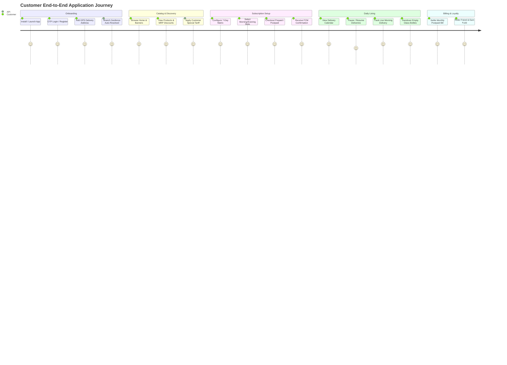

# 02 — Customer Mobile App Test Specification (`in.f2h.customer`)

> **Application Surface:** Customer Mobile App (Flutter 3.11 BLoC · Android/iOS/Web)  
> **API Controllers:** `src/panels/customer/*`, `src/auth/*`, `src/csrf/*`  
> **Package ID:** `in.f2h.customer`  
> **Target Audience:** Consumers, Daily Subscribers, Retail Produce Buyers

---

## 1. Customer Journey Architecture

---

## 2. Test Cases by Functional Area

### 2.1 Signup, Authentication & Onboarding

#### CUST-AUTH-001: Mobile Phone Number OTP Registration & Profile Setup
- **Module:** `Customer / Auth`
- **Scenario:** New customer enters phone number, verifies Fast2SMS OTP, and completes name/email
- **Priority:** `Critical`
- **Preconditions:** New unregistered phone number `+91 9988776655`.
- **Dependencies:** None
- **Steps:**
  1. Launch Customer App. On Welcome screen, enter `Phone Number = '9988776655'`.
  2. Click **Get OTP**.
  3. Enter 6-digit OTP received via SMS (or test fixture `123456`). Click **Verify OTP**.
  4. In Profile Setup screen, enter `First Name = 'Anita'`, `Last Name = 'Deshmukh'`, `Email = 'anita@example.com'`. Click **Complete Registration**.
- **Expected Result:** Registration succeeds. Authenticated JWT stored in secure storage. Bootstrap API hydrates `CustomerSessionCubit`. Home screen renders greeting: *"Hello Anita!"*.
- **Database / API Verification Points:**
  - `POST /api/v1/auth/send-otp` returns `{ status: true, message: "OTP sent" }`.
  - `POST /api/v1/auth/verify-otp` with header `X-Role: C` returns `{ access_token, refresh_token, user }`.
  - Table `users`: new row with `phone = '9988776655'`, `first_name = 'Anita'`, `last_name = 'Deshmukh'`.
  - Table `customers`: new row with `customer_id = users.user_id`, `wallet_balance = 0.00`, `first_order_completed = false`.
  - Table `role_assignments`: new row with `role_id = 'CUSTOMER'`.

#### CUST-AUTH-002: Customer Bootstrap Hydration
- **Module:** `Customer / Bootstrap`
- **Scenario:** App launch executes `/customer/bootstrap` and restores user profile, default address, and cart count
- **Priority:** `High`
- **Preconditions:** Customer is logged in.
- **Dependencies:** `CUST-AUTH-001`
- **Steps:**
  1. Terminate app process and re-open app.
- **Expected Result:** App launches directly to Home screen without prompting for login.
- **Database / API Verification Points:**
  - `GET /api/v1/customer/bootstrap` returns `200 OK` with user profile, active branch, wallet balance, and cart item count.

---

### 2.2 Address Management & Branch Geofencing

#### CUST-ADDR-001: Add GPS Delivery Address & Branch Geofence Assignment
- **Module:** `Customer / Address`
- **Scenario:** Pin address on map, save delivery details, and verify auto-assigned branch
- **Priority:** `Critical`
- **Preconditions:** Customer is logged in. Active branch `BRANCH_KUPPAM_01` covers coordinates `(12.7485, 78.3644)`.
- **Dependencies:** `CUST-AUTH-001`
- **Steps:**
  1. Navigate to Profile → **My Addresses** → Click **+ Add New Address**.
  2. Select GPS location on map at `12.7485, 78.3644` (Kuppam Main Road).
  3. Enter Flat No: `Flat 402`, Building: `Green Valley Apts`, Area: `Kuppam Central`, Landmark: `Near Old Bus Stand`, Contact Phone: `+91 9988776655`.
  4. Check **Set as Default Address**. Click **Save Address**.
- **Expected Result:** Address saved. Home screen top bar updates delivery location to *"Green Valley Apts, Kuppam"*. Branch is resolved as `BRANCH_KUPPAM_01`.
- **Database / API Verification Points:**
  - `POST /api/v1/customer/address` creates row in `customer_addresses`:
    `latitude = 12.7485`, `longitude = 78.3644`, `is_default = true`.
  - Table `customers`: `branch_id = 'BRANCH_KUPPAM_01'`, `address_lat = 12.7485`, `address_lng = 78.3644`.

#### CUST-ADDR-002: Out-of-Coverage Address Validation
- **Module:** `Customer / Address`
- **Scenario:** Customer attempts to add delivery location outside active branch polygons
- **Priority:** `High`
- **Preconditions:** Coordinates `(13.0827, 80.2707)` (Chennai) outside any branch polygon and buffer zone.
- **Dependencies:** `CUST-AUTH-001`
- **Steps:**
  1. Add address with coordinates in Chennai.
  2. Click **Save Address**.
- **Expected Result:** App displays banner: *"We do not deliver to this location yet. Join our waitlist to be notified!"*.
- **Database / API Verification Points:**
  - API returns `{ status: false, error_code: "out_of_delivery_zone", message: "Location outside service area" }`.

---

### 2.3 Product Catalog, Pricing, Tariffs & Cart

#### CUST-CAT-001: Browse Catalog, Categories & Banners
- **Module:** `Customer / Catalog`
- **Scenario:** Browse categories, promotional banners, and product details
- **Priority:** `High`
- **Preconditions:** Active products and categories in database.
- **Dependencies:** `CUST-ADDR-001`
- **Steps:**
  1. On Home screen, view Promotional Banners carousel.
  2. Tap Category `Dairy & Milk`.
  3. Inspect product cards (Image, Name, Unit, Price, Add to Cart button, Subscribe button).
- **Expected Result:** Categories and products load smoothly with cached images. Product cards show correct MRP and subscription pricing.
- **Database / API Verification Points:**
  - `GET /api/v1/customer/categories` and `GET /api/v1/customer/products?category_id=...` return active items.

#### CUST-CAT-002: Customer Special Price Tariff Priority
- **Module:** `Customer / Pricing Engine`
- **Scenario:** Product price reflects customer special tariff over catalog default
- **Priority:** `Critical`
- **Preconditions:** Product variant `VAR_MILK_1L` standard price = `₹75.00`. Customer has active `customer_special_prices` row with `special_price = ₹65.00`.
- **Dependencies:** `CUST-ADDR-001`, `ADM-CUST-003`
- **Steps:**
  1. Open product details for `Farm Fresh Milk 1L`.
- **Expected Result:** Price displays `₹65.00` (highlighted as Special Price) with crossed-out MRP `₹80.00`.
- **Database / API Verification Points:**
  - `GET /api/v1/customer/products/:id` checks `customer_special_prices` for the calling user:
    `final_price = 65.00`.

#### CUST-CART-001: Cart Calculations, Sync & Bill Summary
- **Module:** `Customer / Cart`
- **Scenario:** Add items to cart, change quantities, apply coupon, verify bill summary
- **Priority:** `Critical`
- **Preconditions:** Products exist with valid prices.
- **Dependencies:** `CUST-CAT-001`
- **Steps:**
  1. Add 2 units of `Milk 1L` (`₹75.00` × 2 = `₹150.00`).
  2. Add 1 unit of `Country Eggs 6pcs` (`₹60.00`).
  3. Open Cart screen.
  4. Apply Coupon `FRESH50` (Flat ₹50 discount on orders > ₹200).
- **Expected Result:**
  - Subtotal: `₹210.00`
  - Coupon Discount: `-₹50.00`
  - Delivery Fee: `₹0.00` (Free Delivery)
  - Final Total: `₹160.00`
  - Floating "View Cart" bar smoothly adjusts with navbar auto-hide animation.
- **Database / API Verification Points:**
  - `POST /api/v1/customer/cart-sync` stores cart JSON in `carts` table for `user_id`.
  - `GET /api/v1/customer/cart-items` returns verified server-calculated `billSummary`.

---

### 2.4 One-Time Order Checkout & Payment

#### CUST-ORD-001: One-Time Order with Customer Wallet Payment
- **Module:** `Customer / Orders`
- **Scenario:** Place one-time order using prepaid wallet balance
- **Priority:** `Critical`
- **Preconditions:** Customer wallet balance = `₹500.00`. Cart total = `₹160.00`.
- **Dependencies:** `CUST-CART-001`
- **Steps:**
  1. In Cart screen, select Delivery Slot: `Tomorrow Morning (6:00 AM - 8:30 AM)`.
  2. Select Payment Method: **F2H Wallet (Balance: ₹500.00)**.
  3. Click **Place Order**.
- **Expected Result:** Order placed immediately. Redirected to Order Success screen with Order ID `#F2H-ORD-...`. Wallet balance updates to `₹340.00`. Push notification received.
- **Database / API Verification Points:**
  - `POST /api/v1/customer/checkout/payment` executes inside DB transaction.
  - Table `orders`: new row with `status = 'placed'`, `payment_mode = 'wallet'`, `payment_status = 'paid'`, `total_amount = 160.00`.
  - Table `order_items`: line items matching cart with quantities and final prices.
  - Table `customers`: `wallet_balance = 340.00`.
  - Table `customer_wallet_transactions`: row with `transaction_type = 'debit'`, `amount = 160.00`, `balance_after = 340.00`, `reference_type = 'order'`.

#### CUST-ORD-002: One-Time Order with Cash on Delivery (COD)
- **Module:** `Customer / Orders`
- **Scenario:** Place one-time order with Cash on Delivery
- **Priority:** `High`
- **Preconditions:** Cart total = `₹160.00`.
- **Dependencies:** `CUST-CART-001`
- **Steps:**
  1. Select Payment Method: **Cash on Delivery (COD)**.
  2. Click **Place Order**.
- **Expected Result:** Order placed with status `placed`, payment status `pending`.
- **Database / API Verification Points:**
  - Table `orders`: `payment_mode = 'cod'`, `payment_status = 'pending'`, `total_amount = 160.00`.

#### CUST-ORD-003: Order Cancellation & Wallet Refund
- **Module:** `Customer / Orders`
- **Scenario:** Cancel placed one-time order before cutoff and receive instant wallet refund
- **Priority:** `Critical`
- **Preconditions:** Order in `placed` status paid via wallet (`₹160.00`).
- **Dependencies:** `CUST-ORD-001`
- **Steps:**
  1. Open Order History → Select Order `#F2H-ORD-...`.
  2. Click **Cancel Order** → Select Reason: `Ordered by mistake`. Click **Confirm Cancellation**.
- **Expected Result:** Order status changes to `cancelled`. Toast: *"Order cancelled. ₹160.00 has been refunded to your wallet"*. Wallet balance restores to `₹500.00`.
- **Database / API Verification Points:**
  - `POST /api/v1/customer/orders/:orderId/cancel` executes inside DB transaction.
  - Table `orders`: `status = 'cancelled'`.
  - Table `customers`: `wallet_balance = 500.00`.
  - Table `customer_wallet_transactions`: row with `transaction_type = 'credit'`, `amount = 160.00`, `reference_type = 'order_refund'`.

---

### 2.5 Subscriptions Setup, Matrix Schedule & Lifecycle

#### CUST-SUB-001: Create Prepaid Subscription with 7-Day Variable Matrix
- **Module:** `Customer / Subscriptions`
- **Scenario:** Create weekly subscription with different morning/evening quantities across weekdays
- **Priority:** `Critical`
- **Preconditions:** Product `Farm Fresh Milk 1L` is subscribable. Customer wallet balance = `₹2,500.00`.
- **Dependencies:** `CUST-ADDR-001`
- **Steps:**
  1. Tap **Subscribe** on `Farm Fresh Milk 1L`.
  2. Set Start Date: `Tomorrow`.
  3. Configure Weekly Matrix:
     - Monday–Saturday: `Morning Qty = 1`, `Evening Qty = 0`.
     - Sunday: `Morning Qty = 2`, `Evening Qty = 1`.
  4. App detects non-identical quantities and renders full 7-day schedule grid (omits "Daily" tag).
  5. Select Payment Type: **Prepaid (Wallet)**.
  6. Click **Confirm Subscription**.
- **Expected Result:** Subscription created with status `active`. Subscription number assigned. Calendar tab populated with daily scheduled deliveries.
- **Database / API Verification Points:**
  - `POST /api/v1/customer/subscriptions/checkout` creates row in `subscriptions` and `subscription_items`.
  - Table `subscription_weekly_schedule`: 7 rows inserted with day-wise `m_quantity` and `e_quantity`.
  - Table `customer_bills`: prepaid bill row created with `status = 'paid'`.
  - Table `customer_wallet_transactions`: debit entry for prepaid estimated monthly amount.

#### CUST-SUB-002: Subscription Calendar & Pause Delivery
- **Module:** `Customer / Subscriptions`
- **Scenario:** View monthly delivery calendar and pause subscription for upcoming holiday
- **Priority:** `Critical`
- **Preconditions:** Active subscription exists.
- **Dependencies:** `CUST-SUB-001`
- **Steps:**
  1. Open Subscription Details → Tap **Calendar & Pauses**.
  2. Verify calendar shows upcoming deliveries with green dots and quantities.
  3. Click **Pause Subscription**.
  4. Select `Pause From = Tomorrow + 2 Days`, `Pause To = Tomorrow + 5 Days` (4 days total).
  5. Reason: `Vacation`. Click **Confirm Pause**.
- **Expected Result:** Calendar updates showing paused days in orange/grey with "Paused" badge. Subscription remains `active` (or `paused` if pause starts today).
- **Database / API Verification Points:**
  - `POST /api/v1/customer/subscriptions/:id/pause` creates row in `subscription_pauses`:
    `start_date = ...`, `end_date = ...`, `status = 'paused'`.
  - `subscriptions` table: `pause_from_date` and `pause_to_date` updated.

#### CUST-SUB-003: Subscription Resume Scenarios
- **Module:** `Customer / Subscriptions`
- **Scenario:** Test resume before pause starts (Scenario 1) and resume during ongoing pause (Scenario 2)
- **Priority:** `Critical`
- **Preconditions:** Subscription with scheduled or active pause.
- **Dependencies:** `CUST-SUB-002`
- **Steps:**
  1. For upcoming pause (Scenario 1): Tap **Resume Subscription**. App cancels scheduled pause; deliveries continue uninterrupted.
  2. For ongoing pause (Scenario 2): Tap **Resume Subscription** → Select `Resume Date = Tomorrow`.
- **Expected Result:** Subscription pause truncated to yesterday. Deliveries resume tomorrow. Immutable pause history preserved in `subscription_pauses`.
- **Database / API Verification Points:**
  - `POST /api/v1/customer/subscriptions/:id/resume` updates `subscription_pauses.status = 'resumed'` and adjusts `pause_to_date`.
  - Table `subscription_logs` records resume action and scenario index.

---

### 2.6 Customer Referrals & First Order Reward

#### CUST-REF-001: Share Referral Link & Friend Signup
- **Module:** `Customer / Referrals`
- **Scenario:** Customer shares referral code; friend signs up using code
- **Priority:** `High`
- **Preconditions:** Customer `Alice (CUST_A)` is active.
- **Dependencies:** `CUST-AUTH-001`
- **Steps:**
  1. Alice opens Profile → **Refer & Earn**.
  2. Copies Referral Code: `REF_ALICE`.
  3. Friend `Bob` registers new account and inputs Referral Code: `REF_ALICE`.
- **Expected Result:** Bob's account linked to Alice. Referrals screen in Alice's app shows *"Bob signed up — Reward pending on first order delivery"*.
- **Database / API Verification Points:**
  - Table `customers` for Bob: `referred_by = 'CUST_A'`.
  - Table `referrals`: row created with `referrer_customer_id = 'CUST_A'`, `referred_customer_id = 'CUST_B'`, `status = 'pending'`, `referrer_reward_amount = 100.00`.

#### CUST-REF-002: Referral Reward Credit on First Order Completed
- **Module:** `Customer / Referrals`
- **Scenario:** Bob's first order is marked delivered; Alice receives ₹100 wallet reward
- **Priority:** `Critical`
- **Preconditions:** Bob has pending referral from Alice and places first order.
- **Dependencies:** `CUST-REF-001`, `CUST-ORD-001`
- **Steps:**
  1. Delivery Partner marks Bob's order as `delivered`.
- **Expected Result:**
  - Bob's profile updates `first_order_completed = true`.
  - Alice receives FCM Push Notification: *"🎉 ₹100 Referral Bonus Credited to your wallet!"*.
  - Alice's wallet balance increases by `₹100.00`.
- **Database / API Verification Points:**
  - `ReferralRewardEngineService` executes inside PostgreSQL transaction with row locks.
  - Table `referrals`: `status = 'rewarded'`, `rewarded_at = NOW()`.
  - Table `customers` for Alice: `wallet_balance` incremented by `100.00`.
  - Table `customer_wallet_transactions`: row with `transaction_type = 'credit'`, `amount = 100.00`, `reference_type = 'referral_bonus'`.
  - Attempting to re-deliver or trigger reward again returns `{ status: false, message: "Referral reward already processed previously" }`.
