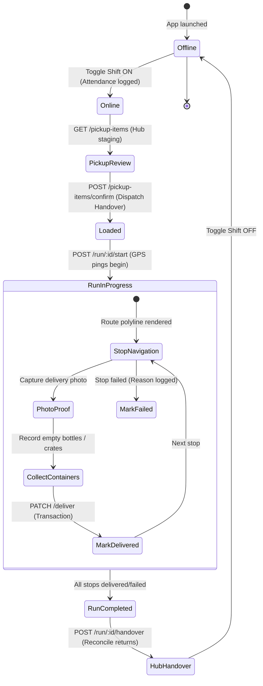

# 03 — Delivery Partner Mobile App Test Specification (`in.f2h.partner`)

> **Application Surface:** Delivery Partner Mobile App (Flutter 3.11 BLoC · Android/iOS/Web)  
> **API Controllers:** `src/panels/delivery-partner/*`, `src/auth/*`  
> **Package ID:** `in.f2h.partner`  
> **Target Audience:** Delivery Drivers, Route Riders, Field Hub Logistics Agents

---

## 1. Delivery Partner Shift & Run Lifecycle

---

## 2. Test Cases by Functional Area

### 2.1 Registration, KYC & Availability

#### DP-AUTH-001: Partner Registration, Document Upload & KYC Verification
- **Module:** `Delivery Partner / Auth & KYC`
- **Scenario:** Partner registers with vehicle info and uploads Aadhaar, Driving License, and Bank details
- **Priority:** `Critical`
- **Preconditions:** New phone number `+91 9876500001`.
- **Dependencies:** None
- **Steps:**
  1. Open Delivery App → Enter phone number `9876500001` → Verify OTP.
  2. In Profile & Vehicle Setup, select `Vehicle Type = Bike`, enter `Vehicle Number = AP04 XY 1234`, `Daily Salary = ₹500.00`.
  3. Upload photo of Aadhaar Card and Driving License. Enter Bank Account No & IFSC.
  4. Submit for Verification.
- **Expected Result:** Profile created with status `is_verified = false`, `is_active = false`. App displays *"KYC Under Verification by Admin"*.
- **Database / API Verification Points:**
  - Table `delivery_partners`: new row with `delivery_partner_id = users.user_id`, `vehicle_type = 'bike'`, `is_verified = false`.
  - Table `delivery_partner_documents`: rows with uploaded file paths.

#### DP-AUTH-002: Shift Toggle & Attendance Logging
- **Module:** `Delivery Partner / Shift`
- **Scenario:** Partner toggles Online status to start shift and logs attendance
- **Priority:** `High`
- **Preconditions:** Partner is verified (`is_verified = true`, `is_active = true`).
- **Dependencies:** `DP-AUTH-001`, `ADM-DEL-001`
- **Steps:**
  1. Open Delivery App. Tap top header toggle switch to **Online**.
- **Expected Result:** Switch turns green with *"On Shift"*. Header displays current slot (e.g. `Morning Slot`) and assigned branch `Kuppam Main`.
- **Database / API Verification Points:**
  - `POST /api/v1/delivery-partner/auth/shift-toggle` with `{ status: "online" }`.
  - Table `delivery_partners`: `is_active = true`, `current_lat`, `current_lng`.
  - Attendance logged for current calendar date.

#### DP-AUTH-003: Leave Request Submission
- **Module:** `Delivery Partner / Leave Requests`
- **Scenario:** Partner submits leave request for next week
- **Priority:** `High`
- **Preconditions:** Partner is on active roster.
- **Dependencies:** `DP-AUTH-002`
- **Steps:**
  1. Open Drawer Menu → **Leave Requests** → Click **+ Apply Leave**.
  2. Select Date: `Tomorrow + 3 Days`. Reason: `Family Function`.
  3. Click **Submit Leave**.
- **Expected Result:** Toast: *"Leave request submitted to Admin"*. Status shows `pending`.
- **Database / API Verification Points:**
  - `POST /api/v1/delivery-partner/profile/leave-request` creates row in `delivery_leave_requests`:
    `partner_id = ...`, `leave_date = ...`, `status = 'pending'`.
  - Admin receives real-time notification badge.

---

### 2.2 Hub Pickup & Dispatch Confirmation

#### DP-DISP-001: Review Hub Pickup Items & Planned Quantities
- **Module:** `Delivery Partner / Dispatch Pickup`
- **Scenario:** View total items and extra crates assigned for morning route
- **Priority:** `Critical`
- **Preconditions:** Delivery run created and dispatch generated for morning slot.
- **Dependencies:** `DP-AUTH-002`
- **Steps:**
  1. Open **Pickup & Inventory** tab.
  2. Inspect item checklist:
     - `Farm Fresh Milk 1L`: Planned `35 Bottles` + Extra Buffer `5 Bottles` = `40 Bottles`.
     - `Country Eggs 6pcs`: Planned `10 Packs`.
     - Returnable Glass Bottles (Empty crates issued): `2 Crates (24 slots each)`.
- **Expected Result:** Clean checklist matches warehouse physical staging.
- **Database / API Verification Points:**
  - `GET /api/v1/delivery/orders/pickup-items` returns aggregated lines from `dispatch_requirements` and `dispatch_plans`.

#### DP-DISP-002: Confirm Pickup & Handover Acknowledgment
- **Module:** `Delivery Partner / Dispatch Handover`
- **Scenario:** Partner confirms receipt of stock at warehouse hub
- **Priority:** `Critical`
- **Preconditions:** Pickup items reviewed.
- **Dependencies:** `DP-DISP-001`
- **Steps:**
  1. Tap **Confirm & Load Items into Vehicle**.
- **Expected Result:** Dispatch status transitions to `collected`/`loaded`. Action button transitions to **Start Delivery Run**.
- **Database / API Verification Points:**
  - `POST /api/v1/delivery/orders/pickup-items/confirm` executes inside DB transaction.
  - Table `delivery_dispatch`: `status = 'loaded'`.
  - Table `dispatch_balances`: rows populated with `dispatched_qty = 40`, `delivered_qty = 0`, `returned_qty = 0`, `damaged_qty = 0`, `balance_qty = 40`.

---

### 2.3 Delivery Run, Navigation & Order Fulfillment

#### DP-RUN-001: Start Delivery Run & Live Location Streaming
- **Module:** `Delivery Partner / Run Execution`
- **Scenario:** Start route; GPS pings stream to Admin live tracking
- **Priority:** `Critical`
- **Preconditions:** Pickup confirmed (`dispatch_status = 'loaded'`).
- **Dependencies:** `DP-DISP-002`
- **Steps:**
  1. Tap **Start Delivery Run**.
- **Expected Result:** Run status updates to `in_progress`. All assigned orders transition from `confirmed` to `out_for_delivery`. Stops rendered in sequence with route polylines.
- **Database / API Verification Points:**
  - `POST /api/v1/delivery/orders/run/:runId/start` executes inside DB transaction.
  - Table `delivery_runs`: `status = 'in_progress'`, `started_at = NOW()`.
  - Table `orders`: `status = 'out_for_delivery'` for all run orders.
  - Periodic background task `POST /api/v1/delivery-partner/location/update` emits `partner_location_update` to Socket.IO room `admin_tracking`.

#### DP-RUN-002: Stop Details, Multi-Order Stacking & Customer Contact
- **Module:** `Delivery Partner / Stop Details`
- **Scenario:** View customer address, landmarks, contact, and multiple orders at one address
- **Priority:** `High`
- **Preconditions:** Stop with 2 orders (1 standing subscription + 1 retail one-time order).
- **Dependencies:** `DP-RUN-001`
- **Steps:**
  1. Tap Stop #1 (`Flat 402, Green Valley Apts`).
- **Expected Result:** Card expands showing stacked deliveries for same customer:
  - Item 1: `Milk 1L (Subscription #SUB-101)` — Prepaid.
  - Item 2: `Country Eggs 6pcs (Order #F2H-ORD-501)` — COD `₹60.00`.
  - Customer contact: `+91 9988776655` with one-tap Call and Directions buttons.
  - Expected Bottle Returns: `1 Glass Bottle`.

#### DP-RUN-003: Delivery Proof Photo Upload & Complete Stop
- **Module:** `Delivery Partner / Proof & Deliver`
- **Scenario:** Take doorstep delivery photo, collect empty bottle, collect COD cash, mark delivered
- **Priority:** `Critical`
- **Preconditions:** Stop in progress.
- **Dependencies:** `DP-RUN-002`
- **Steps:**
  1. Click **Take Proof Photo** → Capture doorstep milk packet/bottle image.
  2. Under Returnable Containers, enter `Bottles Collected = 1`.
  3. Under COD Collection, confirm `Collected ₹60.00 in Cash`.
  4. Tap **Mark as Delivered**.
- **Expected Result:** Stop marks completed with green checkmark. Push notification sent to Customer: *"Your F2H Fresh order has been delivered!"*. Stop vanishes from active list and moves to Completed tab.
- **Database / API Verification Points:**
  - `POST /api/v1/delivery/orders/:orderId/upload-proof` saves image and returns CDN path.
  - `PATCH /api/v1/delivery/orders/run/:runId/address/:addressId/deliver` executes inside DB transaction:
    - `orders.status = 'delivered'`, `orders.delivered_at = NOW()`, `orders.delivery_image = ...`.
    - `orders.payment_status = 'paid'` (for COD order).
    - `customer_container_balances` updated: `returned_quantity += 1`.
    - `dispatch_balances`: `delivered_qty += 2`, `balance_qty` adjusted.
    - `FirstOrderDetectorService` checks customer first order.

#### DP-RUN-004: Failed Delivery Stop & Reason Logging
- **Module:** `Delivery Partner / Failed Stops`
- **Scenario:** Customer not home / door locked; partner marks stop failed
- **Priority:** `Critical`
- **Preconditions:** Stop cannot be delivered.
- **Dependencies:** `DP-RUN-001`
- **Steps:**
  1. On Stop #3, tap **Report Issue / Unable to Deliver**.
  2. Select Reason: `Door Locked / Customer Not Available`.
  3. Upload photo of locked door. Enter Notes: `Called customer 3 times, no response`.
  4. Tap **Confirm Failed Delivery**.
- **Expected Result:** Stop marked failed. Undelivered items remain in vehicle inventory for end-of-run warehouse return.
- **Database / API Verification Points:**
  - `PATCH /api/v1/delivery/orders/run/:runId/address/:addressId/fail` with reason.
  - `orders.status = 'failed'`.
  - Table `delivery_proof_logs`: row created with `delivery_status = 'failed'`, `delivery_notes = ...`.
  - For prepaid subscriptions, order is flagged for `RefundEligibilityService` review.

---

### 2.4 End-of-Day Handover & Reconciliation

#### DP-HND-001: End-of-Run Warehouse Handover & Return Reconciliation
- **Module:** `Delivery Partner / Handover`
- **Scenario:** Return to hub, submit collected bottles and returned products, close run
- **Priority:** `Critical`
- **Preconditions:** All stops completed or failed. Extra stock and collected bottles in vehicle.
- **Dependencies:** `DP-RUN-003`, `DP-RUN-004`
- **Steps:**
  1. Open **Handover & Return** tab.
  2. Summary displays:
     - Planned Dispatched: `40 Bottles Milk`
     - Successfully Delivered: `36 Bottles`
     - Undelivered / Returned: `4 Bottles (3 extra buffer + 1 failed stop)`
     - Empty Bottles Collected from Customers: `32 Glass Bottles`
     - Cash Collected: `₹60.00`
  3. Warehouse Supervisor inspects returns and signs off in Admin panel.
  4. Partner taps **Submit Hub Handover**.
- **Expected Result:** Delivery run transitions to `completed` → `handed_over`. Stock returned to warehouse inventory.
- **Database / API Verification Points:**
  - `POST /api/v1/delivery/orders/run/:runId/handover` executes inside DB transaction.
  - Table `delivery_runs`: `status = 'handed_over'`, `actual_end_time = NOW()`.
  - Table `delivery_container_reconciliation`: `collected_quantity = 32`, `status = 'pending'`.
  - Table `warehouse_containers`: warehouse stock incremented by returned bottles.
  - Table `stock_balances`: returned perishable units reconciled into warehouse stock.

---

### 2.5 Delivery Partner Referrals & Monthly Bonuses

#### DP-REF-001: Partner Referral Bonus Accrual & Payout Visibility
- **Module:** `Delivery Partner / Referral Earnings`
- **Scenario:** Partner refers new customer; ₹75 bonus accrues to monthly salary ledger
- **Priority:** `High`
- **Preconditions:** Customer signed up with Delivery Partner's referral code and completed first delivery.
- **Dependencies:** `CUST-REF-002`
- **Steps:**
  1. Open Drawer Menu → **My Earnings & Bonuses**.
  2. Check Referral Bonuses section.
- **Expected Result:** Screen lists ₹75 referral reward for referee customer with status `pending` (payable in monthly salary).
- **Database / API Verification Points:**
  - Table `delivery_partner_referral_bonuses`: row with `partner_id = ...`, `amount = 75.00`, `status = 'pending'`.
  - Month-end payroll query includes `SUM(amount)` from bonuses.
