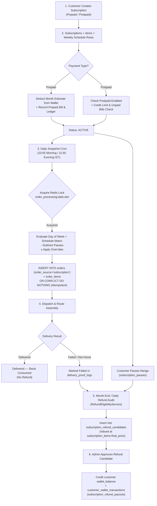

# 04 — Subscriptions Master Test Specification

> **Subsystem:** Standing Subscriptions Engine & Snapshot Automation  
> **API Services:** `SubscriptionsService`, `SubscriptionSnapshotService`, `SubscriptionStatusService`, `RefundEligibilityService`  
> **Crons:** `subscription-snapshot.cron.ts` (`23:55`, `11:55` IST), `subscription-status.cron.ts` (`01:00` IST)  
> **Priority:** `P0 — Core Revenue Engine of F2H Fresh`

---

## 1. Complete Subscription Architecture & Data Lifecycle



---

## 2. In-Depth Test Cases

### 2.1 Subscription Creation & Schedule Matrix

#### SUB-CRT-001: Prepaid Subscription Creation with Multi-Product Matrix
- **Module:** `Subscriptions / Creation`
- **Scenario:** Customer creates prepaid subscription for Milk (daily) and Eggs (Sunday only)
- **Priority:** `Critical`
- **Preconditions:** Customer wallet balance = `₹3,000.00`. Product variants active.
- **Dependencies:** None
- **Steps:**
  1. Submit `POST /api/v1/customer/subscriptions/checkout`:
     ```json
     {
       "customer_id": "CUST_PREPAID_01",
       "start_date": "2026-09-01",
       "payment_type": "prepaid",
       "payment_method": "wallet",
       "schedule_type": "weekly",
       "auto_renew": true,
       "estimated_total": 2400.00,
       "items": [
         {
           "product_variant_id": "VAR_MILK_1L",
           "unit_price": 75.00,
           "discount_amount": 5.00,
           "final_price": 70.00,
           "schedules": [
             { "day_of_week": 1, "m_quantity": 1, "e_quantity": 0 },
             { "day_of_week": 2, "m_quantity": 1, "e_quantity": 0 },
             { "day_of_week": 3, "m_quantity": 1, "e_quantity": 0 },
             { "day_of_week": 4, "m_quantity": 1, "e_quantity": 0 },
             { "day_of_week": 5, "m_quantity": 1, "e_quantity": 0 },
             { "day_of_week": 6, "m_quantity": 1, "e_quantity": 0 },
             { "day_of_week": 0, "m_quantity": 2, "e_quantity": 1 }
           ]
         },
         {
           "product_variant_id": "VAR_EGGS_6",
           "unit_price": 60.00,
           "final_price": 60.00,
           "schedules": [
             { "day_of_week": 0, "m_quantity": 1, "e_quantity": 0 }
           ]
         }
       ]
     }
     ```
- **Expected Result:** Subscription created (`status = 'active'`). Wallet balance atomically debited by `₹2,400.00` to `₹600.00`.
- **Database / API Verification Points:**
  - Table `subscriptions`: `subscription_id = 'SUB_...'`, `payment_type = 'prepaid'`, `start_date = '2026-09-01'`, `end_date = '2026-09-30'`.
  - Table `subscription_items`: 2 rows (`VAR_MILK_1L` with `final_price = 70.00`, `VAR_EGGS_6` with `final_price = 60.00`).
  - Table `subscription_weekly_schedule`: 8 rows total (7 for milk, 1 for eggs).
  - Table `customer_bills`: row with `payment_type = 'prepaid'`, `status = 'paid'`, `total_amount = 2400.00`.
  - Table `customer_wallet_transactions`: debit entry of `2400.00` with `balance_after = 600.00`.

#### SUB-CRT-002: Postpaid Subscription Credit Limit & Unpaid Bills Guard
- **Module:** `Subscriptions / Postpaid Gating`
- **Scenario:** Reject postpaid subscription if customer has unpaid overdue bills or exceeds credit limit
- **Priority:** `Critical`
- **Preconditions:** Customer `is_postpaid_enabled = true`, `postpaid_credit_limit = 2000.00`. Existing active postpaid commitments = `₹1,500.00`.
- **Dependencies:** None
- **Steps:**
  1. Test A: Customer has 1 unpaid bill in `customer_bills` (`due_amount = 450.00`, `status = 'unpaid'`).
     - Submit postpaid subscription checkout.
  2. Test B: Clear unpaid bill. Submit new postpaid subscription with `monthly_estimate = 800.00` (Combined `1500 + 800 = 2300 > 2000`).
- **Expected Result:**
  - Test A: Rejected with `{ status: false, error_code: "outstanding_bills_exist", message: "You have 1 unpaid bill(s)..." }`.
  - Test B: Rejected with `{ status: false, error_code: "credit_limit_exceeded", message: "Postpaid credit limit exceeded..." }`.
- **Database / API Verification Points:**
  - No row inserted in `subscriptions`. Database state remains untouched.

---

### 2.2 Pause & Resume Matrix Verification

#### SUB-PAUS-001: Schedule Future Pause Window
- **Module:** `Subscriptions / Pauses`
- **Scenario:** Customer pauses subscription from Sep 10 to Sep 15 (inclusive)
- **Priority:** `Critical`
- **Preconditions:** Active subscription `SUB_TEST_01` starting Sep 01.
- **Dependencies:** `SUB-CRT-001`
- **Steps:**
  1. `POST /api/v1/customer/subscriptions/SUB_TEST_01/pause` with `{ "startDate": "2026-09-10", "endDate": "2026-09-15" }`.
- **Expected Result:** Pause scheduled. Status message: *"Subscription paused successfully"*.
- **Database / API Verification Points:**
  - Table `subscription_pauses`: row with `start_date = '2026-09-10'`, `end_date = '2026-09-15'`, `status = 'paused'`.
  - Table `subscriptions`: `pause_from_date = '2026-09-10'`, `pause_to_date = '2026-09-15'`.
  - Status remains `active` until Sep 10.

#### SUB-PAUS-002: Resume Scenario 1 — Cancel Pause Before Start Date
- **Module:** `Subscriptions / Resume`
- **Scenario:** On Sep 05, customer cancels upcoming pause scheduled for Sep 10
- **Priority:** `Critical`
- **Preconditions:** Current date = `2026-09-05`. Pause scheduled for `2026-09-10` to `2026-09-15`.
- **Dependencies:** `SUB-PAUS-001`
- **Steps:**
  1. `POST /api/v1/customer/subscriptions/SUB_TEST_01/resume` (no `resume_date` needed or empty body).
- **Expected Result:** Scenario 1 triggered. Message: *"Upcoming pause cancelled. Regular deliveries will continue without interruption."*.
- **Database / API Verification Points:**
  - Table `subscriptions`: `pause_from_date = NULL`, `pause_to_date = NULL`, `pause_reason = NULL`.
  - Table `subscription_pauses`: `status = 'resumed'`, `updated_at = NOW()`.
  - Table `subscription_logs`: action `resume_before_start` with `scenario: 1`.

#### SUB-PAUS-003: Resume Scenario 2 — Truncate Ongoing Pause Mid-Window
- **Module:** `Subscriptions / Resume`
- **Scenario:** On Sep 12 (during active pause Sep 10–15), customer resumes early starting Sep 13
- **Priority:** `Critical`
- **Preconditions:** Active pause `2026-09-10` to `2026-09-15`. Today = `2026-09-12`.
- **Dependencies:** `SUB-PAUS-001`
- **Steps:**
  1. `POST /api/v1/customer/subscriptions/SUB_TEST_01/resume` with `{ "resume_date": "2026-09-13" }`.
- **Expected Result:** Scenario 2 triggered. Message: *"Subscription resumed successfully! Deliveries will restart on 2026-09-13."*.
- **Database / API Verification Points:**
  - Active pause in `subscription_pauses` updated: `end_date = '2026-09-12'`.
  - New row in `subscription_pauses`: `start_date = '2026-09-13'`, `end_date = '2026-09-15'`, `status = 'resumed'`.
  - Table `subscriptions`: `pause_to_date = '2026-09-12'`.
  - Deliveries generate starting Sep 13. Sep 10–12 remain eligible for prepaid refund.

---

### 2.3 Order Generation Cron & Idempotency

#### SUB-CRON-001: Daily Snapshot Cron Execution for Next Slot
- **Module:** `Subscriptions / Cron Engine`
- **Scenario:** Run `23:55` IST cron to generate morning orders for active subscriptions
- **Priority:** `Critical`
- **Preconditions:** Active subscriptions with morning schedule on `2026-09-02`.
- **Dependencies:** `SUB-CRT-001`
- **Steps:**
  1. Trigger `SubscriptionSnapshotService.generateOrdersForDateAndSlot('2026-09-02', 'morning', 'cron')`.
- **Expected Result:**
  - Redis lock `order_processing:2026-09-02:morning` acquired and released in `finally` block.
  - Active subscriptions without pauses generate concrete rows in `orders` and `order_items`.
  - One-time orders for Sep 02 Morning confirmed (`status = 'placed'` → `'confirmed'`).
  - Branch statistics compiled.
- **Database / API Verification Points:**
  - Table `orders`: rows created with `order_source = 'subscription'`, `scheduled_date = '2026-09-02'`, `delivery_slot = 'morning'`, `status = 'confirmed'`.
  - Table `order_items`: line items matching `subscription_items` with `quantity = m_quantity`, `final_price = subscription_items.final_price`.

#### SUB-CRON-002: Cron Double-Run Idempotency Verification
- **Module:** `Subscriptions / Cron Idempotency`
- **Scenario:** Re-execute snapshot cron for the same date and slot immediately
- **Priority:** `Critical`
- **Preconditions:** Orders already generated for `2026-09-02 Morning`.
- **Dependencies:** `SUB-CRON-001`
- **Steps:**
  1. Re-trigger `SubscriptionSnapshotService.generateOrdersForDateAndSlot('2026-09-02', 'morning', 'cron')`.
- **Expected Result:** Zero duplicate orders created. Result returns `subscriptionOrdersCreated = 0`, `status = 'success'`.
- **Database / API Verification Points:**
  - `SELECT COUNT(*) FROM orders WHERE scheduled_date = '2026-09-02' AND delivery_slot = 'morning'` count remains identical.

---

### 2.4 Prepaid Refund Calculation & Review Workflow

#### SUB-RFD-001: Prepaid Refund Calculation at `subscription_items.final_price`
- **Module:** `Subscriptions / Refund Engine`
- **Scenario:** Calculate refund for 3 paused days and 1 failed delivery order
- **Priority:** `Critical`
- **Preconditions:**
  - Prepaid subscription with `Farm Fresh Milk 1L` (`final_price = ₹70.00`, daily `m_qty = 1`).
  - Customer was paused for 3 days (Sep 10, 11, 12).
  - On Sep 16, delivery failed (`status = 'failed'`).
- **Dependencies:** `SUB-CRT-001`, `SUB-PAUS-003`
- **Steps:**
  1. Execute `RefundEligibilityService.scanMonth({ month: '2026-09', customer_id: 'CUST_PREPAID_01' })`.
- **Expected Result:**
  - Scans and finds 4 eligible refund lines:
    - 3 × Paused days @ `₹70.00` = `₹210.00` (`refund_reason = 'pause'`).
    - 1 × Failed order @ `₹70.00` = `₹70.00` (`refund_reason = 'failed'`).
  - Total Refund Candidate = `₹280.00`.
  - Note: Current catalog price (even if changed to `₹85.00`) is completely ignored; customer's prepaid `final_price` of `₹70.00` is used.
- **Database / API Verification Points:**
  - Table `subscription_refund_candidates`: 4 rows upserted on `(subscription_item_id, scheduled_date, delivery_slot)`.
  - Re-running `scanMonth()` skips existing rows (`created = 0`, `skipped_existing = 4`).

#### SUB-RFD-002: Admin Refund Approval & Wallet Credit
- **Module:** `Subscriptions / Refund Payout`
- **Scenario:** Admin reviews refund candidates and approves payout to customer wallet
- **Priority:** `Critical`
- **Preconditions:** 4 refund candidates exist for `CUST_PREPAID_01` totaling `₹280.00`.
- **Dependencies:** `SUB-RFD-001`
- **Steps:**
  1. Admin opens `/admin/finance/refunds` → Selects candidates for `CUST_PREPAID_01`.
  2. Clicks **Approve & Credit to Wallet**.
- **Expected Result:**
  - Payout record created.
  - Customer wallet balance credited with `₹280.00`.
  - Candidates marked `is_refunded = true`.
- **Database / API Verification Points:**
  - Table `subscription_refund_payouts`: new row with `customer_id = 'CUST_PREPAID_01'`, `total_amount = 280.00`, `status = 'completed'`.
  - Table `customers`: `wallet_balance` incremented by `280.00`.
  - Table `customer_wallet_transactions`: row with `transaction_type = 'credit'`, `amount = 280.00`, `reference_type = 'subscription_refund'`.
