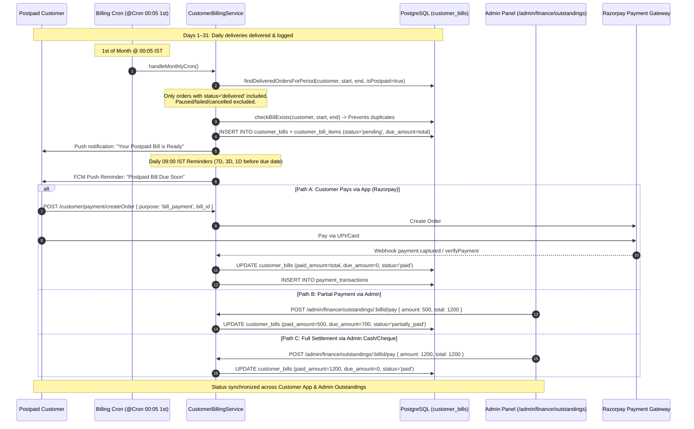

# 05 — Outstanding Bills & Postpaid Billing Master Test Specification

> **Subsystem:** Postpaid Customer Billing, Outstanding Settlement & PDF Receipts  
> **API Services:** `CustomerBillingService`, `CustomerBillingRepository`, `FinanceService`, `CustomerPaymentService`  
> **Crons:** `customer-billing.service.ts` (`00:05` 1st of month, `09:00` daily reminders)  
> **Priority:** `P0 — Core Financial Settlement & Debt Control`

---

## 1. Postpaid Billing Lifecycle & Settlement Flow

---

## 2. Comprehensive Test Cases

### 2.1 Postpaid Bill Generation & Delivered Orders Aggregation

#### OUT-GEN-001: Automated Monthly Postpaid Bill Generation
- **Module:** `Billing / Generation Engine`
- **Scenario:** Generate monthly bill aggregating only successfully delivered orders for the period
- **Priority:** `Critical`
- **Preconditions:**
  - Customer `CUST_POSTPAID_01` has active postpaid subscription.
  - In August (Aug 01–31):
    - 25 orders successfully `delivered` @ `₹70.00` = `₹1,750.00`.
    - 4 days were `paused` (no orders generated).
    - 2 orders were `failed` / undelivered.
- **Dependencies:** None
- **Steps:**
  1. Trigger monthly billing run:
     `CustomerBillingService.runMonthlyBatchBilling({ periodStart: '2026-08-01', periodEnd: '2026-08-31', dueDate: '2026-09-05' })`.
- **Expected Result:**
  - Exactly 1 new bill generated for `CUST_POSTPAID_01`.
  - Bill Total Amount = `₹1,750.00` (25 delivered orders).
  - Paused days and failed orders are completely excluded from the bill.
  - Bill status = `pending`, `due_amount = 1750.00`, `paid_amount = 0.00`.
  - Push notification dispatched to customer.
- **Database / API Verification Points:**
  - Table `customer_bills`:
    - `bill_number = 'BILL_...'`
    - `customer_id = 'CUST_POSTPAID_01'`
    - `payment_type = 'postpaid'`
    - `billing_from = '2026-08-01'`, `billing_to = '2026-08-31'`
    - `due_date = '2026-09-05'`
    - `total_amount = 1750.00`, `due_amount = 1750.00`, `paid_amount = 0.00`
    - `status = 'pending'`
  - Table `customer_bill_items`: 25 rows linking each delivered `order_id`.

#### OUT-GEN-002: Duplicate Bill Generation Prevention
- **Module:** `Billing / Idempotency`
- **Scenario:** Re-running bill generation for same customer and period skips generation
- **Priority:** `Critical`
- **Preconditions:** Bill for August 2026 already exists for `CUST_POSTPAID_01`.
- **Dependencies:** `OUT-GEN-001`
- **Steps:**
  1. Re-run `CustomerBillingService.runMonthlyBatchBilling({ customerId: 'CUST_POSTPAID_01', periodStart: '2026-08-01', periodEnd: '2026-08-31' })`.
- **Expected Result:**
  - Response returns `{ status: false, action: "skipped", message: "Bill already exists for this customer and billing period." }`.
  - Zero duplicate rows created in `customer_bills`.
- **Database / API Verification Points:**
  - `SELECT COUNT(*) FROM customer_bills WHERE customer_id = 'CUST_POSTPAID_01' AND billing_from = '2026-08-01'` returns `1`.

---

### 2.2 Payment, Partial Settlement & Status Sync

#### OUT-PAY-001: Customer Full Payment via Razorpay Online Checkout
- **Module:** `Billing / Online Settlement`
- **Scenario:** Customer pays full bill of ₹1,750.00 in Customer App via Razorpay
- **Priority:** `Critical`
- **Preconditions:** Bill `#BILL-AUG-01` with `due_amount = 1750.00`, `status = 'pending'`.
- **Dependencies:** `OUT-GEN-001`
- **Steps:**
  1. Customer opens App → **Bills & Invoices** → Selects Bill `#BILL-AUG-01`.
  2. Clicks **Pay Now (₹1,750.00)**.
  3. Completes payment via Razorpay UPI / Netbanking.
  4. Razorpay webhook `payment.captured` arrives at `/api/v1/payment/webhook`.
- **Expected Result:**
  - Bill status updates to `paid`.
  - `due_amount` becomes `₹0.00`.
  - `paid_amount` becomes `₹1,750.00`.
  - Customer App shows *"Paid on [Date]"* with green checkmark.
  - Admin Outstandings screen removes customer from active debtor list.
- **Database / API Verification Points:**
  - Table `customer_bills`: `status = 'paid'`, `due_amount = 0.00`, `paid_amount = 1750.00`, `payment_method = 'razorpay'`.
  - Table `payment_transactions`: row with `status = 'captured'`, `amount = 1750.00`, `purpose = 'bill_payment'`.

#### OUT-PAY-002: Partial Bill Settlement via Admin Finance
- **Module:** `Billing / Partial Settlement`
- **Scenario:** Customer pays ₹750 cash; Admin records partial payment leaving ₹1,000 balance
- **Priority:** `High`
- **Preconditions:** Unpaid bill of `₹1,750.00`.
- **Dependencies:** `OUT-GEN-001`
- **Steps:**
  1. Admin opens `/admin/finance/outstandings`.
  2. Clicks **Settle Bill** on `#BILL-AUG-01`.
  3. Enters `Amount = ₹750.00`, Mode = `Cash`.
  4. Clicks **Submit Partial Payment**.
- **Expected Result:**
  - Bill status updates to `partially_paid` (or `pending` with reduced due amount).
  - `paid_amount` becomes `₹750.00`.
  - `due_amount` becomes `₹1,000.00`.
  - Customer App reflects remaining balance: *"Due: ₹1,000.00 (₹750.00 paid)"*.
- **Database / API Verification Points:**
  - Table `customer_bills`: `paid_amount = 750.00`, `due_amount = 1000.00`.

#### OUT-PAY-003: Multiple Outstanding Bills Settlement Ordering
- **Module:** `Billing / Multiple Debtors`
- **Scenario:** Customer has unpaid bills from July (₹1,200) and August (₹1,750); verify FIFO settlement
- **Priority:** `High`
- **Preconditions:** Two unpaid bills exist for same customer.
- **Dependencies:** `OUT-GEN-001`
- **Steps:**
  1. Customer makes payment of `₹1,200.00` targeting July bill.
- **Expected Result:**
  - July bill transitions to `paid`.
  - August bill remains `pending` with `due_amount = 1750.00`.
  - Postpaid subscription checkout remains blocked until ALL bills are settled or within limit.
- **Database / API Verification Points:**
  - Querying `customer_bills` shows July bill `status = 'paid'` and August bill `status = 'pending'`.

---

### 2.3 Push Reminders & Overdue Transitions

#### OUT-REM-001: 7-Day, 3-Day and 1-Day Postpaid Push Notification Reminders
- **Module:** `Billing / Automated Reminders`
- **Scenario:** Verify 9 AM daily cron sends correct reminder tiers based on due date proximity
- **Priority:** `Medium`
- **Preconditions:** Unpaid bills with due dates in 7 days, 3 days, and tomorrow.
- **Dependencies:** `OUT-GEN-001`
- **Steps:**
  1. Trigger `CustomerBillingService.handlePostpaidRemindersCron()`.
- **Expected Result:**
  - Customer with bill due in 7 days receives: *"🔔 F2H Postpaid Bill Due in 7 Days"*.
  - Customer with bill due in 3 days receives: *"⏰ F2H Postpaid Bill Due in 3 Days"*.
  - Customer with bill due tomorrow receives: *"🚨 Final Alert: Postpaid Bill Due Tomorrow"*.
- **Database / API Verification Points:**
  - Table `notifications` / FCM logs record dispatched push notification payloads.

---

### 2.4 Data Consistency Across Surfaces

| Entity / Field | Database (`customer_bills`) | API (`GET /bills`) | Admin Web (`/admin/finance/outstandings`) | Customer App (`BillsScreen`) |
|---|---|---|---|---|
| **Bill Number** | `bill_number` (VARCHAR) | `billNumber` | Bill # Column | Header Title |
| **Total Amount** | `total_amount` (NUMERIC) | `totalAmount` | Total Billed (`₹1,750.00`) | Grand Total |
| **Paid Amount** | `paid_amount` (NUMERIC) | `paidAmount` | Paid Amount (`₹750.00`) | Amount Paid |
| **Due Amount** | `due_amount` (NUMERIC) | `balanceAmount` | Outstanding (`₹1,000.00`) | Pay Button Amount |
| **Status** | `status` (`pending`/`paid`) | `status` | Status Badge (`Pending`/`Paid`) | Status Tag |
| **PDF Receipt** | `/bills/receipt/:id/pdf` | Streams Binary PDF | Download PDF Button | View Invoice Button |
