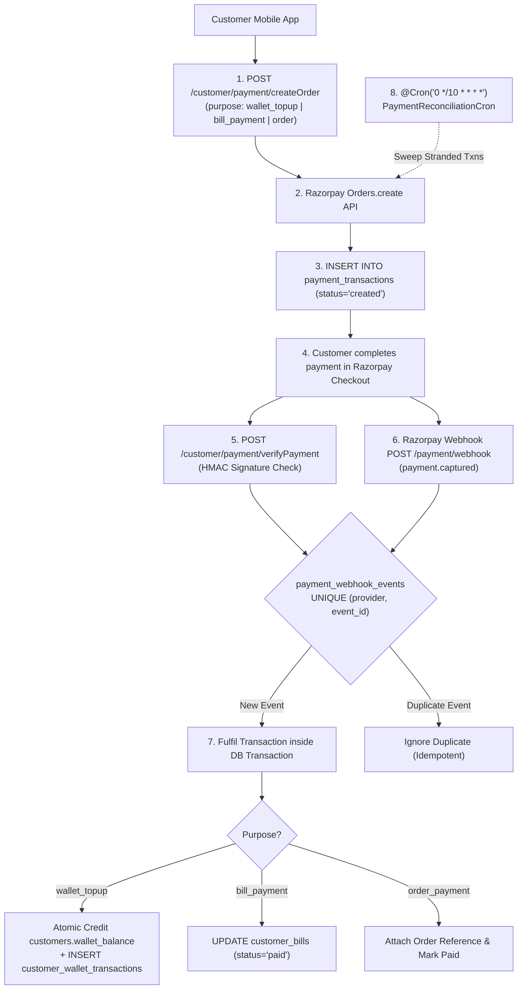

# 06 — Payments, Refunds & Wallet Ledger Master Test Specification

> **Subsystems:** Customer Wallet Ledger, Razorpay Payment Gateway, Webhooks & Subscriptions Refund Reviews  
> **API Services:** `CustomerPaymentService`, `PaymentWebhookService`, `PaymentReconciliationCron`, `RefundEligibilityService`  
> **Tables:** `customers`, `customer_wallet_transactions`, `payments`, `payment_transactions`, `payment_webhook_events`, `subscription_refund_candidates`, `subscription_refund_payouts`  
> **Priority:** `P0 — Financial Integrity & Payment Gateway Reliability`

---

## 1. Wallet & Payment Architecture



---

## 2. Test Cases

### 2.1 Customer Wallet Top-Up & Atomic Balance Mutations

#### WAL-TOP-001: Wallet Top-Up via Razorpay Gateway
- **Module:** `Wallet / Top-Up`
- **Scenario:** Customer adds ₹1,000 to wallet via UPI; balance updates atomically
- **Priority:** `Critical`
- **Preconditions:** Customer initial wallet balance = `₹200.00`.
- **Dependencies:** None
- **Steps:**
  1. In Customer App, navigate to **My Wallet** → Tap **+ Add Money**.
  2. Enter `Amount = ₹1,000.00` → Tap **Proceed to Pay**.
  3. Razorpay sheet opens. Complete mock payment with success status.
  4. App sends `verifyPayment` with valid signature.
- **Expected Result:**
  - Toast: *"₹1,000.00 added to your wallet successfully!"*.
  - Wallet balance displays `₹1,200.00`.
  - Transaction ledger displays credit entry `#WT...`.
- **Database / API Verification Points:**
  - `POST /api/v1/customer/payment/createOrder` creates row in `payment_transactions` (`amount = 1000.00`, `purpose = 'wallet_topup'`).
  - `POST /api/v1/customer/payment/verifyPayment` verifies HMAC SHA256 signature.
  - Table `customers`: `wallet_balance = 1200.00`.
  - Table `customer_wallet_transactions`: row with `transaction_type = 'credit'`, `amount = 1000.00`, `balance_after = 1200.00`, `reference_type = 'payment_topup'`.

#### WAL-DEB-001: Atomic Wallet Debit & Negative Balance Prevention
- **Module:** `Wallet / Atomic Debit`
- **Scenario:** Prevent wallet balance from going negative during concurrent debit requests
- **Priority:** `Critical`
- **Preconditions:** Customer wallet balance = `₹500.00`.
- **Dependencies:** `WAL-TOP-001`
- **Steps:**
  1. Trigger 2 concurrent order checkouts of `₹400.00` each at the exact same millisecond.
- **Expected Result:**
  - First checkout succeeds: debits `₹400.00`, leaving `₹100.00`.
  - Second checkout fails with `400 Bad Request`: *"Insufficient wallet balance"*.
  - Final wallet balance = `₹100.00` (No overdraft, no negative balance).
- **Database / API Verification Points:**
  - Atomic SQL executes:
    ```sql
    UPDATE customers SET wallet_balance = wallet_balance - 400.00
    WHERE customer_id = 'CUST_01' AND wallet_balance >= 400.00
    RETURNING wallet_balance;
    ```
  - Exactly 1 debit transaction recorded in `customer_wallet_transactions`.

---

### 2.2 Razorpay Webhook & Signature Verification

#### PAY-WBH-001: Razorpay Webhook Idempotency & Duplicate Event Shield
- **Module:** `Payment / Webhook`
- **Scenario:** Razorpay fires the same `payment.captured` webhook 3 times; verify single fulfillment
- **Priority:** `Critical`
- **Preconditions:** Order payment pending verification.
- **Dependencies:** None
- **Steps:**
  1. Send `POST /api/v1/payment/webhook` with event payload `event_id = 'evt_test_998811'`, `payment_id = 'pay_998811'`, `amount = 50000` (₹500.00).
  2. Send identical webhook request a second and third time.
- **Expected Result:**
  - First webhook returns `200 OK` and fulfills the transaction.
  - Second and third webhooks return `200 OK` (ACK to gateway) but perform zero database mutations.
- **Database / API Verification Points:**
  - Table `payment_webhook_events`: exactly 1 row for `event_id = 'evt_test_998811'`.
  - `customers.wallet_balance` credited exactly once (`+₹500.00`, not `+₹1,500.00`).

#### PAY-HMAC-001: Tampered Webhook Signature Rejection
- **Module:** `Payment / Security`
- **Scenario:** Attacker sends fake webhook with invalid `x-razorpay-signature`
- **Priority:** `Critical`
- **Preconditions:** Active webhook endpoint.
- **Dependencies:** None
- **Steps:**
  1. Send `POST /api/v1/payment/webhook` with fabricated payload and fake signature.
- **Expected Result:** Webhook rejected with `400 Bad Request` or `401 Unauthorized`: *"Invalid webhook signature"*. No database change.

---

### 2.3 Stranded Payment Reconciliation Cron

#### PAY-REC-001: Automated Sweep of Stuck Razorpay Transactions
- **Module:** `Payment / Reconciliation Cron`
- **Scenario:** Customer paid on Razorpay but browser crashed before `verifyPayment`; cron sweeps and auto-credits
- **Priority:** `Critical`
- **Preconditions:** Transaction `TXN_STRANDED_01` in `payment_transactions` with `status = 'created'`, created 15 minutes ago. Razorpay API confirms `captured`.
- **Dependencies:** None
- **Steps:**
  1. Trigger `@Cron('0 */10 * * * *')` reconciliation job.
- **Expected Result:**
  - Cron queries Razorpay API for status of `TXN_STRANDED_01`.
  - Discovers status is `captured`.
  - Calls `fulfilTransaction()` to credit customer's wallet.
  - `payment_transactions.status` updates to `captured`.
- **Database / API Verification Points:**
  - Table `customers`: `wallet_balance` credited with stranded amount.
  - Table `customer_wallet_transactions`: ledger row with `remarks = 'Reconciled via automated sweep'`.

---

### 2.4 Subscriptions & Order Refund Flows

#### RFD-ORD-001: Immediate Order Cancellation Refund to Wallet
- **Module:** `Refunds / One-Time Order`
- **Scenario:** Customer cancels eligible order paid via wallet; verify instant ledger credit
- **Priority:** `Critical`
- **Preconditions:** Order `#F2H-ORD-301` paid via wallet (`₹350.00`), status = `placed`.
- **Dependencies:** `WAL-TOP-001`
- **Steps:**
  1. Call `POST /api/v1/customer/orders/F2H-ORD-301/cancel`.
- **Expected Result:**
  - Order status updates to `cancelled`.
  - Customer wallet credited with `₹350.00`.
- **Database / API Verification Points:**
  - Executed inside single database transaction.
  - Table `customer_wallet_transactions`: row with `transaction_type = 'credit'`, `amount = 350.00`, `reference_type = 'order_refund'`, `reference_id = 'F2H-ORD-301'`.

#### RFD-SUB-001: Month-End Prepaid Subscription Refund Payout
- **Module:** `Refunds / Subscription Review`
- **Scenario:** Admin reviews and approves monthly unconsumed prepaid days payout
- **Priority:** `Critical`
- **Preconditions:** Active refund candidate rows in `subscription_refund_candidates` for customer `CUST_01` totaling `₹420.00`.
- **Dependencies:** None
- **Steps:**
  1. Admin opens `/admin/finance/refunds` → Clicks **Approve Selected Payouts**.
- **Expected Result:**
  - Candidates marked `status = 'approved'`, `is_refunded = true`.
  - Payout record created in `subscription_refund_payouts`.
  - Customer wallet credited with `₹420.00`.
- **Database / API Verification Points:**
  - Table `subscription_refund_candidates`: `is_refunded = true`.
  - Table `subscription_refund_payouts`: `status = 'completed'`, `total_amount = 420.00`.
  - Table `customer_wallet_transactions`: `amount = 420.00`, `reference_type = 'subscription_refund'`.
