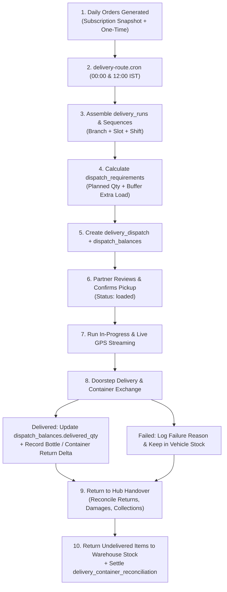

# 07 — Delivery Dispatch, Logistics & Container Reconciliation Test Specification

> **Subsystems:** Route Assembly, Dispatch Plans, Hub Handover, Baskets & Container Tracking  
> **API Services:** `DeliveryOrderService`, `WarehouseDispatchService`, `DeliveryTrackingService`  
> **Tables:** `delivery_runs`, `delivery_dispatch`, `delivery_dispatch_items`, `dispatch_requirements`, `dispatch_balances`, `containers`, `customer_container_balances`, `warehouse_containers`, `delivery_container_reconciliation`, `delivery_baskets`, `basket_movements`  
> **Priority:** `P0 — Physical Logistics, Fleet Operations & Asset Tracking`

---

## 1. Dispatch & Delivery Logistics Architecture

---

## 2. Test Cases

### 2.1 Route Assembly & Dispatch Generation

#### DSP-PLN-001: Automated Delivery Run Creation & Address Sequencing
- **Module:** `Logistics / Route Assembly`
- **Scenario:** Schedulers group orders into delivery runs and sequence stops geographically
- **Priority:** `Critical`
- **Preconditions:** Confirmed orders for tomorrow morning in `BRANCH_KUPPAM_01`.
- **Dependencies:** None
- **Steps:**
  1. Trigger route generation for `2026-09-02 Morning`.
- **Expected Result:**
  - Orders assigned to `delivery_runs`.
  - Sequential `run_sequence` numbers (1, 2, 3...) assigned per stop.
  - Linked orders update `delivery_run_id` and `run_sequence`.
- **Database / API Verification Points:**
  - Table `delivery_runs`: new row with `branch_id = 'BRANCH_KUPPAM_01'`, `delivery_slot = 'morning'`, `status = 'assigned'`.
  - Table `orders`: `delivery_run_id` references the newly created run.

#### DSP-REQ-001: Dispatch Requirements Aggregation & Extra Buffer Loading
- **Module:** `Logistics / Dispatch Requirements`
- **Scenario:** Calculate required produce quantities plus 10% buffer for milk bottles
- **Priority:** `Critical`
- **Preconditions:** 30 orders of `Milk 1L` in Run `#RUN_101`.
- **Dependencies:** `DSP-PLN-001`
- **Steps:**
  1. Inspect `dispatch_requirements` for `#RUN_101`.
- **Expected Result:**
  - Planned Quantity = `30 Bottles`.
  - Extra Loaded Buffer = `3 Bottles`.
  - Total Dispatched = `33 Bottles`.
- **Database / API Verification Points:**
  - Table `dispatch_requirements`: `planned_quantity = 30`, `extra_quantity = 3`, `total_quantity = 33`.
  - Table `dispatch_balances`: row with `dispatched_qty = 33`, `delivered_qty = 0`, `balance_qty = 33`.

---

### 2.2 Hub Pickup & Dispatch Balances

#### DSP-BAL-001: Partner Pickup Confirmation & Balance Initialization
- **Module:** `Logistics / Hub Handover`
- **Scenario:** Partner acknowledges receipt of stock at hub; balances locked
- **Priority:** `Critical`
- **Preconditions:** Run `#RUN_101` in status `assigned`.
- **Dependencies:** `DSP-REQ-001`
- **Steps:**
  1. Partner submits `POST /api/v1/delivery/orders/pickup-items/confirm`.
- **Expected Result:**
  - `delivery_dispatch.status` updates to `loaded`.
  - Dispatch balances initialized.
- **Database / API Verification Points:**
  - Table `delivery_dispatch`: `status = 'loaded'`, `handed_over_at = NOW()`.
  - Table `dispatch_balances`: verified `dispatched_qty = 33`.

---

### 2.3 Container & Returnable Glass Bottle Tracking

#### CONT-LGT-001: Doorstep Empty Bottle Collection & Customer Balance Delta
- **Module:** `Containers / Bottle Collection`
- **Scenario:** Customer receives 2 new bottles and returns 1 empty bottle; balance updates
- **Priority:** `Critical`
- **Preconditions:** Customer initial bottle balance in `customer_container_balances` = `3 Bottles`.
- **Dependencies:** `DSP-BAL-001`
- **Steps:**
  1. Partner marks stop delivered with `issued = 2`, `returned = 1`.
- **Expected Result:**
  - Customer's new bottle balance becomes `3 + 2 - 1 = 4 Bottles`.
  - Run reconciliation reflects 1 collected bottle.
- **Database / API Verification Points:**
  - Table `customer_container_balances`:
    `issued_quantity += 2`, `returned_quantity += 1`, `balance_quantity = 4`.
  - Table `delivery_container_reconciliation`: `collected_quantity = 1` for `(run_id, 'CONT-001')`.

#### CONT-LGT-002: Maximum Container Collection Validation
- **Module:** `Containers / Validation`
- **Scenario:** Partner cannot collect more containers than customer possesses (balance + order expected)
- **Priority:** `High`
- **Preconditions:** Customer balance = `1 Bottle`. Order expected = `1 Bottle` (Max allowed = 2).
- **Dependencies:** None
- **Steps:**
  1. Partner attempts to submit `returned = 5 Bottles`.
- **Expected Result:** Rejected with `400 Bad Request`: *"Cannot collect 5 containers. Customer only has 1 outstanding containers (plus 1 delivered in this order)."*.
- **Database / API Verification Points:**
  - Mutation rolled back; zero changes to database.

---

### 2.4 End-of-Run Warehouse Reconciliation

#### DSP-HND-001: End-of-Day Handover Reconciliation & Stock Restoral
- **Module:** `Logistics / Hub Handover`
- **Scenario:** Settle returned bottles, damaged items, and unsold buffer inventory
- **Priority:** `Critical`
- **Preconditions:** Run `#RUN_101` completed:
  - Dispatched: `33 Bottles Milk`
  - Delivered: `29 Bottles`
  - Returned Undamaged: `3 Bottles (Buffer)`
  - Damaged on Route: `1 Bottle`
  - Empty Bottles Collected: `25 Glass Bottles`
- **Dependencies:** `CONT-LGT-001`
- **Steps:**
  1. Partner calls `POST /api/v1/delivery/orders/run/RUN_101/handover` with breakdown.
  2. Warehouse supervisor acknowledges.
- **Expected Result:**
  - Run status updates to `handed_over`.
  - Balance quantity balances: `29 + 3 + 1 = 33` (0 discrepancy).
  - 3 undamaged milk bottles returned to warehouse inventory stock.
  - 25 collected glass bottles added to `warehouse_containers`.
- **Database / API Verification Points:**
  - Table `delivery_runs`: `status = 'handed_over'`.
  - Table `dispatch_balances`: `dispatched_qty = 33`, `delivered_qty = 29`, `returned_qty = 3`, `damaged_qty = 1`, `balance_qty = 0`.
  - Table `delivery_container_reconciliation`: `submitted_quantity = 25`, `status = 'reconciled'`.
  - Table `warehouse_containers`: `quantity` incremented by 25.
  - Table `stock_movements`: row with `movement_type = 'return_from_run'`, `quantity = 3`.
