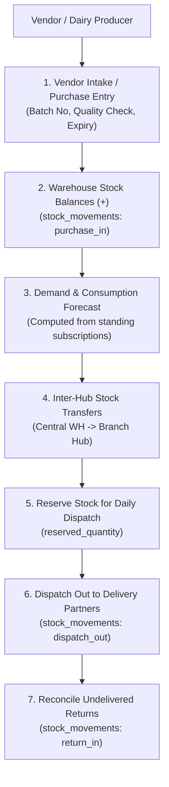

# 08 — Inventory, Warehouse & Supply Chain Test Specification

> **Subsystems:** Warehouses, Stock Balances, Stock Movements, Inter-Warehouse Transfers, Vendor Procurement & Consumption Forecasts  
> **API Services:** `WarehouseService`, `InventoryService`, `VendorLogisticsService`, `ForecastService`  
> **Tables:** `warehouses`, `stock_balances`, `stock_movements`, `stock_transfers`, `vendors`, `vendor_intakes`, `purchase_entries`, `production_plans`, `consumption_forecasts`  
> **Priority:** `P1 — Inventory Accuracy, Supply Planning & Stock Protection`

---

## 1. Inventory & Supply Chain Flow

---

## 2. Test Cases

### 2.1 Warehouse Management & Stock Movements

#### WH-STK-001: Stock Inward via Vendor Purchase Entry
- **Module:** `Inventory / Inward`
- **Scenario:** Inward 500 liters of Fresh Milk from Vendor into Kuppam Central Warehouse
- **Priority:** `Critical`
- **Preconditions:** Vendor `VR_DAIRY_01` and Warehouse `WH-KUPPAM-MAIN` exist. Initial stock = `100 L`.
- **Dependencies:** None
- **Steps:**
  1. Submit purchase intake:
     `POST /api/v1/admin/inventory/purchase-entries` with `{ warehouse_id: "WH-KUPPAM-MAIN", variant_id: "VAR_MILK_1L", quantity: 500, unit_cost: 45.00, batch_no: "BATCH-2026-09-01", vendor_id: "VR_DAIRY_01" }`.
- **Expected Result:**
  - Purchase entry created.
  - Stock balance increments to `600 L`.
  - Immutable stock movement logged.
- **Database / API Verification Points:**
  - Table `stock_balances`: `available_quantity = 600.00` for `(WH-KUPPAM-MAIN, VAR_MILK_1L)`.
  - Table `stock_movements`: row with `movement_type = 'purchase_in'`, `quantity = 500.00`, `balance_after = 600.00`.

#### WH-STK-002: Inter-Warehouse Stock Transfer
- **Module:** `Inventory / Transfers`
- **Scenario:** Transfer 100 liters of milk from Central Warehouse to Satellite Hub
- **Priority:** `High`
- **Preconditions:** Source `WH-KUPPAM-MAIN` has 600 L. Destination `WH-KUPPAM-SUB` has 20 L.
- **Dependencies:** `WH-STK-001`
- **Steps:**
  1. Admin creates stock transfer: `POST /api/v1/admin/inventory/transfers` (Quantity: 100).
  2. Source dispatches transfer (`status = 'in_transit'`).
  3. Destination confirms receipt (`status = 'received'`).
- **Expected Result:**
  - Source stock becomes `500 L`.
  - Destination stock becomes `120 L`.
  - Double movement logged (transfer_out from source, transfer_in to dest).
- **Database / API Verification Points:**
  - Table `stock_transfers`: `status = 'received'`.
  - Source `stock_balances`: `available_quantity = 500.00`.
  - Destination `stock_balances`: `available_quantity = 120.00`.

---

### 2.2 Demand Forecasting & Subscription Consumption

#### WH-FOR-001: Subscription Demand Forecast for Tomorrow
- **Module:** `Supply Chain / Demand Forecast`
- **Scenario:** Calculate required produce procurement from active subscription schedule matrix
- **Priority:** `High`
- **Preconditions:** Active subscriptions scheduled for tomorrow totaling 420 liters of milk.
- **Dependencies:** None
- **Steps:**
  1. Open `/admin/production` → View Demand Forecast for Tomorrow.
- **Expected Result:**
  - Milk demand computed: `420 L (Subscription) + 42 L (10% Buffer) = 462 L Required`.
  - Alert displays if current stock < required.
- **Database / API Verification Points:**
  - Forecast calculation matches exact aggregate of `subscription_weekly_schedule` for tomorrow's day-of-week minus active pauses.

---

### 2.3 Out-of-Stock Protections

#### WH-OOS-001: Out-of-Stock Variant Cart Gating
- **Module:** `Catalog / Stock Protection`
- **Scenario:** Product variant marked `is_out_of_stock = true` blocks customer one-time cart checkout
- **Priority:** `High`
- **Preconditions:** Variant `VAR_MANGO_1KG` has `is_out_of_stock = true` in `product_variants`.
- **Dependencies:** None
- **Steps:**
  1. Customer attempts to add or checkout `VAR_MANGO_1KG`.
- **Expected Result:**
  - App displays *"Out of Stock"* badge.
  - Checkout rejects item with `400 Bad Request`: *"Product variant is currently out of stock"*.
- **Database / API Verification Points:**
  - API validation enforces `is_out_of_stock = false` before accepting one-time order groups.
