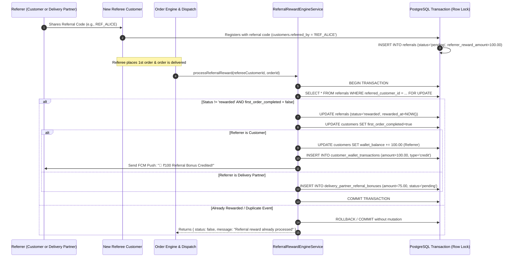

# 09 — Customer & Delivery Partner Referrals Master Test Specification

> **Subsystems:** Customer Referral Wallet Rewards & Delivery Partner Acquisition Bonuses  
> **API Services:** `ReferralRewardEngineService`, `FirstOrderDetectorService`, `CustomerReferralService`, `DeliveryPartnerReferralService`  
> **Tables:** `customers`, `referrals`, `customer_wallet_transactions`, `delivery_partner_referral_bonuses`, `notifications`  
> **Priority:** `P0 — Growth Engine & Reward Anti-Fraud Protection`

---

## 1. Referral Reward Engine Lifecycle

---

## 2. Test Cases

### 2.1 Customer-to-Customer Referrals

#### REF-CUST-001: End-to-End Customer Referral Flow & ₹100 Wallet Reward
- **Module:** `Referrals / Customer`
- **Scenario:** Customer A refers Customer B; upon B's first delivery, A receives ₹100 in wallet
- **Priority:** `Critical`
- **Preconditions:**
  - Customer A (`CUST_A`) has wallet balance = `₹50.00`.
  - Customer B (`CUST_B`) registers using A's referral code.
- **Dependencies:** None
- **Steps:**
  1. Customer B completes one-time order `#F2H-ORD-B1`.
  2. Delivery partner delivers `#F2H-ORD-B1` and uploads proof.
  3. `ReferralRewardEngineService.processReferralReward('CUST_B', 'F2H-ORD-B1')` is triggered.
- **Expected Result:**
  - Referral status transitions to `rewarded`.
  - Customer A's wallet balance increases to `₹150.00` (`+₹100.00`).
  - Customer B's profile updates `first_order_completed = true`.
  - Customer A receives FCM Push Notification: *"🎉 Referral Bonus Received! ₹100 credited to your wallet!"*.
- **Database / API Verification Points:**
  - Table `referrals`: `status = 'rewarded'`, `rewarded_at` is set.
  - Table `customers` (Customer A): `wallet_balance = 150.00`.
  - Table `customer_wallet_transactions`: row with `transaction_type = 'credit'`, `amount = 100.00`, `balance_after = 150.00`, `reference_type = 'referral_bonus'`.

#### REF-CUST-002: Double Reward Fraud Prevention
- **Module:** `Referrals / Idempotency`
- **Scenario:** Delivery partner marks order delivered multiple times; verify reward credited ONLY once
- **Priority:** `Critical`
- **Preconditions:** Reward for `CUST_B` already processed in `REF-CUST-001`.
- **Dependencies:** `REF-CUST-001`
- **Steps:**
  1. Re-invoke `ReferralRewardEngineService.processReferralReward('CUST_B', 'F2H-ORD-B1')`.
  2. Customer B places a second order `#F2H-ORD-B2` and it is delivered.
- **Expected Result:**
  - Engine detects `referrals.status = 'rewarded'` and `first_order_completed = true`.
  - Rejection response returned: `{ status: false, message: "Referral reward already processed previously." }`.
  - Customer A's wallet balance remains `₹150.00` (NO second ₹100 credit).
- **Database / API Verification Points:**
  - `SELECT COUNT(*) FROM customer_wallet_transactions WHERE customer_id = 'CUST_A' AND reference_type = 'referral_bonus'` returns exactly `1`.

#### REF-CUST-003: Self-Referral Prevention
- **Module:** `Referrals / Security`
- **Scenario:** Customer attempts to refer their own phone number or email
- **Priority:** `High`
- **Preconditions:** Active customer `CUST_A` with phone `9123456780`.
- **Dependencies:** None
- **Steps:**
  1. New account registration with phone `9123456780` inputs referral code of `CUST_A`.
- **Expected Result:**
  - Registration rejects duplicate phone or ignores self-referral code with error: *"You cannot refer your own account"*.
- **Database / API Verification Points:**
  - No row created in `referrals` where `referrer_customer_id = referred_customer_id`.

---

### 2.2 Delivery Partner Acquisition Bonuses

#### REF-PART-001: Delivery Partner Referral ₹75 Bonus Accrual
- **Module:** `Referrals / Partner Bonus`
- **Scenario:** Delivery partner `DP_01` refers customer `CUST_C`; on first delivery, ₹75 bonus logged
- **Priority:** `Critical`
- **Preconditions:** Delivery partner `DP_01` exists in `delivery_partners`. `CUST_C` signs up with code `DP_01`.
- **Dependencies:** None
- **Steps:**
  1. `CUST_C` completes first order `#F2H-ORD-C1`.
  2. `ReferralRewardEngineService.processReferralReward('CUST_C', 'F2H-ORD-C1')` triggers.
- **Expected Result:**
  - Engine detects referrer is in `delivery_partners` table.
  - Inserts ₹75 pending bonus into `delivery_partner_referral_bonuses`.
  - Customer `CUST_C` wallet is NOT credited with referrer bonus.
- **Database / API Verification Points:**
  - Table `delivery_partner_referral_bonuses`: row with `partner_id = 'DP_01'`, `amount = 75.00`, `status = 'pending'`, `order_id = 'F2H-ORD-C1'`.
  - Table `referrals`: `status = 'rewarded'`, `referrer_reward_amount = 75.00`.
