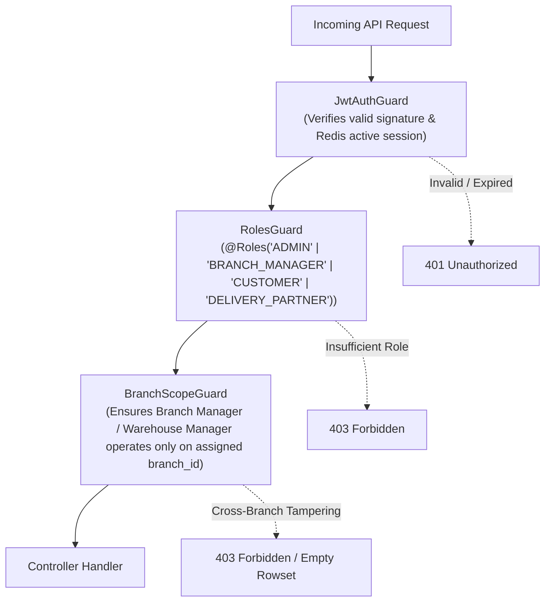

# 10 — Roles, Permissions, Branch Scoping & Security Test Specification

> **Subsystems:** Role-Based Access Control (RBAC), Branch Isolation, Warehouse Scoping & IDOR Defense  
> **Guards & Middleware:** `JwtAuthGuard`, `RolesGuard`, `BranchScopeGuard`, `RoleHeaderMiddleware`  
> **Tables:** `users`, `roles`, `role_assignments`, `admin_roles`, `management_staff`, `admin_audit_logs`  
> **Priority:** `P0 — System Security, Data Isolation & Privilege Enforcement`

---

## 1. Multi-Role Authorization & Scoping Matrix

| Role | Scope & Permissions | Restricted Surfaces |
|---|---|---|
| **SUPER ADMIN** (`ADMIN`) | Global full access across all branches, warehouses, finance & system settings | None |
| **BRANCH MANAGER** (`BRANCH_MANAGER`) | Full control within assigned `branch_id` (orders, routes, delivery partners, branch inventory) | Other branches' revenue, reports, company-wide profile |
| **WAREHOUSE MANAGER** (`WAREHOUSE_MANAGER`) | Stock intakes, movements, transfers, packaging & container stocks for assigned warehouse | Financial outstandings, customer wallets, system configs |
| **DELIVERY MANAGER** (`DELIVERY_MANAGER`) | Partner onboarding, shift approvals, run dispatch, leave requests | Finance, product master tariffs, system settings |
| **DELIVERY PARTNER** (`DELIVERY_PARTNER`) | Assigned delivery runs, pickup items, stop delivery proofs, shift toggles | All admin modules, other partners' runs |
| **CUSTOMER** (`CUSTOMER`) | Own cart, addresses, orders, subscriptions, wallet ledger, bills | All admin, warehouse, and partner endpoints |

---

## 2. Security & Access Control Test Cases

### 2.1 Role-Based Access Control (RBAC) Tests

#### SEC-RBAC-001: Customer Token Blocked from Admin Endpoints (403 Forbidden)
- **Module:** `Security / RBAC`
- **Scenario:** Customer token attempting to access any `/admin/*` API endpoint is rejected with 403
- **Priority:** `Critical`
- **Preconditions:** Valid customer JWT token for `CUST_01`.
- **Dependencies:** None
- **Steps:**
  1. Send `GET /api/v1/admin/customer/table` with `Authorization: Bearer <CustomerToken>`.
  2. Send `GET /api/v1/admin/finance/outstandings` with `Authorization: Bearer <CustomerToken>`.
  3. Send `POST /api/v1/admin/catalog/products/saveAdd` with `Authorization: Bearer <CustomerToken>`.
- **Expected Result:** All three requests return `403 Forbidden`: `{"statusCode": 403, "message": "Insufficient role", "error": "Forbidden"}`.
- **Database / API Verification Points:**
  - Zero admin data leaked. Requests rejected before hitting service layer.

#### SEC-RBAC-002: Delivery Partner Blocked from Customer & Admin Write Endpoints
- **Module:** `Security / RBAC`
- **Scenario:** Delivery Partner token cannot checkout customer carts or modify admin product catalog
- **Priority:** `Critical`
- **Preconditions:** Valid Delivery Partner JWT token.
- **Dependencies:** None
- **Steps:**
  1. Send `POST /api/v1/customer/checkout/payment` with `Authorization: Bearer <PartnerToken>`.
  2. Send `POST /api/v1/admin/special-prices` with `Authorization: Bearer <PartnerToken>`.
- **Expected Result:** Both requests return `403 Forbidden`.

---

### 2.2 Branch Scoping & Cross-Tenant Data Isolation

#### SEC-BRN-001: Branch Manager Restricted to Assigned Branch Data
- **Module:** `Security / Branch Scoping`
- **Scenario:** Branch Manager of `BRANCH_KUPPAM_01` cannot read or edit orders from `BRANCH_BANGALORE_02`
- **Priority:** `Critical`
- **Preconditions:** User `bm.kuppam` has role `BRANCH_MANAGER` assigned strictly to `BRANCH_KUPPAM_01`.
- **Dependencies:** None
- **Steps:**
  1. Branch manager calls `GET /api/v1/admin/orders/table?branch_id=BRANCH_BANGALORE_02`.
  2. Branch manager attempts to update order `#ORD_BLR_999` belonging to Bangalore branch.
- **Expected Result:**
  - Query 1 returns empty results or forces `branch_id = 'BRANCH_KUPPAM_01'`.
  - Mutation 2 rejected with `403 Forbidden`: *"Access denied for specified branch"*.
- **Database / API Verification Points:**
  - `BranchScopeGuard` enforces `req.user.branch_id == target.branch_id`.

#### SEC-WH-001: Warehouse Manager Restricted to Permitted Warehouse
- **Module:** `Security / Warehouse Scoping`
- **Scenario:** Warehouse manager of Hub A cannot perform stock transfers from Hub B without permission
- **Priority:** `High`
- **Preconditions:** User assigned to `WH-KUPPAM-MAIN`.
- **Dependencies:** None
- **Steps:**
  1. Attempt to dispatch stock from `WH-BANGALORE-CENTRAL`.
- **Expected Result:** Rejected with `403 Forbidden`: *"You do not have management permissions for the source warehouse"*.

---

### 2.3 Insecure Direct Object Reference (IDOR) Defenses

#### SEC-IDOR-001: Customer Cannot View or Modify Another Customer's Cart / Address / Bill
- **Module:** `Security / IDOR Defense`
- **Scenario:** Authenticated Customer A attempts to sync cart or fetch bills for Customer B
- **Priority:** `Critical`
- **Preconditions:** Customer A logged in with user ID `USER_ALICE`. Customer B has ID `USER_BOB`.
- **Dependencies:** None
- **Steps:**
  1. Alice sends `POST /api/v1/customer/cart-sync` with body `{ "customer_id": "USER_BOB", "items": [...] }`.
  2. Alice sends `GET /api/v1/customer/orders/order_of_bob`.
  3. Alice sends `GET /api/v1/bills/receipt/bill_of_bob/pdf`.
- **Expected Result:**
  - Step 1: Server overwrites `customer_id` with `USER_ALICE` extracted securely from verified JWT payload (Bob's cart remains untouched).
  - Step 2: Request returns `404 Not Found` or `403 Forbidden`.
  - Step 3: Returns `403 Forbidden`: *"Unauthorized to access this bill"*.
- **Database / API Verification Points:**
  - Table `carts`: Bob's cart row is unmodified. Alice's own row is updated.
