# 11 — Comprehensive End-to-End Test Scenarios

> **Scope:** Full-System Cross-Surface Integration Scenarios  
> **Participating Surfaces:** Customer Mobile App, Admin Web Panel, Delivery Partner Mobile App, Backend API, PostgreSQL, BullMQ, Redis, Razorpay, Firebase FCM  
> **Priority:** `P0 — End-to-End Business Flow Validation`

---

## 1. Summary of E2E Master Scenarios

```mermaid
gantt
    title 12 Complete Cross-Surface Business Scenarios
    dateFormat X
    axisFormat %s
    section Retail & On-Demand
    E2E-01 Customer Signup to COD Delivery          :crit, e1, 0, 10
    E2E-02 Wallet Topup to Paid Delivery            :crit, e2, 0, 10
    E2E-03 Referral Signup to ₹100 Reward           :crit, e3, 0, 10
    section Subscriptions Lifecycle
    E2E-04 Prepaid Subscription Full Lifecycle      :crit, e4, 0, 10
    E2E-05 Paused Day Month-End Wallet Refund       :crit, e5, 0, 10
    E2E-06 Failed Delivery Refund Workflow          :crit, e6, 0, 10
    section Postpaid & Billing
    E2E-07 Postpaid Subscription to Settlement      :crit, e7, 0, 10
    E2E-08 Multi-Bill Partial to Full Settlement    :crit, e8, 0, 10
    section Logistics & Partner
    E2E-09 Partner Acquisition Bonus Flow           :active, e9, 0, 10
    E2E-10 Dispatch Buffer & Handover Returns       :active, e10, 0, 10
    E2E-11 Glass Bottle Circulation Reconciliation  :active, e11, 0, 10
    E2E-12 Branch Geofence to Dispatch Assignment   :active, e12, 0, 10
```

---

## 2. End-to-End Test Scenarios

### E2E-001: Customer Signup → Address → Product → Cart → COD Order → Admin Run → Partner Delivery → Delivered
- **Scenario:** Full on-demand Cash on Delivery retail journey across Customer, Admin, and Delivery Partner apps.
- **Priority:** `Critical`
- **Steps:**
  1. **Customer App:** New user registers with phone `+91 9111222333`, enters address at `12.7485, 78.3644` (Kuppam).
  2. Customer adds `Farm Fresh Milk 1L` (`₹75.00`) and `Country Eggs 6pcs` (`₹60.00`) to cart.
  3. Customer checks out with **Cash on Delivery (COD)** for Tomorrow Morning slot (`Total = ₹135.00`).
  4. **Admin Web:** Order `#F2H-ORD-E2E1` appears in `/admin/live-orders` with status `placed`.
  5. Schedulers assign order to Delivery Run `#RUN_KUP_M1` and Delivery Partner `Ramesh`.
  6. **Delivery Partner App:** Ramesh sees pickup items (1 Milk, 1 Eggs) → Confirms pickup (`dispatch_status = 'loaded'`).
  7. Ramesh starts run (`orders.status = 'out_for_delivery'`).
  8. Arrives at customer doorstep → Takes proof photo → Collects `₹135.00` in Cash → Taps **Mark as Delivered**.
  9. **Customer App:** Push notification received: *"Order Delivered!"*. Status in Order History shows `Delivered`.
  10. **Delivery Partner App:** At end of run, Ramesh submits handover of `₹135.00` cash to hub supervisor.
- **Verification Points:**
  - `orders.status = 'delivered'`, `orders.payment_status = 'paid'`.
  - `dispatch_balances.delivered_qty` incremented.
  - `customers.first_order_completed = true`.

---

### E2E-002: Customer Signup → Wallet Topup → Checkout → Delivery → Ledger Verification
- **Scenario:** Customer tops up wallet via Razorpay, places prepaid order, and verifies balance ledger.
- **Priority:** `Critical`
- **Steps:**
  1. Customer adds `₹500.00` to wallet using UPI in Customer App.
  2. Wallet balance becomes `₹500.00`.
  3. Customer orders `Organic Ghee 500ml` (`₹380.00`) using Wallet Payment.
  4. Wallet debited atomically to `₹120.00`.
  5. Order dispatched and delivered by partner.
- **Verification Points:**
  - `customer_wallet_transactions`: 2 rows (Topup `+₹500.00`, Order `−₹380.00`, balance after `₹120.00`).
  - `orders.payment_status = 'paid'`, `orders.payment_mode = 'wallet'`.

---

### E2E-003: Referral Signup → First Order Completed → ₹100 Referral Reward
- **Scenario:** Referrer Alice gives code to Bob; Bob completes first delivery; Alice receives ₹100.
- **Priority:** `Critical`
- **Steps:**
  1. Alice copies referral code `REF_ALICE`.
  2. Bob registers with code `REF_ALICE`.
  3. Bob places first order (`₹150.00`).
  4. Delivery partner delivers Bob's order.
  5. System unlocks reward: Alice's wallet credited with `₹100.00`.
  6. Alice receives notification: *"🎉 ₹100 Referral Bonus Received!"*.
- **Verification Points:**
  - `referrals.status = 'rewarded'`.
  - Alice's `customers.wallet_balance` increased by `100.00`.
  - Bob's `customers.first_order_completed = true`.

---

### E2E-004: Prepaid Subscription → Daily Cron → Dispatch → Doorstep Delivery
- **Scenario:** Standing prepaid subscription produces morning orders daily via automated cron.
- **Priority:** `Critical`
- **Steps:**
  1. Customer subscribes to `Milk 1L` (`₹70.00/day`) for 30 days. Wallet debited `₹2,100.00`.
  2. At `23:55` IST, `subscription-snapshot.cron` runs.
  3. Generates concrete order `#F2H-ORD-SUB1` for tomorrow morning.
  4. At `00:00` IST, `delivery-route.cron` assigns order to morning delivery run.
  5. Partner loads milk, delivers stop, and captures photo proof.
- **Verification Points:**
  - Order generated with `order_source = 'subscription'`.
  - `orders.total_amount = 70.00`, `orders.payment_status = 'paid'`.
  - No additional wallet debit on delivery day (already prepaid).

---

### E2E-005: Prepaid Subscription → Paused Days → Month-End Refund → Customer Wallet Credit
- **Scenario:** Customer pauses subscription for 4 days; system refunds unconsumed days to wallet.
- **Priority:** `Critical`
- **Steps:**
  1. Customer pauses Sep 10 to Sep 13 (4 days @ `₹70.00` = `₹280.00`).
  2. Snapshot cron skips order generation on Sep 10–13.
  3. At month-end, `RefundEligibilityService.scanMonth()` detects 4 paused days.
  4. 4 candidate rows created in `subscription_refund_candidates` valued at `final_price` (`₹70.00`).
  5. Admin reviews `/admin/finance/refunds` and clicks **Approve Payout**.
  6. Customer wallet credited with `₹280.00`.
- **Verification Points:**
  - `subscription_refund_payouts` records completed payout of `280.00`.
  - `customer_wallet_transactions` records refund credit of `280.00`.

---

### E2E-006: Prepaid Subscription → Failed Delivery → Admin Approval → Wallet Refund
- **Scenario:** Delivery partner marks subscription order failed (customer not home); refund credited.
- **Priority:** `Critical`
- **Steps:**
  1. Partner marks morning subscription order failed (`delivery_status = 'failed'`).
  2. Undelivered milk bottle returned to hub stock.
  3. System flags failed order as refund candidate (`amount = ₹70.00`).
  4. Admin approves refund. Customer receives `₹70.00` in wallet.
- **Verification Points:**
  - `orders.status = 'failed'`.
  - `subscription_refund_candidates.refund_reason = 'failed'`.
  - `customer_wallet_transactions` credited with `70.00`.

---

### E2E-007: Postpaid Subscription → Daily Orders → Monthly Bill → Razorpay Payment
- **Scenario:** Postpaid subscriber receives 26 deliveries; bill generated on 1st; paid via Razorpay.
- **Priority:** `Critical`
- **Steps:**
  1. Customer creates postpaid subscription (Credit limit `₹3,000.00`).
  2. 26 deliveries completed in August (`26 × ₹70.00 = ₹1,820.00`).
  3. On Sep 01 at `00:05` IST, monthly billing cron generates Bill `#BILL-AUG-01` for `₹1,820.00`.
  4. Customer receives bill push notification.
  5. Customer opens app and pays `₹1,820.00` via Razorpay UPI.
  6. Webhook confirms capture. Bill status updates to `paid`.
- **Verification Points:**
  - `customer_bills`: `status = 'paid'`, `due_amount = 0.00`, `paid_amount = 1820.00`.
  - Admin outstandings ledger updates in real-time.

---

### E2E-008: Postpaid Multi-Bill Partial Payment → Balance Settlement
- **Scenario:** Customer with two unpaid bills pays partially and settles remaining balance.
- **Priority:** `High`
- **Steps:**
  1. Customer has July bill (`₹1,000.00`) and August bill (`₹1,820.00`). Total due = `₹2,820.00`.
  2. Customer pays `₹1,000.00` targeting July bill → July bill marked `paid`.
  3. Customer makes partial payment of `₹820.00` on August bill → August bill marked `partially_paid` (Due `₹1,000.00`).
  4. Next week, customer pays remaining `₹1,000.00` → August bill marked `paid`.
- **Verification Points:**
  - Both bills in `customer_bills` reflect `status = 'paid'`, `due_amount = 0.00`.

---

### E2E-009: Delivery Partner Referral → Month-End Acquisition Bonus Payout
- **Scenario:** Partner refers 5 new customers; earns ₹375 bonus added to monthly salary.
- **Priority:** `High`
- **Steps:**
  1. Partner `DP_01` acquires 5 new customers.
  2. All 5 complete their first delivery.
  3. 5 rows of `₹75.00` logged in `delivery_partner_referral_bonuses` (Total `₹375.00`).
  4. Month-end payroll query aggregates bonuses into partner total salary payout.
- **Verification Points:**
  - `SUM(amount)` in `delivery_partner_referral_bonuses` = `375.00`.

---

### E2E-010: Dispatch Buffer Loading → Handover Returns → Warehouse Stock Restoral
- **Scenario:** Partner loads 30 planned + 3 extra milk bottles; returns 3 unsold bottles to warehouse.
- **Priority:** `Critical`
- **Steps:**
  1. Hub dispatches `33 Bottles` to partner.
  2. Partner delivers 30 bottles on route.
  3. Partner returns 3 unsold buffer bottles to hub.
  4. Supervisor completes handover in Admin panel.
- **Verification Points:**
  - `dispatch_balances`: `dispatched_qty = 33`, `delivered_qty = 30`, `returned_qty = 3`, `balance_qty = 0`.
  - Warehouse `stock_balances` restored by 3 bottles (`movement_type = 'return_from_run'`).

---

### E2E-011: Returnable Glass Bottle Circulation & Handover Reconciliation
- **Scenario:** Partner delivers milk in glass bottles, collects empties from customers, returns to hub.
- **Priority:** `Critical`
- **Steps:**
  1. Partner issues 25 full glass bottles to customers.
  2. Collects 22 empty glass bottles from previous deliveries.
  3. Delivers 22 empties back to warehouse container storage.
- **Verification Points:**
  - Customer container balances updated for each stop.
  - `delivery_container_reconciliation`: `collected_quantity = 22`, `status = 'reconciled'`.
  - Warehouse `warehouse_containers` stock incremented by 22 bottles.

---

### E2E-012: Branch Geofence → Customer Address → Stock Intake → Order Assignment
- **Scenario:** Admin sets up new branch polygon; customer orders inside boundary; order assigned to branch hub.
- **Priority:** `Critical`
- **Steps:**
  1. Admin creates `BRANCH_KUPPAM_01` with Google Maps polygon and links `WH-KUPPAM-MAIN`.
  2. Warehouse intakes stock for `VAR_MILK_1L`.
  3. Customer registers address within polygon coordinates.
  4. Customer places order.
  5. Order correctly inherits `branch_id = 'BRANCH_KUPPAM_01'` and routes to Kuppam warehouse hub.
- **Verification Points:**
  - `orders.branch_id = 'BRANCH_KUPPAM_01'`.
  - `delivery_runs.branch_id = 'BRANCH_KUPPAM_01'`.
