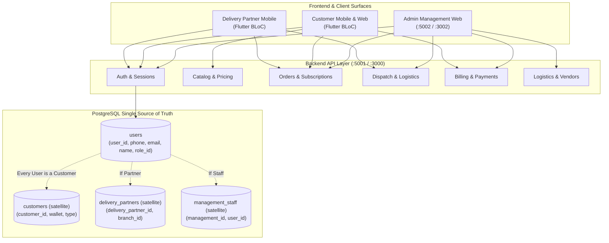

# F2H Fresh — Master Test Plan (18-09-2026)

> **Platform Version:** F2H Fresh 2026 Unified Architecture  
> **Test Date:** 18 September 2026  
> **Repository:** `dev.f2hfresh.com`  
> **Scope:** Full-Stack Quality Assurance across all applications from start:
> - **Admin Web Portal** (`apps/web`)
> - **Customer Mobile & Web App** (`apps/mobile/customer`)
> - **Delivery Partner Mobile & Web App** (`apps/mobile/delivery`)
> - **Backend REST API** (`apps/api` — NestJS, Redis, BullMQ)
> - **PostgreSQL Database** (`f2h_dev`, Migrations 001-028)
> - **Cross-App End-to-End Business Integration Workflows**

---

## 1. System Topology & Core Architecture Rules

### Core Architectural Rules Under Test
1. **Users Schema Single Source of Truth**: All identity attributes (`first_name`, `last_name`, `phone`, `email`, `user_name`) reside exclusively on `users`. Satellite tables (`customers`, `delivery_partners`, `management_staff`) contain only domain extension fields.
2. **Universal Customer Rule**: Every user in the system is a customer. Delivery partners registered via the app, admin-created partners, and admin-created staff automatically provision a corresponding record in `customers`.
3. **Phone Number Storage**: Whenever a user provides a phone number (signup, OTP verification, admin create customer, admin create partner, admin create staff), it must be persisted on `users.phone`.
4. **REST API Naming**: Lowercase `kebab-case` for all route roots and endpoints, preserving backward-compatibility aliases where necessary.
5. **Database Parameter Binding**: `$1`, `$2` PostgreSQL parameter placeholders; no MySQL `?` placeholders.

---

## 2. Test Plan Modular Index

The detailed test specifications are partitioned into the following test plans:

| Plan File | Area Under Test | Key Focus Areas |
|---|---|---|
| [`01-admin-panel.md`](file:///home/f2hfresh-dev/htdocs/dev.f2hfresh.com/.claude/test/18-09-2026/test-plan/01-admin-panel.md) | Admin Panel Web | Authentication, Staff Management, Customer Management, Delivery Partner Management, Vendor Logistics, Inventory, Finance & Invoicing |
| [`02-customer-app.md`](file:///home/f2hfresh-dev/htdocs/dev.f2hfresh.com/.claude/test/18-09-2026/test-plan/02-customer-app.md) | Customer App (Mobile/Web) | OTP Sign-In & Registration, Address Geocoding, Catalog & Pricing, Subscriptions, One-Time Orders, Calendar Schedule, Delivery Orders & Details |
| [`03-delivery-partner-app.md`](file:///home/f2hfresh-dev/htdocs/dev.f2hfresh.com/.claude/test/18-09-2026/test-plan/03-delivery-partner-app.md) | Delivery Partner App | Partner Auth, Universal Customer Linking, Shift Toggle, Run Management, Route & Order Details, Delivery Status Proof, Container Handover |
| [`04-backend-api-and-db.md`](file:///home/f2hfresh-dev/htdocs/dev.f2hfresh.com/.claude/test/18-09-2026/test-plan/04-backend-api-and-db.md) | Backend API & Database | REST Routes, SQL Joins & Schema Integrity, Migration 001-028 verification, Universal Customer Provisioning & Phone Persistence |
| [`05-end-to-end-integration-flows.md`](file:///home/f2hfresh-dev/htdocs/dev.f2hfresh.com/.claude/test/18-09-2026/test-plan/05-end-to-end-integration-flows.md) | Cross-Application Flows | End-to-end user lifecycle: Sign-up -> Subscription -> Dispatch -> Run Assignment -> Delivery -> Invoicing & Payment |

---

## 3. Test Execution Methodology

1. **Phase 1: Automated API & Database Verification**
   - Execute HTTP REST API contract assertions with bearer tokens and payload validation.
   - Verify PostgreSQL database constraints, triggers, and foreign keys across all active tables.
2. **Phase 2: Surface & Feature Functional Validation**
   - Test Admin Panel, Customer App, and Delivery Partner App endpoints and behaviors.
   - Verify recent enhancements: Subscription Details UI changes, PDF generation overflow fixes, and universal customer provisioning.
3. **Phase 3: Results Compilation & Issue Logging**
   - Record comprehensive evidence and response outputs in `.claude/test/18-09-2026/test-results/`.
