# 01 — Admin Panel Test Specification (`apps/web`)

> **Application Surface:** Next.js 16 App Router Admin Panel (`f2hfresh.com/admin/*` or `:5002`)  
> **API Controllers:** `src/panels/admin/*`, `src/auth/*`, `src/users/*`  
> **Target Audience:** Super Admin (Single `ADMIN` Role for all Admin Panel Modules)

---

## 1. Module Overview & Route Map

The Admin Panel organizes operations across eight major route groups:

```mermaid
graph TD
    ADMIN["/admin"] --> BM["(BRANCH_MANAGEMENT)"]
    ADMIN --> CI["(CATALOG_INVENTORY)"]
    ADMIN --> CO["(CUSTOMERS_ORDERS)"]
    ADMIN --> DM["(DELIVERY_MANAGEMENT)"]
    ADMIN --> FG["(FINANCE_GROWTH)"]
    ADMIN --> LV["(LOGISTICS_VENDORS)"]
    ADMIN --> OPS["(OPERATIONS)"]
    ADMIN --> PS["(PROFILE_SYSTEM)"]

    BM --> B1["/admin/branches"] & B2["/admin/zones"] & B3["/admin/staffs"]
    CI --> C1["/admin/catalog"] & C2["/admin/inventory"] & C3["/admin/production"] & C4["/admin/warehouse"]
    CO --> O1["/admin/customers"] & O2["/admin/orders"] & O3["/admin/subscriptions"]
    DM --> D1["/admin/delivery/delivery-boys"] & D2["/admin/delivery/runs"] & D3["/admin/delivery/tracking"]
    FG --> F1["/admin/finance/outstandings"] & F2["/admin/finance/bills"] & F3["/admin/reports"]
    LV --> L1["/admin/vendors"]
    OPS --> OP1["/admin/dashboard"] & OP2["/admin/live-orders"] & OP3["/admin/delivery-tracking"]
    PS --> P1["/admin/profile"] & P2["/admin/system/roles"] & P3["/admin/system/audit"] & P4["/admin/developer"]
```



---

## 2. Test Cases by Functional Area

### 2.1 Authentication, Session & Access Control

#### ADM-AUTH-001: Admin Login via Password Credentials
- **Module:** `Admin / Auth`
- **Scenario:** Valid Super Admin credentials login to Admin Panel
- **Priority:** `Critical`
- **Preconditions:** Active user exists in `users` with `role_assignments` containing role `ADMIN`.
- **Dependencies:** None
- **Steps:**
  1. Navigate to `/login`.
  2. Input `identifier = 'admin@f2hfresh.com'` and `password = 'MasterAdminPass!2026'`.
  3. Click **Sign In**.
- **Expected Result:** Successfully authenticated. JWT stored in `access_token` cookie and local session state. Redirected to `/admin/dashboard`. Navigation header displays Admin avatar and role badge.
- **Database / API Verification Points:**
  - `POST /api/v1/auth/login` returns `200 OK` with `{ status: true, access_token: "...", user: { user_id, email, roles: [...] } }`.
  - Header `Set-Cookie: access_token=...; HttpOnly; Path=/; SameSite=Lax`.
  - Redis key `f2h_user_jwt_<userId>` updated with new active session entry.
  - Table `auth_logs` contains new row with `action = 'login'`, `status = 'success'`, `ip_address`, `user_agent`.

#### ADM-AUTH-002: Invalid Password Rejection & Rate Limiting
- **Module:** `Admin / Auth`
- **Scenario:** Incorrect password rejection and 5-attempt brute-force lock
- **Priority:** `High`
- **Preconditions:** Valid admin user exists.
- **Dependencies:** `ADM-AUTH-001`
- **Steps:**
  1. Attempt login with invalid password 5 consecutive times.
- **Expected Result:** Login rejected with clear toast: *"Invalid credentials"*. On 6th attempt, throttler returns `429 Too Many Requests`.
- **Database / API Verification Points:**
  - `POST /api/v1/auth/login` returns `401 Unauthorized` for attempts 1–5.
  - 6th attempt returns `429 Too Many Requests` (`CustomThrottlerGuard`).
  - Table `auth_logs` records failed attempts.

#### ADM-AUTH-003: Session Logout & Revocation
- **Module:** `Admin / Auth`
- **Scenario:** Admin logs out of the session
- **Priority:** `High`
- **Preconditions:** Admin is logged in.
- **Dependencies:** `ADM-AUTH-001`
- **Steps:**
  1. Click Profile Menu → **Logout**.
- **Expected Result:** Redirected to `/login`. Cookie `access_token` cleared.
- **Database / API Verification Points:**
  - `POST /api/v1/auth/logout` returns `200 OK`.
  - Redis key `f2h_user_jwt_<userId>` session entry deleted. Subsequent API calls with old token return `401 Token revoked`.

---

### 2.2 Dashboard, Operations Console & Analytics

#### ADM-DASH-001: Operational Dashboard Metrics & Live Status
- **Module:** `Admin / Dashboard` (`/admin/dashboard`, `(OPERATIONS)/dashboard`)
- **Scenario:** Render KPIs, order counters, active deliveries, and system status
- **Priority:** `High`
- **Preconditions:** Database has active orders, deliveries, and customers.
- **Dependencies:** `ADM-AUTH-001`
- **Steps:**
  1. Open `/admin/dashboard`.
  2. Inspect KPI metric cards (Total Orders Today, Delivered, In-Progress, Active Subscriptions, Revenue, Active Delivery Partners).
- **Expected Result:** Real-time counters match live database values. Charts render without rendering glitches.
- **Database / API Verification Points:**
  - `GET /api/v1/admin/dashboard/stats` returns accurate counts matching SQL queries:
    ```sql
    SELECT COUNT(*) FROM orders WHERE scheduled_date = CURRENT_DATE;
    SELECT COUNT(*) FROM subscriptions WHERE status = 'active';
    SELECT COUNT(*) FROM delivery_partners WHERE is_active = true;
    ```

#### ADM-DASH-002: Live Terminal Log Console & Action Bar
- **Module:** `Admin / Dashboard Operations`
- **Scenario:** View server PM2 status and execute operational reload
- **Priority:** `Medium`
- **Preconditions:** Super Admin access.
- **Dependencies:** `ADM-AUTH-001`
- **Steps:**
  1. Click **Reload** in Action Bar.
  2. Verify live log console output.
- **Expected Result:** Action executes safely; output displays process status.

#### ADM-ANL-001: Analytics Revenue & Sales Growth Reports
- **Module:** `Admin / Analytics` (`/admin/analytics`, `/admin/reports`)
- **Scenario:** Filter revenue reports by Date Range, Branch, and Slot
- **Priority:** `High`
- **Preconditions:** Completed and delivered orders exist across multiple days and branches.
- **Dependencies:** `ADM-AUTH-001`
- **Steps:**
  1. Navigate to `/admin/reports`.
  2. Select Date Range: `Last 30 Days`, Branch: `BRANCH_KUPPAM_01`, Slot: `Morning`.
  3. Click **Apply Filters**.
  4. Click **Export CSV** / **Export Excel**.
- **Expected Result:** Chart updates dynamically with daily revenue aggregates. Exported file downloads with correct headers and line totals.
- **Database / API Verification Points:**
  - `GET /api/v1/admin/analytics/revenue?from=...&to=...&branch_id=...` returns aggregated sums matching:
    ```sql
    SELECT DATE(scheduled_date), SUM(total_amount), SUM(subtotal), SUM(discount_amount)
    FROM orders WHERE status = 'delivered' AND branch_id = 'BRANCH_KUPPAM_01'
    GROUP BY DATE(scheduled_date);
    ```

---

### 2.3 Customers Management

#### ADM-CUST-001: Customer Directory, Search & Filter
- **Module:** `Admin / Customers` (`/admin/customers`)
- **Scenario:** Search customer by Name, Phone, Email, or Customer ID
- **Priority:** `High`
- **Preconditions:** Customers exist in `customers` joined with `users`.
- **Dependencies:** `ADM-AUTH-001`
- **Steps:**
  1. Open `/admin/customers`.
  2. Type `+91 9123456780` in Search Input.
- **Expected Result:** Table filters instantly to show matching customer record with Wallet Balance, Postpaid Badge, and First Order Completed status.
- **Database / API Verification Points:**
  - `GET /api/v1/admin/customer/table?search=9123456780` returns matching row:
    ```sql
    SELECT c.*, u.first_name, u.last_name, u.phone, u.email
    FROM customers c JOIN users u ON u.user_id = c.customer_id
    WHERE u.phone ILIKE '%9123456780%';
    ```

#### ADM-CUST-002: Customer Postpaid Limit Configuration
- **Module:** `Admin / Customers`
- **Scenario:** Enable Postpaid billing and configure credit limit
- **Priority:** `Critical`
- **Preconditions:** Customer exists with `is_postpaid_enabled = false`.
- **Dependencies:** `ADM-CUST-001`
- **Steps:**
  1. In Customer row actions, click **Edit Postpaid Settings**.
  2. Toggle **Postpaid Facility** to `ON`.
  3. Set **Credit Limit** to `₹5,000.00`.
  4. Click **Save Settings**.
- **Expected Result:** Toast: *"Customer postpaid settings updated successfully"*. Table reflects Postpaid Enabled with `₹5,000.00` limit.
- **Database / API Verification Points:**
  - `PATCH /api/v1/admin/customer/:id/postpaid-settings` with `{ is_postpaid_enabled: true, postpaid_credit_limit: 5000 }`.
  - Database table `customers`: `is_postpaid_enabled = true`, `postpaid_credit_limit = 5000.00`, `updated_at` updated.

#### ADM-CUST-003: Customer Special Prices Management
- **Module:** `Admin / Special Prices` (`/admin/special-prices`)
- **Scenario:** Add multi-row product tariff rules for a specific customer
- **Priority:** `Critical`
- **Preconditions:** Customer and product variants exist.
- **Dependencies:** `ADM-AUTH-001`
- **Steps:**
  1. Open `/admin/special-prices`.
  2. Click **+ Add Special Price**.
  3. Select Customer: `John Doe (CUST_001)`.
  4. In Multi-Row Form, Row 1: Select Product Variant `Farm Fresh Milk 1L (MRP ₹70)`. Enter `Discount % = 10%` → Special Unit Price auto-calculates to `₹63.00`.
  5. Row 2: Select `Country Eggs 6pcs (MRP ₹60)`. Enter `Special Unit Price = ₹50.00` → Discount % auto-calculates to `16.67%`.
  6. Verify Total MRP (`₹130`), Total Special Price (`₹113`), Total Savings (`₹17`).
  7. Click **Save Tariff Rules**.
- **Expected Result:** Modal closes. Customer row accordion expands showing active special prices.
- **Database / API Verification Points:**
  - `POST /api/v1/admin/customer-special-prices` with payload:
    ```json
    {
      "customer_id": "CUST_001",
      "items": [
        { "variant_id": "VAR_MILK_1L", "special_price": 63.00, "discount_percent": 10.00 },
        { "variant_id": "VAR_EGGS_6", "special_price": 50.00, "discount_percent": 16.67 }
      ]
    }
    ```
  - Table `customer_special_prices` has 2 rows with `is_active = true`.

---

### 2.4 Customer Orders & Live Operations

#### ADM-ORD-001: Orders Table Filtering, Sorting & Pagination
- **Module:** `Admin / Orders` (`/admin/orders`)
- **Scenario:** Filter orders by Status (`confirmed`), Date, Slot (`morning`), and Branch
- **Priority:** `High`
- **Preconditions:** Orders exist with multiple statuses.
- **Dependencies:** `ADM-AUTH-001`
- **Steps:**
  1. Open `/admin/orders`.
  2. Filter by `Status = confirmed`, `Slot = morning`, `Date = Tomorrow`.
- **Expected Result:** Table displays matching orders with Order ID `#F2H-ORD-...`, Customer Name, Delivery Address, Slot, and Amount.
- **Database / API Verification Points:**
  - `GET /api/v1/admin/orders/table?status=confirmed&delivery_slot=morning&date=YYYY-MM-DD` returns filtered orders.

#### ADM-ORD-002: Order Details Modal & Item Breakdown
- **Module:** `Admin / Orders`
- **Scenario:** Open Order Detail Modal, inspect items, quantities, and customer phone formatting
- **Priority:** `High`
- **Preconditions:** Order with multiple items exists.
- **Dependencies:** `ADM-ORD-001`
- **Steps:**
  1. Click on Order ID `#F2H-ORD-1001`.
- **Expected Result:** Modal opens with complete breakdown:
  - Customer contact formatted as `+91 XXX-XXX-XXXX`.
  - Delivery address with latitude/longitude and landmark.
  - Table of items (`product_name`, `variant`, `quantity`, `unit_price`, `final_price`, `subtotal`).
  - Container collection badge (`empty_bottles_expected`).
- **Database / API Verification Points:**
  - `GET /api/v1/admin/orders/:orderId/details` returns exact line items matching `order_items` joined with `product_variants`.

#### ADM-ORD-003: Real-Time WebSocket Order Status Stream
- **Module:** `Admin / Operations / Live Orders` (`/admin/live-orders`)
- **Scenario:** Instant UI update when new order is placed or delivered
- **Priority:** `High`
- **Preconditions:** Socket.IO client joined room `admin_live_orders`.
- **Dependencies:** `ADM-AUTH-001`
- **Steps:**
  1. Keep `/admin/live-orders` open in browser.
  2. Trigger customer checkout or delivery completion in separate session.
- **Expected Result:** Live orders feed prepends new order card without page refresh. Audio chime / badge counter increments.
- **Database / API Verification Points:**
  - WebSocket event `order_created` or `order_status_changed` received over Socket.IO gateway with full payload.

---

### 2.5 Subscriptions & Calendar Management

#### ADM-SUB-001: Subscriptions Master Ledger & Search
- **Module:** `Admin / Subscriptions` (`/admin/subscriptions`)
- **Scenario:** View standing subscriptions, active schedules, and future-start subscriptions
- **Priority:** `Critical`
- **Preconditions:** Subscriptions exist with active, paused, and future start dates.
- **Dependencies:** `ADM-AUTH-001`
- **Steps:**
  1. Open `/admin/subscriptions`.
  2. Inspect subscription list. Verify future-start subscriptions (e.g., starts in 3 days) render with status `active` and explicit start date tag.
- **Expected Result:** All subscriptions display accurately with Subscription No, Customer, Schedule Type (`weekly`), Payment Type (`prepaid`/`postpaid`), and Monthly Estimate.
- **Database / API Verification Points:**
  - `GET /api/v1/admin/subscriptions/table` includes subscriptions where `start_date >= CURRENT_DATE` without omission.

#### ADM-SUB-002: Subscription Schedule & Pause History Audit
- **Module:** `Admin / Subscriptions`
- **Scenario:** View full weekly day-wise schedule and pause/resume history for a subscription
- **Priority:** `High`
- **Preconditions:** Subscription with 7-day schedule and historical pause records.
- **Dependencies:** `ADM-SUB-001`
- **Steps:**
  1. Click **View Schedule** on Subscription `#SUB-101`.
  2. Switch to **Pause History** tab.
- **Expected Result:** Matrix displays Monday–Sunday Morning & Evening quantities. Pause history table lists past and upcoming pauses (`start_date`, `end_date`, `status = resumed/paused`, `reason`).
- **Database / API Verification Points:**
  - `GET /api/v1/admin/subscriptions/:id/schedule` returns rows from `subscription_weekly_schedule`.
  - `GET /api/v1/admin/subscriptions/:id/pause-history` returns rows from `subscription_pauses`.

---

### 2.6 Catalog, Products & Variants

#### ADM-CAT-001: Product & Variant Creation with Auto Discount %
- **Module:** `Admin / Catalog` (`/admin/catalog`)
- **Scenario:** Create new product with multiple variants and returnable container link
- **Priority:** `High`
- **Preconditions:** Category and Container exist.
- **Dependencies:** `ADM-AUTH-001`
- **Steps:**
  1. Open `/admin/catalog` → Click **+ Add Product**.
  2. Enter Name: `Organic Buffalo Milk`, Category: `Dairy`, GST: `5%`, Is Subscribable: `Yes`, Is Returnable: `Yes`.
  3. In Variant 1: Name: `1000 ml Glass Bottle`, SKU: `BF-MLK-1L`, Unit: `1000 ml`, MRP / Price: `₹80.00`, Subscription Price: `₹75.00`. Select Container: `Glass Bottle 1L (CONT-001)`.
  4. Verify Discount % auto-calculates to `6.25%`.
  5. Click **Save Product**.
- **Expected Result:** Product and variant created. Displayed in Catalog table with active status.
- **Database / API Verification Points:**
  - `POST /api/v1/admin/catalog/products/saveAdd` creates row in `products` and `product_variants`.
  - Table `product_variants`: `price = 80.00`, `subscription_price = 75.00`, `container_id = 'CONT-001'`.

---

### 2.7 Delivery Partners & Tracking

#### ADM-DEL-001: Delivery Partner Roster & Document KYC
- **Module:** `Admin / Delivery` (`/admin/delivery/delivery-boys`)
- **Scenario:** Verify and approve newly registered delivery partner documents
- **Priority:** `High`
- **Preconditions:** Delivery partner registered with pending KYC documents.
- **Dependencies:** `ADM-AUTH-001`
- **Steps:**
  1. Open `/admin/delivery/delivery-boys`.
  2. Click **View KYC** on Partner `Ramesh Kumar`.
  3. Inspect Aadhaar Card, Driving License, and Bank Account details.
  4. Click **Verify & Activate Partner**.
- **Expected Result:** Partner status transitions to `is_verified = true`, `is_active = true`.
- **Database / API Verification Points:**
  - `PATCH /api/v1/admin/delivery/partners/:id/verify` updates `delivery_partners`: `is_verified = true`, `is_active = true`.

#### ADM-DEL-002: Live Google Maps Delivery Partner Tracking
- **Module:** `Admin / Operations / Tracking` (`/admin/delivery-tracking`)
- **Scenario:** Render real-time GPS locations of all active delivery partners on Google Maps
- **Priority:** `High`
- **Preconditions:** Delivery partners transmitting GPS updates over Socket.IO / REST.
- **Dependencies:** `ADM-AUTH-001`
- **Steps:**
  1. Open `/admin/delivery-tracking`.
- **Expected Result:** Google Map renders partner markers. Clicking a marker shows Partner Name, Phone, Vehicle, Current Speed, Battery %, and Active Run ID.
- **Database / API Verification Points:**
  - Map consumes `partner_location_update` WebSocket event.
  - Table `delivery_partner_locations`: latest `lat`, `lng`, `recorded_at`.

#### ADM-DEL-003: Delivery Partner Leave Request Management
- **Module:** `Admin / Delivery / Leave Requests`
- **Scenario:** Admin reviews and approves a delivery boy leave request with FCM notification
- **Priority:** `High`
- **Preconditions:** Leave request submitted by delivery partner in `delivery_leave_requests`.
- **Dependencies:** `ADM-AUTH-001`
- **Steps:**
  1. Admin header badge shows `🔔 1 New Leave Request`.
  2. Click notification → Open Leave Requests table.
  3. Click **Approve Leave**.
- **Expected Result:** Leave status updates to `approved`. Push notification dispatched to Delivery Partner app: *"Your leave request for [Date] has been approved"*.
- **Database / API Verification Points:**
  - `PATCH /api/v1/admin/delivery/leave-requests/:id/approve` updates `delivery_leave_requests.status = 'approved'`.
  - Push notification logged in `notifications` table for partner user ID.

---

### 2.8 Warehouses, Stock & Containers

#### ADM-WH-001: Warehouse Creation with Mandatory Branch Linking
- **Module:** `Admin / Warehouse` (`/admin/warehouse`)
- **Scenario:** Add warehouse linked explicitly to a branch to prevent orphan records
- **Priority:** `High`
- **Preconditions:** Branches exist.
- **Dependencies:** `ADM-AUTH-001`
- **Steps:**
  1. Open `/admin/warehouse` → Click **+ Add Warehouse**.
  2. Enter Name: `Kuppam Central Hub`, Code: `WH-KUPPAM-01`.
  3. Select Branch: `Kuppam Branch (BRANCH_KUPPAM_01)`.
  4. Click **Save Warehouse**.
- **Expected Result:** Warehouse created. Data card shows linked branch name.
- **Database / API Verification Points:**
  - `POST /api/v1/admin/warehouse/saveAdd` creates row in `warehouses` with `branch_id = 'BRANCH_KUPPAM_01'`.

#### ADM-CONT-001: Container Master & Warehouse Stock Audit
- **Module:** `Admin / Containers` (`/admin/catalog-inventory/containers`)
- **Scenario:** Audit returnable glass bottles and crate balances across warehouses
- **Priority:** `High`
- **Preconditions:** Containers configured in `containers` and `warehouse_containers`.
- **Dependencies:** `ADM-AUTH-001`
- **Steps:**
  1. Open `/admin/catalog-inventory/containers`.
- **Expected Result:** Table displays Container ID (`CONT-001`), Name (`1L Glass Bottle`), Total In Circulation, Warehouse Stock, and Customer Balances.
- **Database / API Verification Points:**
  - Total circulation equals `SUM(warehouse_containers.quantity) + SUM(customer_container_balances.balance_quantity)`.

---

### 2.9 Finance, Billing & Outstandings

#### ADM-FIN-001: Postpaid Outstandings Ledger & Settle Payment
- **Module:** `Admin / Finance` (`/admin/finance/outstandings`)
- **Scenario:** View customer postpaid outstanding balance and record manual cash/bank settlement
- **Priority:** `Critical`
- **Preconditions:** Customer bill exists with `status = 'pending'`, `due_amount > 0`.
- **Dependencies:** `ADM-AUTH-001`
- **Steps:**
  1. Open `/admin/finance/outstandings`.
  2. Locate Customer `Priya Sharma` with Outstanding `₹1,850.00` on Bill `#BILL-2026-08-01`.
  3. Click **Settle Bill** → Enter Payment Mode: `Cash / Bank Transfer`, Amount: `₹1,850.00`, Transaction Ref: `CHQ-98124`.
  4. Click **Confirm Payment**.
- **Expected Result:** Bill status updates to `paid`, `due_amount = 0.00`, `paid_amount = 1850.00`. Customer disappears from Outstandings list.
- **Database / API Verification Points:**
  - `POST /api/v1/admin/finance/outstandings/:billId/pay` executes inside DB transaction.
  - Table `customer_bills`: `status = 'paid'`, `due_amount = 0.00`, `paid_amount = 1850.00`.
  - Table `payment_transactions` records settlement transaction.

#### ADM-FIN-002: Customer Bill PDF Invoice Generation
- **Module:** `Admin / Finance` (`/admin/finance/bills`)
- **Scenario:** Download official PDF tax invoice / receipt for a generated bill
- **Priority:** `Medium`
- **Preconditions:** Generated customer bill exists.
- **Dependencies:** `ADM-AUTH-001`
- **Steps:**
  1. Open `/admin/finance/bills`.
  2. Click **Download PDF** on Bill `#BILL-2026-08-01`.
- **Expected Result:** Clean formatted PDF invoice streams with Company Logo, F2H GSTIN, Customer PII, Period Details, Itemized Deliveries Breakdown, and Tax Totals.
- **Database / API Verification Points:**
  - `GET /api/v1/bills/receipt/:billId/pdf` returns `200 OK` with `Content-Type: application/pdf`.

---

### 2.10 Branch Management & Geofencing

#### ADM-BR-001: Branch Creation with Google Maps Geofence Polygon
- **Module:** `Admin / Branches` (`/admin/branches`)
- **Scenario:** Create branch and define delivery polygon and buffer zones
- **Priority:** `High`
- **Preconditions:** Super Admin access.
- **Dependencies:** `ADM-AUTH-001`
- **Steps:**
  1. Open `/admin/branches` → Click **+ Add Branch**.
  2. Enter Name: `Kuppam Main`, Code: `KUP_01`, Center Coordinates: `12.7485, 78.3644`.
  3. On Google Map editor, draw 5-point delivery coverage polygon.
  4. Configure Buffer Zone: `2.5 km`, Allow Buffer Orders: `true`.
  5. Click **Save Branch**.
- **Expected Result:** Branch saved. Geofence polygon visualized on map.
- **Database / API Verification Points:**
  - `POST /api/v1/admin/branch-Management/saveAdd` creates row in `branches`.
  - Table `branches`: `lat = 12.7485`, `lng = 78.3644`, `buffer_zone` JSONB polygon coordinates saved.
