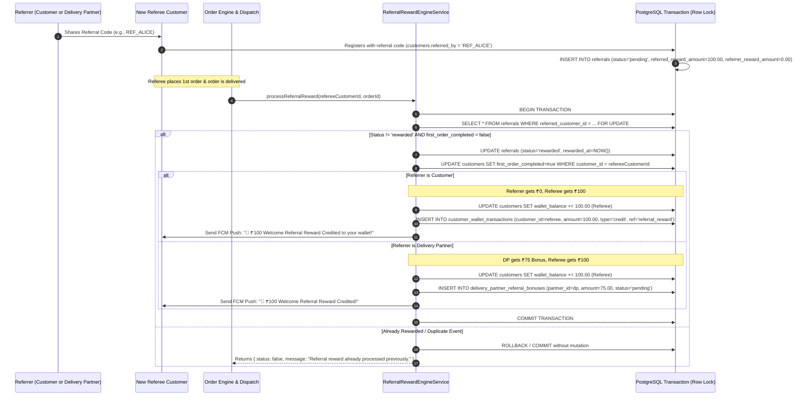

# 09 — Customer & Delivery Partner Referrals Master Test Specification

> **Subsystems:** Customer Referral Wallet Rewards & Delivery Partner Acquisition Bonuses  
> **API Services:** `ReferralRewardEngineService`, `FirstOrderDetectorService`, `CustomerReferralService`, `DeliveryPartnerReferralService`  
> **Tables:** `customers`, `referrals`, `customer_wallet_transactions`, `delivery_partner_referral_bonuses`, `notifications`  
> **Priority:** `P0 — Growth Engine & Reward Anti-Fraud Protection`

---

## 1. Business Logic & Referral Rules

1. **Referred Customer (Referee) Reward**:
   - Only the **referred customer (new account user)** receives the **₹100 wallet reward** when registering with a valid referral code and completing their qualifying first order.
2. **Referrer (Inviter) Rule**:
   - Customer referrers **never** receive a reward (`₹0.00`).
3. **No Automatic First-Order Refunds/Cashbacks**:
   - No hardcoded ₹50 or automatic wallet cashback/refund on first orders.
   - Customers receive discounts on their first order **strictly via Coupons and Promotions** applied at checkout.
4. **Delivery Partner Referral Acquisition**:
   - When a Delivery Partner refers a customer (using DP referral code), a **₹75 acquisition bonus** is logged in `delivery_partner_referral_bonuses` for the partner's payout/salary ledger.
5. **Idempotency & Concurrency Protection**:
   - Atomic PostgreSQL transactions with `SELECT ... FOR UPDATE` row-level locks prevent double-crediting or duplicate reward events.

---

## 2. Referral Reward Engine Lifecycle

---

## 3. Test Cases

### 3.1 Customer Referral Flows

#### REF-CUST-001: End-to-End Referred Customer ₹100 Reward (Referrer Gets ₹0)
- **Module:** `Referrals / Customer`
- **Scenario:** Customer A refers Customer B; upon B's first delivered order, Customer B (referee) receives ₹100 in wallet, Customer A (referrer) receives ₹0
- **Priority:** `Critical`
- **Preconditions:**
  - Customer A (`CUST_A`) has wallet balance = `₹50.00`.
  - Customer B (`CUST_B`) has wallet balance = `₹0.00`.
  - Customer B registers using A's referral code.
- **Dependencies:** None
- **Steps:**
  1. Customer B completes first order `#F2H-ORD-B1`.
  2. Delivery partner delivers `#F2H-ORD-B1`.
  3. `ReferralRewardEngineService.processReferralReward('CUST_B', 'F2H-ORD-B1')` is triggered.
- **Expected Result:**
  - Referral status transitions to `rewarded`.
  - Customer B's wallet balance increases to `₹100.00` (`+₹100.00`).
  - Customer A's wallet balance remains `₹50.00` (`+₹0.00` — referrer never gets reward).
  - Customer B's profile updates `first_order_completed = true`.
  - Customer B receives FCM Push Notification: *"🎉 Welcome Bonus! ₹100 referral reward credited to your wallet!"*.
- **Database / API Verification Points:**
  - Table `referrals`: `status = 'rewarded'`, `referred_reward_amount = 100.00`, `referrer_reward_amount = 0.00`, `rewarded_at` is set.
  - Table `customers` (Customer B): `wallet_balance = 100.00`, `first_order_completed = true`.
  - Table `customers` (Customer A): `wallet_balance = 50.00` (unchanged).
  - Table `customer_wallet_transactions`: row with `customer_id = 'CUST_B'`, `transaction_type = 'credit'`, `amount = 100.00`, `balance_after = 100.00`, `reference_type = 'referral_reward'`.

#### REF-CUST-002: First Order Discount via Coupon Only (No Auto-Refund/Cashback)
- **Module:** `Orders / Promotions & Discounts`
- **Scenario:** Customer places first order without coupon; verify NO hardcoded ₹50 or automatic wallet refund is applied
- **Priority:** `High`
- **Preconditions:** New customer `CUST_NEW` registered.
- **Dependencies:** None
- **Steps:**
  1. `CUST_NEW` places first order of ₹450 without applying any coupon.
  2. Order is delivered and confirmed.
- **Expected Result:**
  - Order total charged is exactly ₹450 (no hardcoded ₹50 discount).
  - Wallet receives NO automatic first-order refund/cashback.
  - Discounts on first order apply only when an active promotional coupon (e.g. `WELCOME50`) is entered.
- **Database / API Verification Points:**
  - Table `orders`: `discount_amount = 0.00`, `total_amount = 450.00`.
  - Table `customer_wallet_transactions`: NO automatic cashback transaction created.

#### REF-CUST-003: Double Reward Fraud & Idempotency Prevention
- **Module:** `Referrals / Idempotency`
- **Scenario:** Delivery partner marks order delivered multiple times or referee places 2nd order; verify reward credited ONLY once
- **Priority:** `Critical`
- **Preconditions:** Reward for `CUST_B` already processed in `REF-CUST-001`.
- **Dependencies:** `REF-CUST-001`
- **Steps:**
  1. Re-invoke `ReferralRewardEngineService.processReferralReward('CUST_B', 'F2H-ORD-B1')`.
  2. Customer B places a second order `#F2H-ORD-B2` and it is delivered.
- **Expected Result:**
  - Engine detects `referrals.status = 'rewarded'` and `first_order_completed = true`.
  - Rejection response returned: `{ status: false, message: "Referral reward already processed previously." }`.
  - Customer B's wallet balance remains `₹100.00` (NO second ₹100 credit).
- **Database / API Verification Points:**
  - `SELECT COUNT(*) FROM customer_wallet_transactions WHERE customer_id = 'CUST_B' AND reference_type = 'referral_reward'` returns exactly `1`.

#### REF-CUST-004: Self-Referral Prevention
- **Module:** `Referrals / Security`
- **Scenario:** Customer attempts to refer their own phone number or email
- **Priority:** `High`
- **Preconditions:** Active customer `CUST_A` with phone `9123456780`.
- **Dependencies:** None
- **Steps:**
  1. New account registration with phone `9123456780` inputs referral code of `CUST_A`.
- **Expected Result:**
  - Registration rejects duplicate phone or ignores self-referral code with error: *"You cannot refer your own account"*.
- **Database / API Verification Points:**
  - No row created in `referrals` where `referrer_customer_id = referred_customer_id`.

---

### 3.2 Delivery Partner Acquisition Bonuses

#### REF-PART-001: Delivery Partner Referral ₹75 Bonus Accrual & Referee ₹100 Reward
- **Module:** `Referrals / Partner Bonus`
- **Scenario:** Delivery partner `DP_01` refers customer `CUST_C`; on first delivery, ₹75 bonus logged for partner and ₹100 credited to referee wallet
- **Priority:** `Critical`
- **Preconditions:** Delivery partner `DP_01` exists in `delivery_partners`. `CUST_C` signs up with code `DP_01`.
- **Dependencies:** None
- **Steps:**
  1. `CUST_C` completes first order `#F2H-ORD-C1`.
  2. `ReferralRewardEngineService.processReferralReward('CUST_C', 'F2H-ORD-C1')` triggers.
- **Expected Result:**
  - Engine detects referrer is in `delivery_partners` table.
  - Inserts ₹75 pending acquisition bonus into `delivery_partner_referral_bonuses`.
  - Customer `CUST_C` wallet is credited with ₹100 referee welcome reward.
- **Database / API Verification Points:**
  - Table `delivery_partner_referral_bonuses`: row with `partner_id = 'DP_01'`, `amount = 75.00`, `status = 'pending'`, `order_id = 'F2H-ORD-C1'`.
  - Table `referrals`: `status = 'rewarded'`, `referrer_reward_amount = 75.00`, `referred_reward_amount = 100.00`.
  - Table `customers` (`CUST_C`): `wallet_balance = 100.00`.
