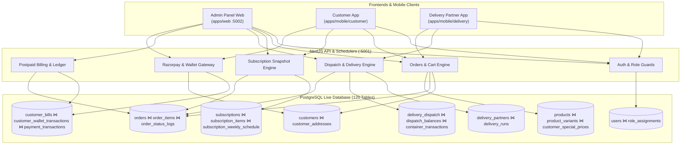

# F2H Fresh — Master Test Plan & Quality Assurance Specification

> **Platform Version:** F2H Fresh 2026 Unified Architecture  
> **Repository:** `f2hfresh.com`  
> **Status:** Final Master Test Specification  
> **Scope:** Full-Stack Quality Assurance Coverage (Admin Web, Customer Mobile App, Delivery Partner Mobile App, Backend REST API, PostgreSQL Database, BullMQ Schedulers, Redis Registry, Razorpay Gateway, Firebase FCM)

---

## 1. Executive Summary & Purpose

This master test documentation defines the end-to-end testing coverage, test cases, verification points, data consistency rules, and edge-case validations for the entire **F2H Fresh** ecosystem.

F2H Fresh is a fresh-produce subscription and on-demand delivery platform serving morning and evening distribution slots. It coordinates operations across five core domains:
1. **Admin / Back-Office Management** (`apps/web` — Next.js 16 App Router)
2. **Customer Experience** (`apps/mobile/customer` — Flutter 3.11 BLoC)
3. **Delivery Partner Logistics** (`apps/mobile/delivery` — Flutter 3.11 BLoC)
4. **Backend API & Schedulers** (`apps/api` — NestJS 11, PostgreSQL, Redis, BullMQ)
5. **Finance & Settlement** (Prepaid Wallet, Postpaid Billing, Razorpay Webhooks, Subscriptions Refund Review)



---

## 2. Documentation Architecture & Directory Structure

The complete test coverage is divided into 12 modular specification documents located in `.claude/test/29-08-2026/test-plan/`:

```
.claude/test/29-08-2026/test-plan/
├── README.md                          # Master Test Plan Overview & Execution Guide (This File)
├── 01-admin-panel.md                  # Test Cases for 30+ Admin Modules & Web Operations (Single ADMIN Role)
├── 02-customer-app.md                 # Complete Customer App Mobile Journey & Catalog Tests
├── 03-delivery-partner-app.md         # Delivery Partner App Runs, Shifts, Delivery Proof & Handover
├── 04-subscriptions.md                # In-Depth Subscription Lifecycle, Weekly Matrix, Pauses & Crons
├── 05-outstanding-bills.md            # Postpaid Customer Billing, Outstanding Settlement & PDF Audits
├── 06-payments-refunds-wallet.md      # Wallet Ledgers, Razorpay HMAC, Webhooks & Refund Reviews
├── 07-delivery-dispatch.md            # Dispatch Plans, Hub Pickups, Baskets, Containers & Reconciliations
├── 08-inventory-warehouse.md          # Warehouses, Stock Movements, Transfers, Intakes & Forecasts
├── 09-referrals.md                    # Customer & Partner Referral Engines, Rewards & Fraud Defenses
├── 11-end-to-end-flows.md             # 12 Comprehensive Cross-Surface Integrated Business Scenarios
├── 12-edge-cases.md                   # 25 High-Stress Race Conditions, Concurrency & Boundary Cases
└── 13-test-data-requirements.md       # Golden Test Fixtures, Accounts, Branches, Warehouses & Catalogs
```

---

## 3. Test Case Standard Schema

Every test specification across all documentation files follows the strict standardized test contract:

| Field | Description |
|---|---|
| **Test ID** | Globally unique identifier (e.g., `ADM-AUTH-001`, `CUST-SUB-003`, `E2E-007`) |
| **Module** | Functional component / service under test |
| **Scenario** | Concise description of the business behavior being validated |
| **Priority** | `Critical` (Money/Security/Core Delivery) · `High` · `Medium` · `Low` |
| **Preconditions** | Required state of database, auth sessions, stock, balances, or crons |
| **Dependencies** | Upstream test cases or prerequisites |
| **Steps** | Step-by-step test execution procedure |
| **Expected Result** | UI/Client expected response, status messages, and visual indicators |
| **Database / API Verification Points** | Exact SQL table asserts, columns, constraints, API HTTP status, and response JSON checks |

---

## 4. Test Persona & Account Configuration

> **Note on Panel Access:** In the Admin Panel, there is **only one role: `ADMIN`** (Super Admin). All back-office modules, branches, warehouses, finance, and settings are managed under this single role. The platform operates across 3 client account types:

| Persona | Primary Identifier | Role | Platform / Surface | Credentials Source / Method |
|---|---|---|---|---|
| **Super Admin** | `admin@f2hfresh.com` / `f2hmaintainence@gmail.com` | `ADMIN` | Admin Web Panel (`/admin/*`) | Provided by project owner / seeded master account |
| **Delivery Partner** | `dp.driver1@f2hfresh.com` / Phone `+91 9876543210` | `DELIVERY_PARTNER` | Delivery Partner App | `delivery_partners` table + `vehicle_type = 'bike'` |
| **Prepaid Customer** | `cust.prepaid@f2hfresh.com` / Phone `+91 9123456780` | `CUSTOMER` | Customer Mobile App | Created via Customer App signup flow |
| **Postpaid Customer** | `cust.postpaid@f2hfresh.com` / Phone `+91 9123456781` | `CUSTOMER` | Customer Mobile App | Customer profile with `is_postpaid_enabled = true` |

---

## 5. Summary Matrix of Test Coverage

```mermaid
gantt
    title Complete Test Plan Coverage Breakdown
    dateFormat X
    axisFormat %s
    section Core Commerce
    Admin Panel (01)              :crit, a1, 0, 45
    Customer App (02)             :crit, a2, 0, 38
    Delivery Partner App (03)     :crit, a3, 0, 30
    section Subscriptions & Billing
    Subscription Engine (04)      :crit, b1, 0, 40
    Outstanding Bills (05)        :crit, b2, 0, 28
    Payments & Wallet (06)        :crit, b3, 0, 32
    section Operations & Supply
    Dispatch & Delivery (07)      :active, c1, 0, 26
    Inventory & Warehouses (08)   :active, c2, 0, 24
    Referral Engine (09)          :active, c3, 0, 20
    section System Resilience
    End-to-End Scenarios (11)     :crit, d2, 0, 12
    Edge Cases & Races (12)       :crit, d3, 0, 25
    Test Data Master Setup (13)   :active, d4, 0, 15
```



---

## 6. Execution Guidelines

> [!IMPORTANT]
> **No Direct Data Mutation Without Sandbox Isolation:** Automated or manual test executions must strictly utilize dedicated staging branches or test database instances (`f2hfresh_test`) to prevent production data corruption.

> [!TIP]
> **Use the Test Data Requirements in File `13` First:** Before executing any end-to-end or edge test cases, ensure the database contains the required baseline branches, warehouses, containers, and product variants specified in `13-test-data-requirements.md`.
