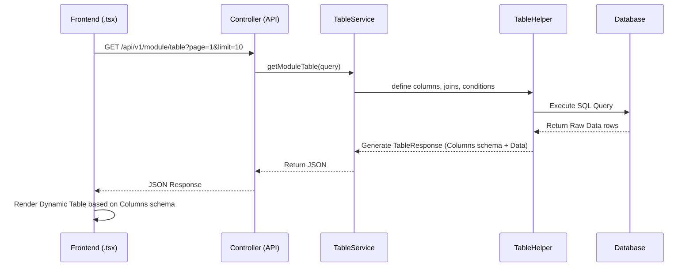
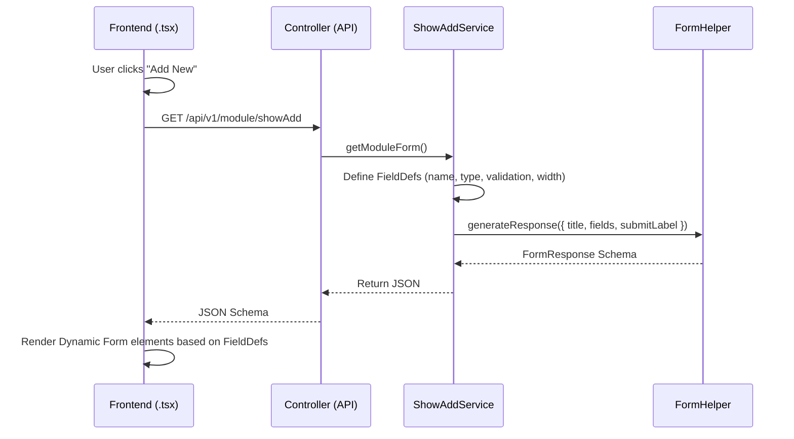
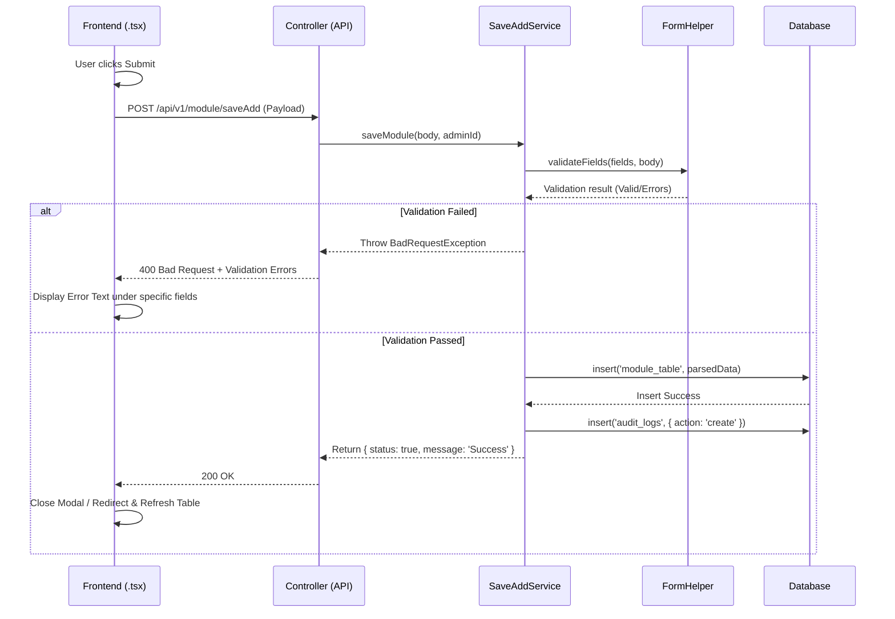
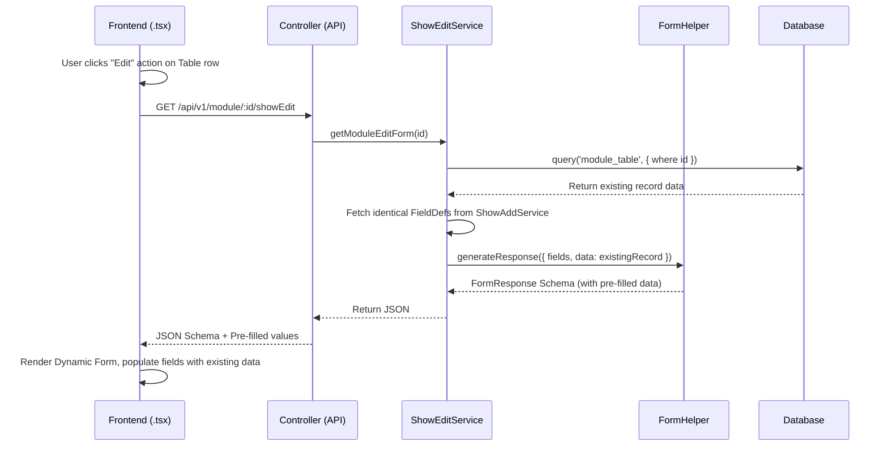
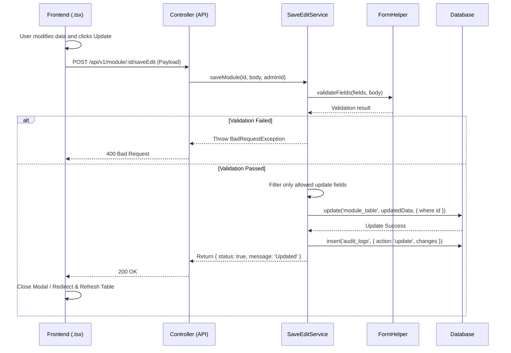
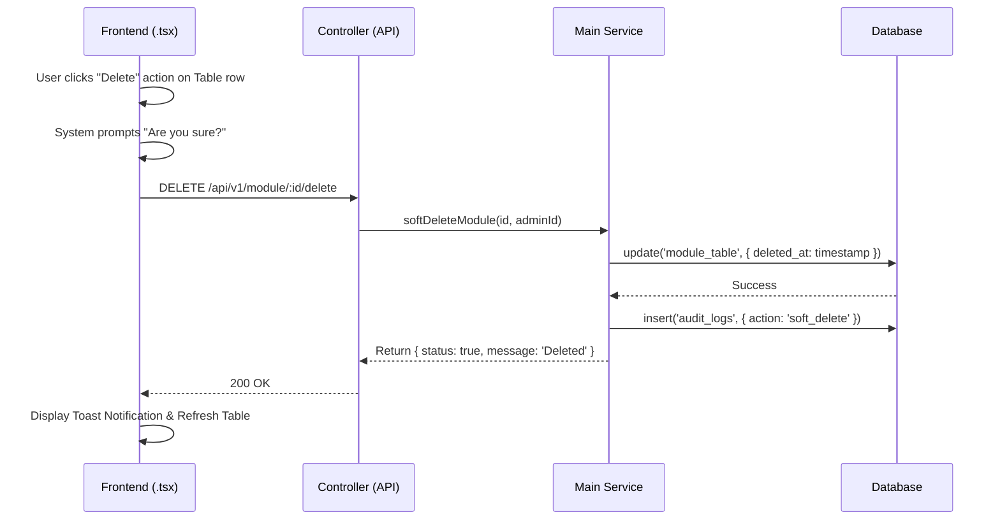

# Frontend-Backend Dynamic Workflow (Form2Home Admin Panel)

This document outlines the standard data flow between the Frontend (`.tsx` components) and the Backend API for the Admin Panel. The Form2Home architecture uses a highly dynamic, metadata-driven approach where the Backend dictates the UI structure (table columns, form fields) rather than hardcoding them in the frontend.

## 1. Data Table Workflow

**Goal**: Display a list of records with sorting, pagination, and dynamic action buttons.

## 2. Show Add Form Workflow

**Goal**: Display a dynamic form for creating a new record.

## 3. Save Add (Create) Workflow

**Goal**: Submit the newly filled form data to create a record in the database.

## 4. Show Edit Form Workflow

**Goal**: Load an existing record into a dynamic form for editing.

## 5. Save Edit (Update) Workflow

**Goal**: Submit the modified form data to update an existing record.

## 6. Delete (Soft Delete) Workflow

**Goal**: Remove a record from the table.

## Summary of the Code Flow Architecture

1. **Routing**: The frontend makes requests via RTK Query or Axios based on the current page context.
2. **Controller (`.controller.ts`)**: Acts as the entry point. It receives the HTTP request, extracts the `Body`, `Query`, `Param`, and `Req.user` context, and passes it to the corresponding service.
3. **Table & Form Schema Services (`table.service.ts`, `showAdd.service.ts`, `showEdit.service.ts`)**: These services do not typically mutate database state. Their primary job is generating JSON definitions (using `TableHelper` and `FormHelper`) that instruct the Frontend on exactly **what** to render.
4. **Mutation Services (`saveAdd.service.ts`, `saveEdit.service.ts`, `main.service.ts`)**: These services handle validation, database transactions (`insert`, `update`), and writing to the `audit_logs` table for tracking administrative actions. They respond with success/error statuses that the frontend uses to display toast notifications.
