# F2H Fresh — Existing System: Complete End-to-End Flow

> Audit date: 2026-08-19 · Branch `main` · Verified against source **and the live PostgreSQL database** (120 tables).
> Companion documents: [flaws.md](flaws.md) (defects + fixes) · [implementation.md](implementation.md) (roadmap).

---

## 1. What This System Is

F2H Fresh is a **farm-to-home fresh-produce delivery platform** built around **daily subscription deliveries**
(milk/vegetables style, morning + evening slots) plus one-time orders. It is a monorepo with **four deployable
surfaces** sharing **one NestJS API** and **one PostgreSQL database**.

| Surface | Tech | Audience | Deploy target |
|---|---|---|---|
| `apps/api` | NestJS 11 · Node · PostgreSQL (pg) · Redis · BullMQ · Socket.IO | All clients | PM2 `api-f2hfresh` → `:5001` |
| `apps/web` | Next.js 16 (App Router) · React 19 · Ant Design + PrimeReact + Bootstrap | **Admin/back-office** + landing | PM2 `frontend-f2hfresh` → `:5002` |
| `apps/mobile/customer` | Flutter 3.11 · BLoC · Dio · Isar | Customers (Android/iOS/Web) | `customer.f2hfresh.com` (static build) |
| `apps/mobile/delivery` | Flutter 3.11 · BLoC · Dio · Isar · Geolocator | Delivery partners | `partner.f2hfresh.com` (static build) |

**Scale in code:** 304 TS files / 54 controllers / 124 services / 54 modules in the API · 103 Next.js pages ·
168 Dart files (customer) · 130 Dart files (delivery) · 120 live DB tables.

---

## 2. System Architecture

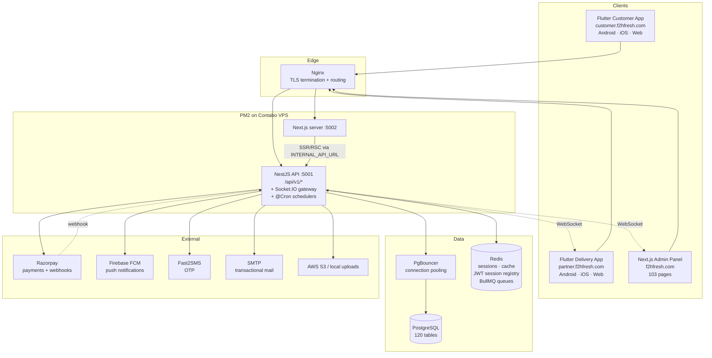

---

## 3. Repository Layout

```
f2hfresh.com/
├── apps/
│   ├── api/          NestJS backend  (src/panels/{admin,customer,delivery-partner})
│   ├── web/          Next.js admin panel + public landing
│   └── mobile/
│       ├── customer/ Flutter customer app
│       └── delivery/ Flutter delivery-partner app
├── infra/
│   ├── pgbouncer/    connection pooler config
│   └── postgres/     pg_hba.conf, postgresql.conf, init scripts
├── docs/
│   ├── plans/        ← this document
│   └── skills/       engineering conventions (architecture, security, testing …)
├── firebase/         FCM service-account config
├── ecosystem.config.js       PM2 production
├── ecosystem.dev.config.cjs  PM2 development
├── docker-compose.yml        local docker stack
├── Makefile / build-flutter.sh / dev-flutter.sh
└── optimize.md       prior "single source of truth" schema-unification plan
```

`package.json` declares npm workspaces: `apps/api`, `apps/web`, `apps/mobile/*`.

---

## 4. API Request Pipeline

Every request to the NestJS API passes through this chain, defined in
[main.ts](../../apps/api/src/main.ts) and [app.module.ts](../../apps/api/src/app.module.ts):

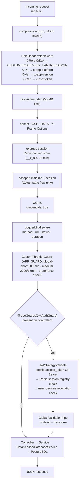

**Conventions**
- Global prefix `api` + URI versioning → all routes are `/api/v1/<path>`.
- Static uploads served at both `/uploads/` and `/api/v1/uploads/` with 1-year immutable cache.
- Compact wire headers keep mobile payloads small; `RoleHeaderMiddleware` expands them server-side.
- `JwtAuthGuard` is applied **per controller**, not globally (see [flaws.md](flaws.md#f-01)).

---

## 5. Authentication & Session Flow

Files: [auth.controller.ts](../../apps/api/src/auth/auth.controller.ts) ·
[auth.service.ts](../../apps/api/src/auth/auth.service.ts) ·
[jwt.strategy.ts](../../apps/api/src/auth/jwt.strategy.ts)

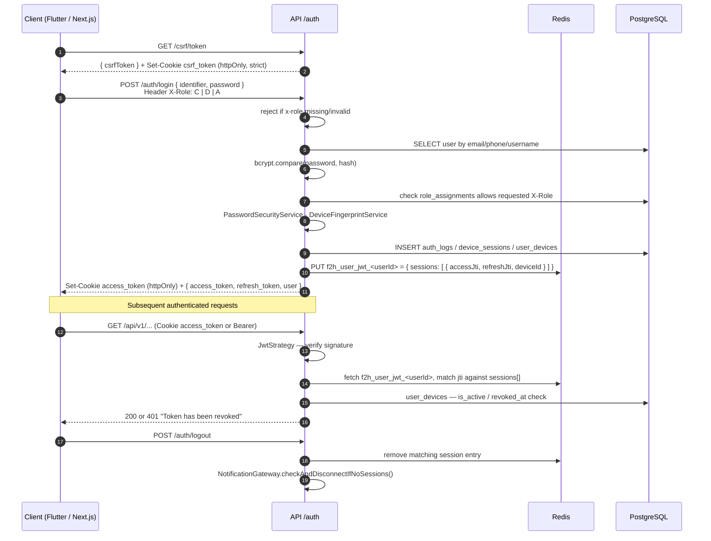

**Key characteristics**
- Auth supports **password**, **OTP (SMS via Fast2SMS)**, **email**, and **Google OAuth** (`social.strategies.ts`).
- Multi-role users exist: one `users` row → many `role_assignments`. The **active role is a Redis preference**
  (`user_selected_role_<id>`, 30-day TTL), resolved in `GET /users/me`.
- Revocation is **Redis-registry driven**, not expiry driven — tokens are signed `expiresIn: '100y'` and the
  strategy sets `ignoreExpiration: true`. Logout deletes the Redis session entry.
- Supporting services: `TokenRevocationService`, `OtpRateLimitService`, `SecurityAlertsService`,
  `AuditLoggerService` (Winston daily-rotate, 90/180-day retention), `FieldEncryptionService`.

---

## 6. Customer Flow (Flutter Customer App)

### 6.1 App bootstrap

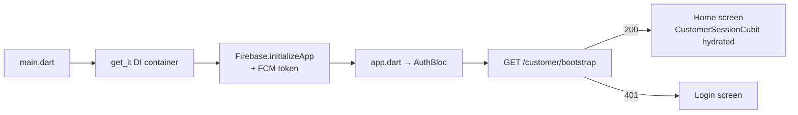

Architecture is **clean/layered per feature**: `features/<name>/{data,domain,presentation}` with
datasources → repositories → usecases → BLoC → screens. Networking is a shared `DioClient` with
`AuthInterceptor` (Bearer injection + silent refresh), `PersistCookieJar`, and compact headers
(`X-Role: C`, `X-Plt`, `X-Ver`). Offline cache via **Isar**; secure token storage via `flutter_secure_storage`.

Features present: `address`, `catalog` (products/cart/checkout), `subscription`, `orders`, `wallet`,
`notifications`, `profile`, `onboarding`.

### 6.2 Browse → Cart → Checkout → Order

Files: [cartAndCheckout.controller.ts](../../apps/api/src/panels/customer/cartAndCheckout/controller/cartAndCheckout.controller.ts) ·
[cartAndCheckout.service.ts](../../apps/api/src/panels/customer/cartAndCheckout/ModuleServices/cartAndCheckout.service.ts)

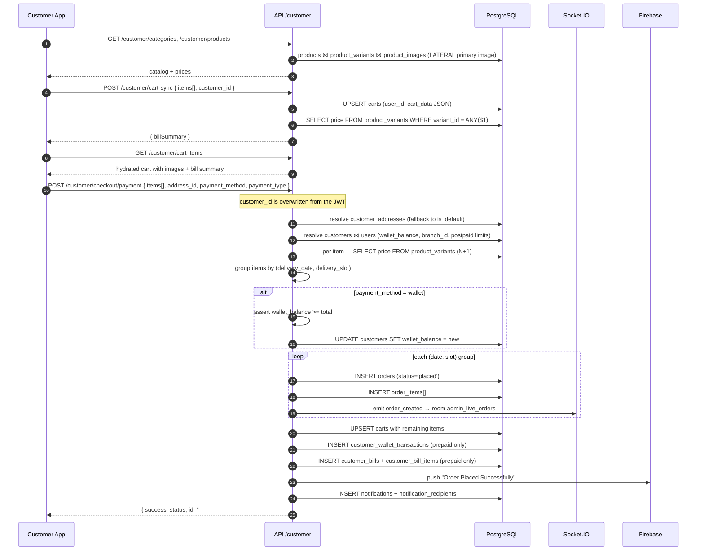

**Payment modes supported at checkout:** `wallet` (prepaid, deducts balance), `cod` (postpaid, `payment_status='pending'`),
`postpaid` (billed monthly via `customer_bills`).

> ⚠️ This entire sequence runs **without a database transaction** even though
> `DatabaseService.transaction()` exists and is used in 8 other services. See [flaws.md F-06](flaws.md#f-06).

### 6.3 Razorpay payment flow (wallet top-up / bill payment)

File: [payment.service.ts](../../apps/api/src/panels/customer/payment/payment.service.ts)

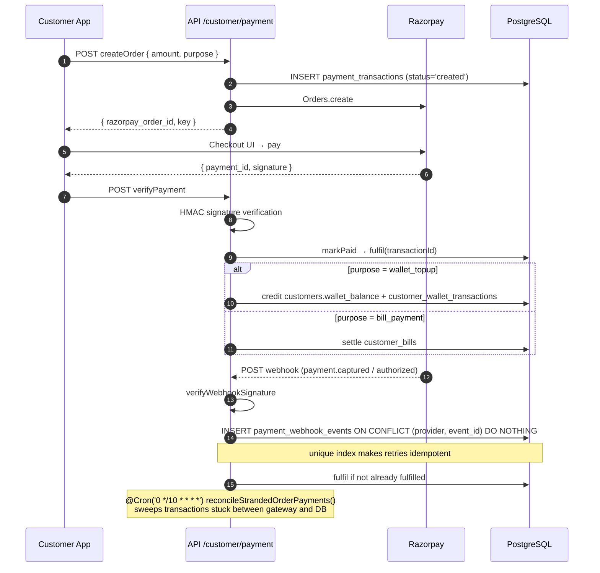

This module is the **most mature** part of the codebase — signature verification, webhook idempotency,
DB transactions, and a reconciliation cron are all present.

### 6.4 Subscription lifecycle (customer side)

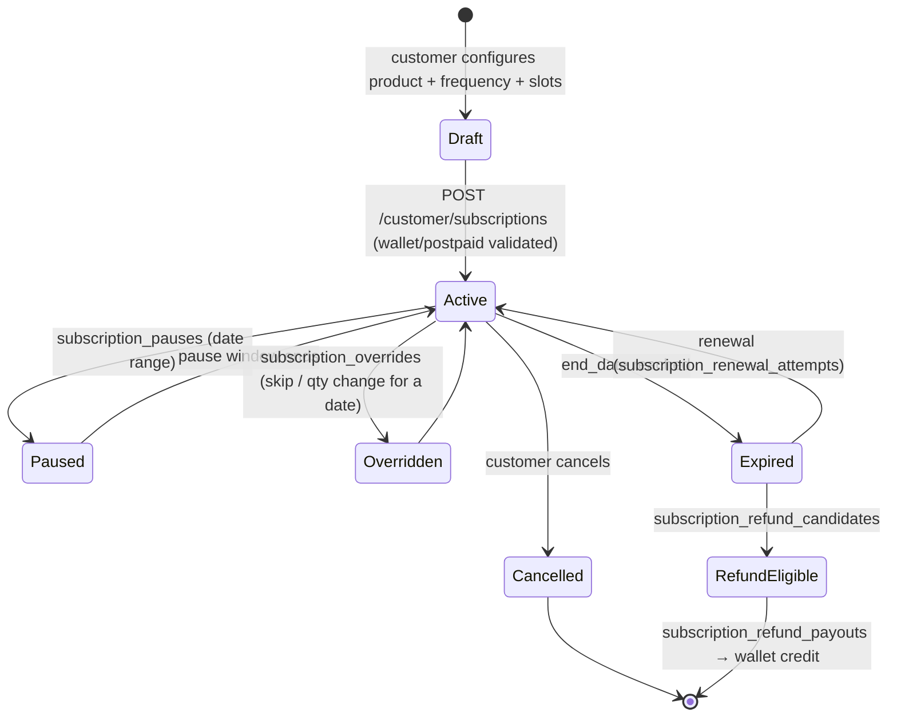

Backing tables: `subscriptions`, `subscription_items`, `subscription_weekly_schedule`,
`subscription_custom_schedule`, `subscription_delivery_slots`, `subscription_pauses`,
`subscription_overrides`, `subscription_logs`, `subscription_calendar_cache`,
`subscription_status`, `subscription_global_config`, `catalog_subscription_config`,
`product_subscription_rules` / `_frequencies` / `_slot_rules`.

---

## 7. The Subscription Order-Generation Engine (core of the business)

This is the scheduled job that turns standing subscriptions into concrete daily `orders`.

File: [subscription-snapshot.cron.ts](../../apps/api/src/panels/admin/customers-orders/subscriptions/cron-job/subscription-snapshot.cron.ts)

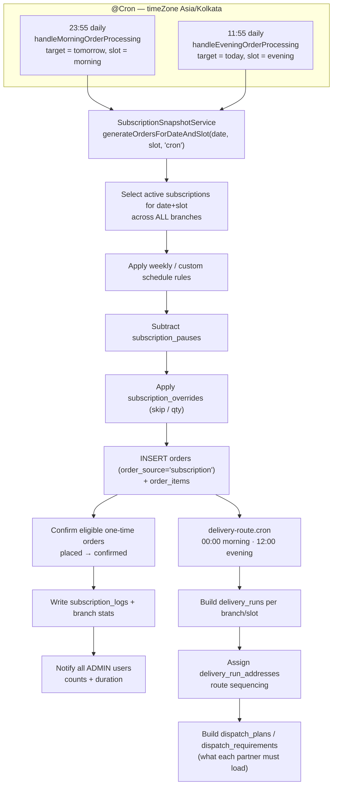

Other schedulers:

| Cron | Schedule | Purpose |
|---|---|---|
| `subscription-snapshot.cron` | `23:55`, `11:55` IST | Generate next slot's subscription orders |
| `delivery-route.cron` | `00:00`, `12:00` IST | Build delivery runs + routes for the slot |
| `subscription-status.cron` | `01:00` daily | Expire / renew / flag refund candidates |
| `customer-billing.service` | `00:05` on the 1st | Generate monthly postpaid bills |
| `customer-billing.service` | `09:00` daily | Postpaid payment reminders |
| `payment-reconciliation.cron` | every 10 min | Sweep stranded Razorpay payments |

BullMQ queues: `default-queue`, `calendar-aggregation-queue`, `calendar-refresh-queue`
(subscription-calendar materialisation).

---

## 8. Delivery Partner Flow (Flutter Delivery App)

Files: [delivery.order.controller.ts](../../apps/api/src/panels/delivery-partner/orders/controllers/delivery.order.controller.ts) ·
[delivery.order.service.ts](../../apps/api/src/panels/delivery-partner/orders/services/delivery.order.service.ts) ·
[basket.controller.ts](../../apps/api/src/panels/delivery-partner/orders/controllers/basket.controller.ts) ·
[location.controller.ts](../../apps/api/src/panels/delivery-partner/location/location.controller.ts)

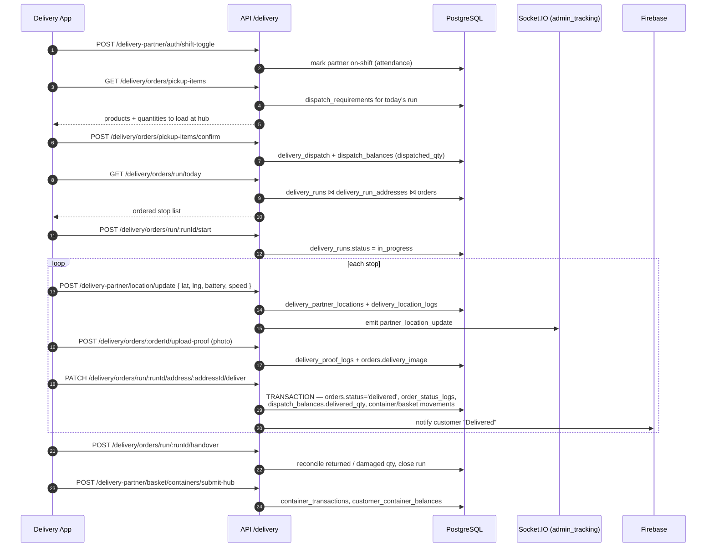

Additional partner capabilities: SOS (`/location/sos`, `/clear-sos`), leave requests, attendance history,
leaderboard, documents/vehicles/bank-account KYC, referral bonuses and redeem requests.

---

## 9. Admin Panel Flow (Next.js Web)

`apps/web` is an **App Router** application. Route groups organise 103 pages:

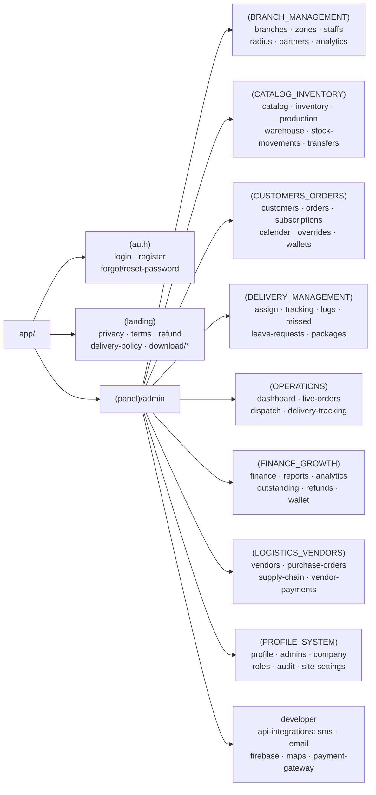

**Client-side data flow**

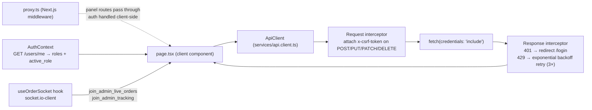

- Auth on the web is **client-side**: `proxy.ts` lets `/admin/*`, `/delivery/*`, `/customer/*` through and
  `AuthProvider` calls `/users/me`; role→home mapping lives in `AuthContext.tsx`.
- Base URL resolution: `NEXT_PUBLIC_API_URL` in the browser, `INTERNAL_API_URL` during SSR/RSC.
- Realtime: `useOrderSocket` joins `admin_live_orders`; the tracking page joins `admin_tracking`.

---

## 10. Data Layer

### 10.1 Two parallel database services

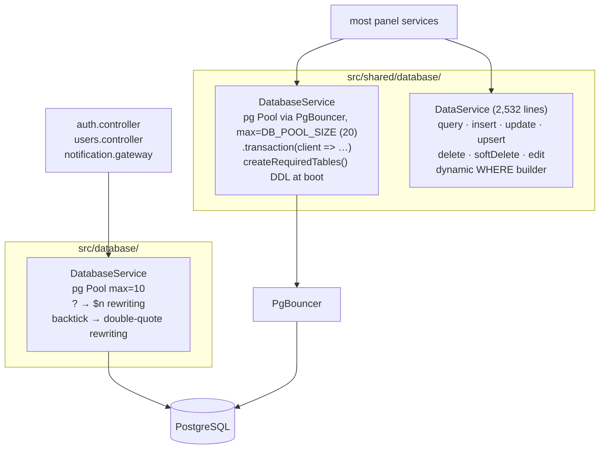

Both pools connect to the same database with the same credentials — **two independent connection pools
in one process**, only one of which goes through PgBouncer.

`DataService` is a hand-rolled query builder used across most panels; the raw
`DatabaseService.query(sql, params)` is used for joins and reports. Placeholders are parameterised
(`$1`/`?`), and `validateWriteOperation` / `buildDynamicWhereClause` guard the dynamic paths.

### 10.2 Live database inventory (120 tables)

| Domain | Tables |
|---|---|
| **Identity & access** | `users`, `roles`, `role_assignments`, `admin_roles`, `management_staff`, `device_sessions`, `user_devices`, `device_information`, `password_history`, `auth_logs`, `auth_otp_challenges`, `otp_rate_limit_logs`, `admin_audit_logs` |
| **Customers** | `customers`, `customer_addresses`, `customer_activity_logs`, `customer_feedback`, `customer_special_prices`, `customer_waitlist`, `customer_wallet_balances`, `customer_wallet_transactions`, `carts` |
| **Catalog** | `categories`, `products`, `product_variants`, `product_images`, `product_banner`, `product_batches`, `packaging_types`, `catalog_subscription_config`, `product_subscription_rules` / `_frequencies` / `_slot_rules` |
| **Inventory & warehouse** | `warehouses`, `stock_balances`, `stock_movements`, `stock_transfers`, `purchase_entries`, `vendors`, `vendor_intakes`, `production_plans`, `consumption_forecasts`, `order_batches`, `order_batch_items` |
| **Orders** | `orders`, `order_items`, `order_status_logs`, `order_containers` |
| **Subscriptions** | `subscriptions`, `subscription_items`, `subscription_weekly_schedule`, `subscription_custom_schedule`, `subscription_delivery_slots`, `subscription_pauses`, `subscription_overrides`, `subscription_logs`, `subscription_calendar_cache`, `subscription_global_config`, `subscription_refunds`, `subscription_refund_candidates`, `subscription_refund_payouts`, `subscription_renewal_attempts`, `delivery_calendar` |
| **Delivery ops** | `delivery_partners`, `delivery_runs`, `delivery_run_addresses`, `delivery_routes`, `delivery_route_customers`, `route_daily_overrides`, `delivery_dispatch`, `delivery_dispatch_items`, `dispatch_plans`, `dispatch_plan_items`, `dispatch_requirements`, `dispatch_balances`, `delivery_logs`, `delivery_proof_logs`, `delivery_location_logs`, `delivery_partner_locations`, `delivery_leave_requests`, `delivery_partner_documents` / `_bank_accounts` / `_redeem_requests` / `_referral_bonuses`, `breakdown_incidents` |
| **Containers/baskets** | `containers`, `container_transactions`, `customer_container_balances`, `delivery_baskets`, `basket_items`, `basket_movements`, `delivery_container_reconciliation` |
| **Geo** | `branches`, `branch_sectors`, `zones`, `zone_hexagons` (H3 indexing) |
| **Finance** | `payments`, `payment_transactions`, `payment_webhook_events`, `refunds`, `customer_bills`, `customer_bill_items` |
| **Growth** | `coupons`, `coupon_redemptions`, `promotions`, `promotion_products`, `promotion_redemptions`, `referrals` |
| **Platform** | `notifications`, `notification_recipients`, `notification_settings`, `support_tickets`, `contact_enquiries`, `site_settings`, `company_profile`, `app_configs`, `api_integrations_config`, `cache`, `cache_locks` |

**Measured schema characteristics** (live DB):
- 120 tables · 359 indexes · **28 foreign-key constraints** · every table has a primary key.
- Only 20 tables carry any FK. Core tables — `orders`, `subscriptions`, `customers`, `payments`,
  `delivery_runs` — have **none**.
- Timestamp types are mixed: 249 `timestamptz` columns vs 117 `timestamp without time zone`.
- Wallet balance is stored in **two places**: `customers.wallet_balance` and `customer_wallet_balances.wallet_balance`.

---

## 11. Cross-Cutting Services

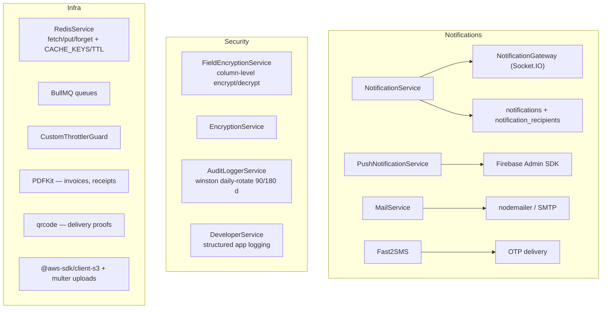

**Socket.IO rooms**

| Room | Joined by | Events |
|---|---|---|
| `user:<userId>` | auto on connect | `notification` |
| `admin_tracking` | client emits `join_admin_tracking` | `partner_location_update` |
| `admin_live_orders` | client emits `join_admin_live_orders` | `order_created`, `order_status_changed` |

---

## 12. Build, Run & Deploy

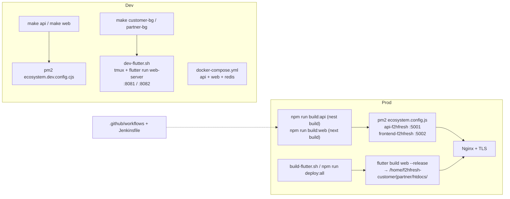

| Command | Effect |
|---|---|
| `make api` / `make web` | Dev servers on `:5001` / `:5002` |
| `make customer` / `make partner` | Release Flutter web build + publish |
| `make dev-all` | Both Flutter apps in tmux with hot reload |
| `npm run deploy:all` | Build + copy both Flutter web apps to their htdocs |
| `npm run db:migrate` | `src/scripts/run-migration.ts` |
| `npm run seed:kuppam` / `seed:delivery` | Demo data seeders |

---

## 13. End-to-End Business Flow (one day in the life)

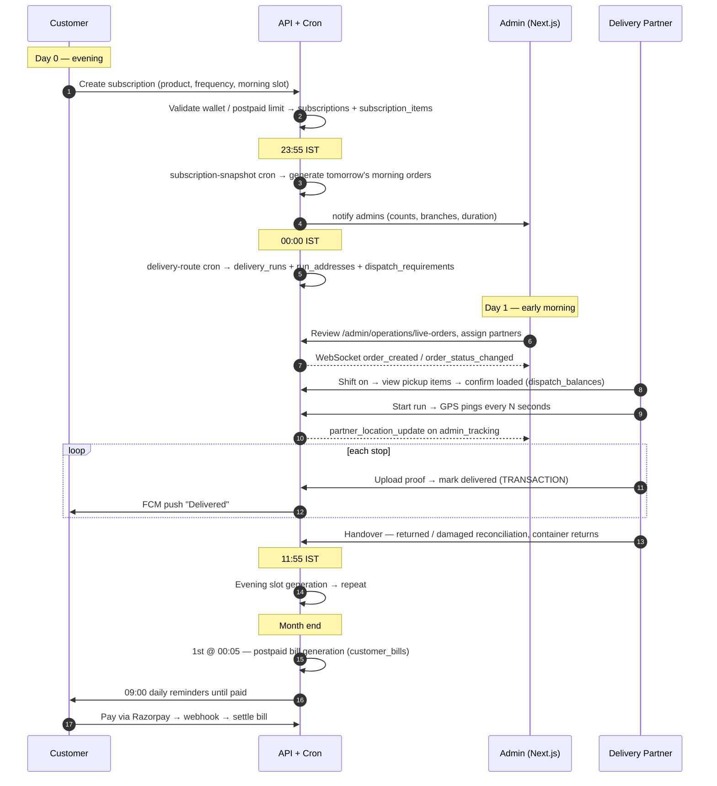

---

## 14. Summary of What Works Well

- **Clear panel segmentation** in the API (`admin` / `customer` / `delivery-partner`) mirrored by the Next.js route groups.
- **Flutter apps follow clean architecture** consistently — data/domain/presentation per feature, BLoC + get_it DI.
- **The payment module is production-grade**: HMAC verification, webhook idempotency via a unique
  `(provider, event_id)` index, DB transactions, and a 10-minute reconciliation sweep.
- **Deep operational domain modelling** — dispatch balances, container/basket reconciliation, H3 geo-zoning,
  route overrides, leave management, and refund candidacy are all modelled, not hand-waved.
- **Infrastructure discipline**: PgBouncer pooling, Redis-backed sessions (no MemoryStore leak), gzip,
  helmet + CSP + HSTS, throttling tiers, Winston audit logs with retention, PM2 process management.
- **Compact mobile wire protocol** (`X-Role`/`X-Plt`/`X-Ver`/`X-Csrf`) shows real attention to mobile payload cost.

Defects and their fixes are catalogued in **[flaws.md](flaws.md)**; the prioritised build plan is in
**[implementation.md](implementation.md)**.
