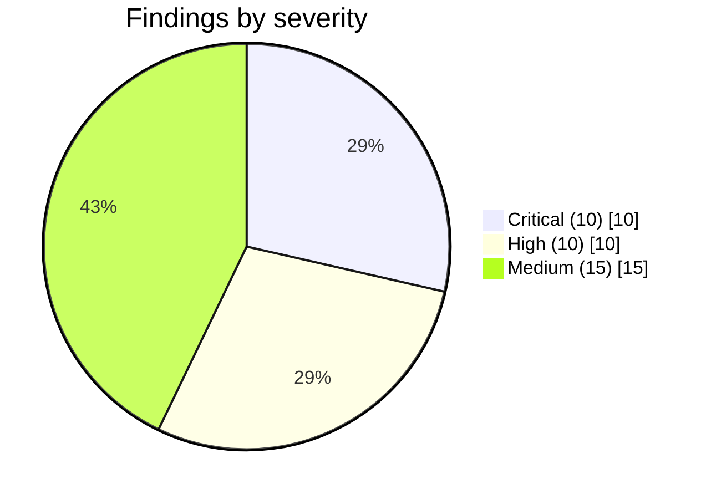
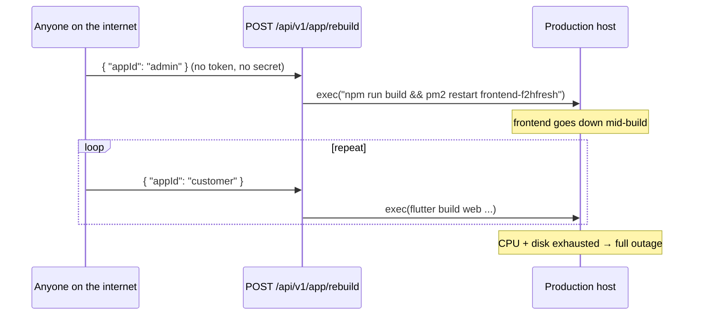
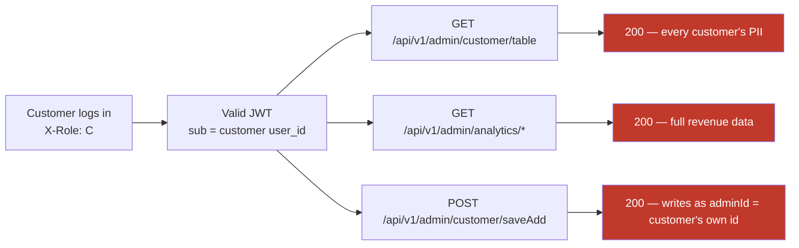
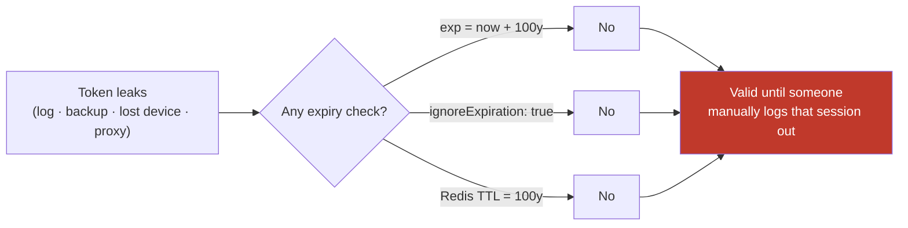
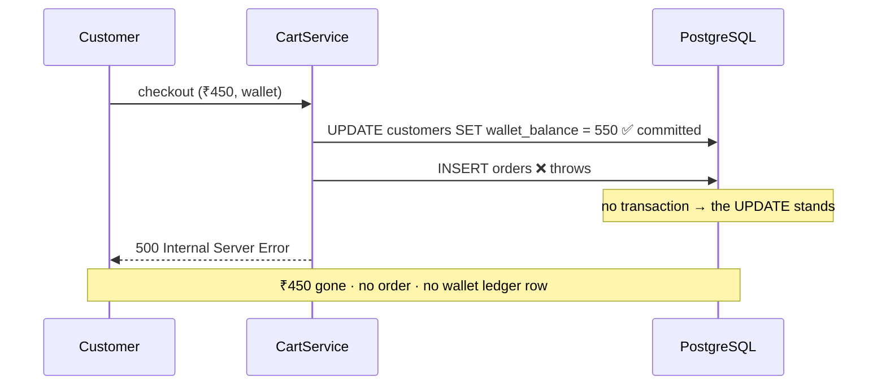

# F2H Fresh — Flaws, Risks & Fixes

> Audit date: 2026-08-19 · Branch `main` · Every finding below was verified by reading the source
> or querying the **live PostgreSQL database**. No finding is speculative.
> System context: [existing.md](existing.md) · Roadmap: [implementation.md](implementation.md)

---

## Executive Summary

**35 confirmed defects.** The dominant theme is that **the API has essentially no authorization layer**.
Authentication exists and is well built; authorization does not exist at all. Every one of the 54 controllers
either applies `JwtAuthGuard` (37) or nothing (17) — and `JwtAuthGuard` only proves *someone is logged in*,
never *who they are allowed to be*. A customer's token opens the admin panel's API surface.

Layered on top of that, one unauthenticated endpoint executes shell commands on the production host.



| ID | Severity | Area | Finding |
|---|---|---|---|
| [F-01](#f-01) | 🔴 Critical | RCE | Unauthenticated `POST /app/rebuild` runs shell commands on the host |
| [F-02](#f-02) | 🔴 Critical | AuthZ | 17 controllers have **no guard at all** — including admin finance & orders |
| [F-03](#f-03) | 🔴 Critical | AuthZ | **No role-based authorization exists** anywhere in the API |
| [F-04](#f-04) | 🔴 Critical | AuthZ | Hardcoded ADMIN backdoor for any email containing `maintainence` |
| [F-05](#f-05) | 🔴 Critical | AuthN | Rate limiting bypassed by sending `Origin: http://localhost` |
| [F-06](#f-06) | 🔴 Critical | Supply chain | Hardcoded APK-upload secret + path traversal in the release endpoint |
| [F-07](#f-07) | 🔴 Critical | AuthN | JWTs signed for **100 years** with `ignoreExpiration: true` |
| [F-08](#f-08) | 🔴 Critical | CORS | Every origin allowed with `credentials: true` |
| [F-09](#f-09) | 🔴 Critical | CSRF | CSRF tokens issued and echoed but **never validated** |
| [F-10](#f-10) | 🔴 Critical | Secrets | Working JWT/session/encryption/DB secrets committed in `docker-compose.yml` |
| [F-11](#f-11) | 🟠 High | Money | Checkout writes orders + debits wallet **without a transaction** |
| [F-12](#f-12) | 🟠 High | Money | Wallet read-modify-write race → double spend |
| [F-13](#f-13) | 🟠 High | Data leak | Socket.IO admin rooms are self-join — any user gets live GPS + all orders |
| [F-14](#f-14) | 🟠 High | IDOR | `cart-sync` writes to any `customer_id` sent in the body |
| [F-15](#f-15) | 🟠 High | Money | Unknown product variant silently priced at **₹150** |
| [F-16](#f-16) | 🟠 High | Secrets | Login handler `console.log`s the request body including the password |
| [F-17](#f-17) | 🟠 High | Secrets | SQL + bound parameters appended to `src/logs.log` on every query error |
| [F-18](#f-18) | 🟠 High | Data integrity | 120 tables, **28 foreign keys**; `orders`/`subscriptions`/`payments` have none |
| [F-19](#f-19) | 🟠 High | Schema | `CREATE TABLE` DDL executed at application boot |
| [F-20](#f-20) | 🟠 High | Architecture | Two independent `DatabaseService` classes → two pg pools per process |
| [F-21](#f-21) | 🟡 Medium | Build | `typescript.ignoreBuildErrors: true` in the web build |
| [F-22](#f-22) | 🟡 Medium | Testing | 4 test files across 304 API sources; 0 in web |
| [F-23](#f-23) | 🟡 Medium | Performance | N+1 product query inside the checkout loop |
| [F-24](#f-24) | 🟡 Medium | Schema | Mixed `timestamptz` (249) and `timestamp` (117) columns |
| [F-25](#f-25) | 🟡 Medium | Schema | Wallet balance duplicated in two tables |
| [F-26](#f-26) | 🟡 Medium | State | In-memory job maps break on restart and under multiple instances |
| [F-27](#f-27) | 🟡 Medium | Types | 1,216 `: any` annotations in the API |
| [F-28](#f-28) | 🟡 Medium | Logging | 88 raw `console.log` calls alongside a real logger |
| [F-29](#f-29) | 🟡 Medium | Scheduling | Crons run in-process with no distributed lock |
| [F-30](#f-30) | 🟡 Medium | DoS | 50 MB global JSON body limit on every route |
| [F-31](#f-31) | 🟡 Medium | Correctness | Checkout customer lookup matches on `customer_id` **OR** email |
| [F-32](#f-32) | 🟡 Medium | Correctness | `role_assignments.id` generated from `Date.now()` |
| [F-33](#f-33) | 🟡 Medium | Frontend | Three UI kits + jQuery + two chart libraries in one bundle |
| [F-34](#f-34) | 🟡 Medium | Errors | 37 empty `catch` blocks silently swallow failures |
| [F-35](#f-35) | 🟡 Medium | Deps | `jsonwebtoken` imported but not declared in `package.json` |

---

# 🔴 CRITICAL

## F-01
### Unauthenticated remote command execution on the production host

**Where:** [app.controller.ts:384-441](../../apps/api/src/app.controller.ts#L384-L441)

`AppController` carries **no `@UseGuards`**. `POST /api/v1/app/rebuild` accepts a JSON body and passes a
constructed string to `child_process.exec` on the production VPS.

```ts
@Post('app/rebuild')
async triggerAppRebuild(@Body() body: { appId: string; action?: string }) {
  ...
  command = `cd .../apps/web && rm -rf .next node_modules/.cache`;
  command = `cd .../apps/web && npm run build && pm2 restart frontend-f2hfresh`;
  ...
  const { exec } = await import('child_process');
  exec(command, { maxBuffer: 10 * 1024 * 1024 }, ...);
}
```

`appId` is matched against a whitelist, so there is no direct argument injection — but **anyone on the
internet** can:
- delete the Next.js build cache and force a cold rebuild,
- `pm2 restart` the production frontend,
- `rsync --delete` over the live customer/partner web roots,
- spawn unbounded concurrent Flutter builds until the VPS exhausts CPU/disk (each build is minutes long
  and nothing limits concurrency).



**Fix — immediate:** delete the endpoint. Builds belong in CI (a `Jenkinsfile` and
`.github/workflows` already exist).

**Fix — if a trigger must remain:**
```ts
@Post('app/rebuild')
@UseGuards(JwtAuthGuard, RolesGuard)      // see F-03
@Roles('ADMIN')
@Throttle({ short: { limit: 2, ttl: 60_000 } })
async triggerAppRebuild(@Body() dto: RebuildDto) {
  // enqueue a BullMQ job with concurrency 1 — never exec() inline
  await this.buildQueue.add('rebuild', dto, { jobId: `build:${dto.appId}` });
}
```
Enqueue rather than `exec`, cap the queue's concurrency at 1, and run the actual shell work in a worker
process that is not the API.

---

## F-02
### 17 controllers ship with no authentication guard

**Where:** verified by scanning every `*.controller.ts` for `UseGuards`.

| Controller | Route base | Exposes |
|---|---|---|
| `app.controller.ts` | `/api/v1/` | rebuild, APK upload, version config ([F-01](#f-01), [F-06](#f-06)) |
| `panels/admin/finance/finance.controller.ts` | `admin/finance`, `customer/bills`, `bills` | outstanding balances, payment reports, **bill receipts + PDFs by id**, `POST outstandings/:id/pay` |
| `panels/admin/customers-orders/orders/orders.controller.ts` | `admin/orders` | full order tables, summaries, **bulk mark-delivered** |
| `panels/admin/customers-orders/customer-billing/*.controller.ts` | `admin/billing` | postpaid bill generation |
| `panels/admin/dashboard/dashboard.controller.ts` | `admin/dashboard` | business KPIs |
| `panels/admin/analytics/analytics.controller.ts` | `admin/analytics` | revenue analytics |
| `panels/admin/branch-Management/controllers/customer.controller.ts` | branch customers | customer PII |
| `panels/admin/branch-Management/controllers/migration.controller.ts` | `zone/admin` | bulk data migration jobs |
| `panels/admin/branch-Management/controllers/delivery-proof.controller.ts` | delivery proofs | delivery photos |
| `panels/admin/branch-Management/branch-config.controller.ts` | branch config | branch settings |
| `panels/admin/customers-orders/subscriptions/calendar/calendar.controller.ts` | subscription calendar | schedules |
| `panels/admin/customers-orders/subscriptions/cron-job/dispatch.controller.ts` | dispatch | dispatch plans |
| `panels/customer/app_assets/controllers/app_assets.controller.ts` | customer assets | (public by design — OK) |
| `panels/customer/categories_products/controllers/*.controller.ts` | catalog | (public by design — OK) |
| `panels/customer/device_information/.../*.controller.ts` | device info | device registration |
| `landing/contact/contact.controller.ts` | contact form | (public by design — OK) |
| `csrf/csrf.controller.ts` | csrf token | (public by design — OK) |

The financially sensitive ones are unambiguous: `GET /api/v1/admin/finance/outstandings` returns every
subscriber's outstanding balance, `GET /api/v1/bills/receipt/:id/pdf` returns any customer's invoice, and
`POST /api/v1/admin/finance/outstandings/:id/pay` **marks a bill paid** — all with zero credentials.

**Fix — structural, not per-controller.** Make authentication the default and opt *out*:

```ts
// app.module.ts
providers: [
  { provide: APP_GUARD, useClass: JwtAuthGuard },   // add — global
  { provide: APP_GUARD, useClass: RolesGuard },     // add — see F-03
  { provide: APP_GUARD, useClass: CustomThrottlerGuard },
]
```

`JwtAuthGuard` already honours `@Public()` (35 routes use it), so genuinely public routes stay public and
everything else becomes protected by construction. Then delete the now-redundant per-controller
`@UseGuards(JwtAuthGuard)` lines. **Do this before F-03** — it is a two-line change that closes the widest hole.

---

## F-03
### There is no role-based authorization in the system

**Where:** `grep -rn 'RolesGuard' apps/api/src` → **0 matches.** The only guard in use across the whole API
is `JwtAuthGuard` (34 occurrences).

`src/roles/` contains `roles.module.ts` and `roles.service.ts` — but no guard, no `@Roles()` decorator, and
no enforcement point. `GET /users/me` computes an `active_role`, but that value is **advisory only**: it is
stored as a Redis *preference* and consumed by the Next.js `AuthContext` to pick a landing page. Nothing
server-side ever checks it.



The login endpoint *does* validate that the requested `X-Role` is assigned to the user
([auth.controller.ts:53-92](../../apps/api/src/auth/auth.controller.ts#L53-L92)) — but that check happens
**once, at login**, and the resulting token carries no role claim that anything later verifies. A customer's
token and an admin's token are indistinguishable to every protected endpoint.

Compounding it: `CustomersController.saveCustomerAdd` does
`const adminId = req.user?.user_id ?? 'system'` — so a customer calling the admin write endpoint is
recorded as the acting admin.

**Fix — add the missing layer.**

1. **Put the role in the token.** In `AuthService`, include the validated login role in the JWT payload:
   ```ts
   const payload = { sub: user.user_id, email, jti, device_id, role: validatedRole };
   ```
2. **Return it from the strategy** — [jwt.strategy.ts](../../apps/api/src/auth/jwt.strategy.ts) `validate()`
   currently drops it. Add `role: payload.role` to the returned user object. Re-verify it against
   `role_assignments` (cached in Redis) so a revoked role stops working without waiting for token rotation.
3. **Create the guard and decorator:**
   ```ts
   // src/auth/decorators/roles.decorator.ts
   export const ROLES_KEY = 'roles';
   export const Roles = (...roles: string[]) => SetMetadata(ROLES_KEY, roles);

   // src/auth/roles.guard.ts
   @Injectable()
   export class RolesGuard implements CanActivate {
     constructor(private reflector: Reflector) {}
     canActivate(ctx: ExecutionContext): boolean {
       const required = this.reflector.getAllAndOverride<string[]>(ROLES_KEY, [
         ctx.getHandler(), ctx.getClass(),
       ]);
       if (!required?.length) return true;
       const { user } = ctx.switchToHttp().getRequest();
       if (!required.includes(user?.role)) {
         throw new ForbiddenException('Insufficient role');
       }
       return true;
     }
   }
   ```
4. **Register globally** (see [F-02](#f-02)) and annotate at the class level:
   ```ts
   @Roles('ADMIN')          @Controller({ path: 'admin/...' })
   @Roles('DELIVERY_PARTNER') @Controller({ path: 'delivery/...' })
   @Roles('CUSTOMER')       @Controller({ path: 'customer/...' })
   ```
5. **Default-deny for panels.** Add a startup assertion that every controller whose path starts with
   `admin/`, `customer/`, or `delivery` carries a `@Roles()` — fail boot if one does not. That makes the
   next forgotten controller a build failure instead of a breach.
6. **Never derive an actor from the caller.** Replace `req.user?.user_id ?? 'system'` with a hard failure —
   if there is no authenticated admin, the request must not proceed.

---

## F-04
### Hardcoded ADMIN backdoor keyed on an email substring

**Where:** [users.controller.ts:67-77](../../apps/api/src/users/users.controller.ts#L67-L77)

```ts
const isMaintenanceOrAdminUser =
  user.email === 'f2hmaintainence@gmail.com' ||
  (user.email && user.email.toLowerCase().includes('maintainence'));

if (isMaintenanceOrAdminUser && !roles.some((r) => r.role_id === 'ADMIN')) {
  roles.unshift({ role_id: 'ADMIN', role_name: 'ADMIN' });
  this.db.query(
    `INSERT INTO role_assignments (id, user_id, role_id, is_active, created_at, updated_at)
     VALUES (?, ?, 'ADMIN', 1, NOW(), NOW()) ON CONFLICT DO NOTHING`,
    [Date.now(), userId],
  ).catch(() => {});
}
```

Any account whose email contains the substring `maintainence` (note the misspelling) is granted ADMIN —
and the grant is **written to the database permanently**. `anything+maintainence@gmail.com` or
`maintainence@attacker.com` both qualify. If self-registration is open, this is self-service admin.

The failure is also silent: `.catch(() => {})` hides any error, and `Date.now()` as a primary key
([F-32](#f-32)) collides for two grants in the same millisecond.

**Fix:** delete the block outright. Grant the maintenance account its ADMIN row once via a migration or
seeder, and let the normal `role_assignments` lookup serve it like every other user.

---

## F-05
### Rate limiting is disabled by an attacker-controlled header

**Where:** [custom-throttler.guard.ts:7-30](../../apps/api/src/throttler/custom-throttler.guard.ts#L7-L30)

```ts
if (process.env.NODE_ENV !== 'production') return true;

const origin = request.headers.origin;
const frontendUrl = process.env.FRONTEND_URL || 'http://localhost:3000';
if ((origin && frontendUrl.includes(origin)) ||
    (referer && referer.startsWith(frontendUrl)) ||
    (origin && origin.includes('localhost'))) {
  return true;                                   // ← throttling skipped entirely
}
```

`Origin` is a request header. It is set by the client. `curl -H 'Origin: http://localhost' …` disables
throttling on **every route in the application**, including `/auth/login` and `/auth/verify-otp`. The
`bruteForce` tier configured in `app.module.ts` (100/hour) never fires.

Two further problems in the same block:
- `frontendUrl.includes(origin)` is backwards — it checks whether the *configured URL contains the
  submitted origin*, so `Origin: http` matches `http://localhost:3000`.
- `path.startsWith('/profile')` and `path.includes('/location/update')` are also unconditionally exempt.

**Fix:**
```ts
@Injectable()
export class CustomThrottlerGuard extends ThrottlerGuard {
  protected async getTracker(req: Record<string, any>): Promise<string> {
    // authenticated → per user; anonymous → per IP (trust proxy is already set)
    return req.user?.user_id ?? req.ip;
  }
}
```
Delete every bypass. If a route legitimately needs a higher ceiling (GPS pings), give it an explicit
`@Throttle({ short: { limit: 600, ttl: 60_000 } })` rather than an exemption. For dev ergonomics, raise the
limits via config — do not short-circuit the guard. Then add explicit brute-force protection to auth:
```ts
@Public() @Post('login')
@Throttle({ bruteForce: { limit: 10, ttl: 3_600_000 } })
```

---

## F-06
### Hardcoded release-upload secret and path traversal in the APK endpoint

**Where:** [app.controller.ts:169-215](../../apps/api/src/app.controller.ts#L169-L215)

```ts
if (secret !== 'F2H_SECURE_UPDATE_WEBHOOK_SECRET_123') { throw new UnauthorizedException(...); }
...
const configSecret = process.env.F2H_CI_CD_UPLOAD_SECRET || 'F2H_SECURE_UPDATE_WEBHOOK_SECRET_123';
```

Three defects in one handler:

1. **The secret is in the source.** It is also the *fallback default*, so an unset env var silently restores
   the published value. Anyone who reads this repository can authenticate.
2. **Path traversal.** `const appFolder = platform.replace('android_', '')` then
   `path.join(__dirname, '..', 'uploads', 'downloads', appFolder)` with `fs.mkdirSync(..., {recursive:true})`.
   A `platform` of `../../../../home/f2hfresh/htdocs/f2hfresh.com/apps/web/public` escapes the upload root.
   The filename `${platform}-release.apk` is equally unsanitised.
3. **No file validation.** `FileInterceptor('file')` here has no `limits` and no `fileFilter` — unlike every
   other upload in the codebase, which correctly caps at 10 MB.

The written file is served from `/uploads/downloads/<app>/…-release.apk`, which is the URL the
`/download/customer` and `/download/delivery` landing pages hand to users. **Successful exploitation
distributes an attacker-supplied APK to customers under the F2H brand.**

**Fix:**
```ts
@Post('webhook/upload-release')
@UseInterceptors(FileInterceptor('file', {
  limits: { fileSize: 200 * 1024 * 1024 },
  fileFilter: (_req, file, cb) =>
    cb(null, file.mimetype === 'application/vnd.android.package-archive'),
}))
async uploadRelease(@UploadedFile() file, @Headers('x-cicd-secret') secret, @Body() dto: UploadReleaseDto) {
  const expected = process.env.F2H_CI_CD_UPLOAD_SECRET;
  if (!expected) throw new InternalServerErrorException('upload secret not configured');
  if (!secret || !timingSafeEqual(Buffer.from(secret), Buffer.from(expected))) {
    throw new UnauthorizedException();
  }
  const PLATFORMS = { android_customer: 'customer', android_delivery: 'delivery' } as const;
  const folder = PLATFORMS[dto.platform];        // whitelist — never string surgery
  if (!folder) throw new BadRequestException('unknown platform');
  ...
}
```
Rotate the exposed secret, require the env var (no fallback), whitelist the platform instead of
`String.replace`, use `timingSafeEqual`, and validate mime + size. Ideally, sign releases and verify the
signature before publishing.

---

## F-07
### Access tokens are valid for one hundred years and expiry is ignored

**Where:** [auth.module.ts:38](../../apps/api/src/auth/auth.module.ts#L38) ·
[jwt.strategy.ts:31](../../apps/api/src/auth/jwt.strategy.ts#L31)

```ts
signOptions: { expiresIn: '100y' }   // auth.module.ts
ignoreExpiration: true,              // jwt.strategy.ts
```

Even a token that somehow carried a short `exp` would be accepted, because the strategy is told to ignore
it. The only thing that stops a leaked token is the Redis session registry (`f2h_user_jwt_<userId>`) —
which is written with a **100-year TTL** in the same file (line ~86). A token captured from a log, a
proxy, a backup, or a stolen device is a permanent credential.



**Fix — move to short access + rotating refresh:**
```ts
// auth.module.ts
signOptions: { expiresIn: '15m' }

// jwt.strategy.ts
ignoreExpiration: false,
```
- Access token: 15 minutes. Refresh token: 30 days, **rotated on every use**, with reuse detection
  (a replayed refresh jti revokes the whole session family).
- Set the Redis session TTL to the refresh lifetime, not 100 years.
- `POST /auth/refresh` already exists in `ApiEndpoints` and the Flutter `AuthInterceptor` already performs
  silent refresh — the client side is ready; only the server lifetimes need changing.
- Ship the change with a one-time forced re-login so existing century-long tokens die.

---

## F-08
### CORS accepts every origin while sending credentials

**Where:** [main.ts:216-231](../../apps/api/src/main.ts#L216-L231)

```ts
app.enableCors({
  origin: (origin, callback) => {
    if (!origin || origin.includes('localhost') || ...) return callback(null, true);
    // In production, add domain whitelist here
    return callback(null, true);          // ← every other origin also allowed
  },
  credentials: true,
});
```

The comment states the intent; the code allows everything. With `credentials: true` and the
`access_token` cookie being `httpOnly` but not `sameSite: strict`, any website a logged-in admin visits can
issue authenticated cross-origin requests and read the responses.

**Fix:**
```ts
const ALLOWED = (process.env.CORS_ORIGINS ?? '').split(',').map(s => s.trim()).filter(Boolean);
app.enableCors({
  origin: (origin, cb) =>
    !origin || ALLOWED.includes(origin)
      ? cb(null, true)                       // no-origin = native mobile app
      : cb(new Error(`Origin not allowed: ${origin}`)),
  credentials: true,
});
```
Set `CORS_ORIGINS=https://f2hfresh.com,https://www.f2hfresh.com,https://customer.f2hfresh.com,https://partner.f2hfresh.com`.
Note the Socket.IO gateway already does this correctly — it has an explicit origin array. Mirror that.

---

## F-09
### CSRF protection is issued but never enforced

**Where:** [csrf.controller.ts](../../apps/api/src/csrf/csrf.controller.ts) ·
[csrf.service.ts](../../apps/api/src/csrf/csrf.service.ts)

`CsrfService.generateToken()` returns 32 random bytes. `CsrfController` sets it as a cookie and returns it.
The web client attaches it as `x-csrf-token` on every mutation
([api.client.ts:76-92](../../apps/web/src/services/api.client.ts#L76-L92)) and `RoleHeaderMiddleware`
expands the compact `X-Csrf` header. Every piece of plumbing exists.

**Nothing ever compares the header to the cookie.** A repository-wide search for `csrf` (case-insensitive)
returns only `main.ts`, `app.module.ts`, `role-header.middleware.ts`, and the three `csrf/` files. There is
no guard, no middleware, no interceptor. Combined with [F-08](#f-08), state-changing requests are
cross-site forgeable.

**Fix — add the missing guard:**
```ts
// src/csrf/csrf.guard.ts
@Injectable()
export class CsrfGuard implements CanActivate {
  canActivate(ctx: ExecutionContext): boolean {
    const req = ctx.switchToHttp().getRequest();
    if (['GET', 'HEAD', 'OPTIONS'].includes(req.method)) return true;
    if (req.headers.authorization?.startsWith('Bearer ')) return true;  // mobile: no cookie, no CSRF surface
    const cookie = req.cookies?.[CSRF_COOKIE_NAME];
    const header = req.headers['x-csrf-token'];
    if (!cookie || !header || cookie.length !== String(header).length ||
        !timingSafeEqual(Buffer.from(cookie), Buffer.from(String(header)))) {
      throw new ForbiddenException('Invalid CSRF token');
    }
    return true;
  }
}
```
Register it as an `APP_GUARD` after `JwtAuthGuard`. The cookie is currently `httpOnly: true`, which prevents
the browser JS from reading it for the double-submit pattern — either set `httpOnly: false` for this
specific cookie (it is not a credential on its own) or keep the value in memory as
[csrf.ts](../../apps/web/src/lib/csrf.ts) already does and drop the cookie comparison in favour of a
session-bound token in Redis.

---

## F-10
### Working secrets committed to the repository

**Where:** [docker-compose.yml:25-32](../../docker-compose.yml#L25-L32) — tracked in git.

```yaml
- DB_PASSWORD=f2h_password
- JWT_SECRET=f2hfresh_super_secret_jwt_key_32chars_min_length!
- SESSION_SECRET=f2hfresh_super_secret_session_key_32chars!
- ENCRYPTION_SECRET=f2hfresh_super_secret_enc_key_32chars_min_length!
- DATA_ENCRYPTION_KEY=f2hfresh_super_secret_data_key_32chars_min_length!
```

`.gitignore` correctly excludes `.env`, but `docker-compose.yml` is tracked and carries the same key names
with real values. `DATA_ENCRYPTION_KEY` is what `FieldEncryptionService` uses for column-level encryption of
customer PII — if this value was ever reused in production, the encrypted columns are readable by anyone
with the repo and a database dump. `app.controller.ts` adds a fourth
(`F2H_SECURE_UPDATE_WEBHOOK_SECRET_123`, [F-06](#f-06)).

**Fix:**
1. **Rotate all five values now**, assuming compromise. `JWT_SECRET` rotation invalidates all sessions —
   which is desirable alongside [F-07](#f-07).
2. `DATA_ENCRYPTION_KEY` rotation needs a re-encryption migration: read with the old key, write with the
   new, under a versioned key id.
3. Replace the literals with interpolation so compose reads from an untracked `.env`:
   ```yaml
   environment:
     - JWT_SECRET=${JWT_SECRET:?JWT_SECRET is required}
     - DATA_ENCRYPTION_KEY=${DATA_ENCRYPTION_KEY:?required}
   ```
4. Add `docker-compose.override.yml` to `.gitignore`, commit a `.env.example` with key **names only**, and
   add a secret scanner (`gitleaks`) to CI.
5. Purge the values from git history (`git filter-repo`) — rotation is the real fix, history purge is
   hygiene.

---

# 🟠 HIGH

## F-11
### Checkout debits the wallet and writes orders without a transaction

**Where:** [cartAndCheckout.service.ts:179-535](../../apps/api/src/panels/customer/cartAndCheckout/ModuleServices/cartAndCheckout.service.ts#L179-L535)

The checkout path performs, as **separate autocommitted statements**:

```
UPDATE customers SET wallet_balance = <new>            ← money leaves
  ↓
INSERT orders                (per delivery group)
INSERT order_items           (per line item)
  ↓
UPSERT carts                 (remaining items)
INSERT customer_wallet_transactions
INSERT customer_bills + customer_bill_items
```

Any failure after the `UPDATE` — a constraint violation, a pool timeout, a process restart, an unhandled
`throw new Error('Failed to create order record…')` on line 426 — leaves the customer **charged with no
order**. There is no compensating action and no rollback.



`DatabaseService.transaction(client => …)` **already exists** and is used correctly in eight other services
(`payment.service.ts`, `subscription-status.service.ts`, `delivery.order.service.ts`,
`warehouse-dispatch.service.ts`, `customer-billing.repository.ts`). Checkout simply does not use it.

**Fix:**
```ts
async checkout(body: CheckOutDto, req?: any) {
  const plan = await this.buildCheckoutPlan(body, req);   // all reads + pricing, no writes

  const result = await this.db.transaction(async (client) => {
    if (plan.paymentMethod === 'wallet' && plan.total > 0) {
      const { rows } = await client.query(
        `UPDATE customers SET wallet_balance = wallet_balance - $1
          WHERE customer_id = $2 AND wallet_balance >= $1
        RETURNING wallet_balance`,
        [plan.total, plan.customerId],
      );                                                   // also fixes F-12
      if (!rows.length) throw new BadRequestException('Insufficient wallet balance');
      plan.newBalance = rows[0].wallet_balance;
    }
    for (const group of plan.groups) {
      await client.query(`INSERT INTO orders (...) VALUES (...)`, [...]);
      await client.query(`INSERT INTO order_items (...) SELECT * FROM unnest(...)`, [...]);
    }
    await client.query(`INSERT INTO customer_wallet_transactions (...)`, [...]);
    await client.query(`UPDATE carts SET cart_data = $1 WHERE user_id = $2`, [...]);
    return plan;
  });

  // side effects AFTER commit — never inside the transaction
  await this.emitOrderCreated(result);
  await this.notify(result);
  return this.toResponse(result);
}
```
Note the socket broadcast and the push notifications move **after** commit — right now
`broadcastNewOrderToLiveOrders` fires mid-loop, so admins can see an order that later fails to complete.

---

## F-12
### Wallet balance race condition permits double spend

**Where:** same file, lines 288 and 385.

```ts
const walletBalance = Number(customer.wallet_balance || 0);   // READ
...
if (walletBalance < onetimeTotal) throw new BadRequestException('Insufficient…');
newBalance = walletBalance - onetimeTotal;                    // COMPUTE in JS
...
await this.Data.update('customers', { wallet_balance: newBalance }, [...]);   // WRITE
```

Classic lost update. Two concurrent checkouts both read ₹500, both pass the check for a ₹400 order, both
write ₹100. The customer spends ₹800 from a ₹500 balance. Any customer with two devices — or a script —
can drain value deliberately. `insertWalletTransactions` compounds it by recomputing
`balance_after` from the same stale snapshot, so the ledger records a balance that never existed.

**Fix:** make the debit a single conditional atomic statement (shown in [F-11](#f-11)):
```sql
UPDATE customers
   SET wallet_balance = wallet_balance - $1
 WHERE customer_id = $2 AND wallet_balance >= $1
RETURNING wallet_balance;
```
Zero rows returned ⇒ insufficient funds ⇒ roll back. Derive `balance_after` from the `RETURNING` value, not
from the pre-read snapshot. Longer term, treat `customer_wallet_transactions` as the **ledger of record**
and make `wallet_balance` a derived/cached projection ([F-25](#f-25)).

---

## F-13
### Any authenticated user can join the admin realtime rooms

**Where:** [notification.gateway.ts:348-359](../../apps/api/src/notifications/notification.gateway.ts#L348-L359)

```ts
client.on('join_admin_tracking', () => {
  client.join('admin_tracking');            // no role check
});
client.on('join_admin_live_orders', () => {
  client.join('admin_live_orders');         // no role check
});
```

`handleConnection` verifies the JWT and derives a `userId` — then trusts the client to declare itself an
admin. Any customer or delivery partner with a valid token can emit these two strings and receive:

| Room | Leaked stream |
|---|---|
| `admin_tracking` | `partner_location_update` — **live GPS, battery, speed of every delivery partner**, continuously |
| `admin_live_orders` | `order_created` / `order_status_changed` — every order across every branch, with assigned partner name and phone |

This is real-time location surveillance of staff and a live feed of the whole order book, available to any
customer account. It is also a GDPR/DPDP-class personal-data exposure.

**Fix:**
```ts
async handleConnection(client: Socket) {
  const payload = await this.verify(client);          // return the full payload, not just userId
  if (!payload) return client.disconnect();
  (client as any).userId = payload.sub;
  (client as any).role  = await this.resolveRole(payload);   // authoritative, from role_assignments

  client.join(this.getUserRoom(payload.sub));

  client.on('join_admin_tracking', () => {
    if ((client as any).role !== 'ADMIN') return;      // silently ignore, or emit an error
    client.join('admin_tracking');
  });
  client.on('join_admin_live_orders', () => {
    if ((client as any).role !== 'ADMIN') return;
    client.join('admin_live_orders');
  });
}
```
Better still: join admins to their rooms **server-side on connect** based on their resolved role and remove
the client-triggered join entirely. Also scope `admin_live_orders` per branch
(`admin_live_orders:<branch_id>`) so a branch manager sees only their branch.

---

## F-14
### `cart-sync` writes to any customer id supplied in the body

**Where:** [cartAndCheckout.controller.ts:13-17](../../apps/api/src/panels/customer/cartAndCheckout/controller/cartAndCheckout.controller.ts#L13-L17) ·
[cartAndCheckout.service.ts:31-51](../../apps/api/src/panels/customer/cartAndCheckout/ModuleServices/cartAndCheckout.service.ts#L31-L51)

```ts
@UseGuards(AuthGuard('jwt'))
@Post('/cart-sync')
create(@Body() body: CartDto) {          // ← req.user never consulted
  return this.cartService.syncCart(body);
}
```
```ts
if (body.customer_id) {
  await this.Data.upsert('carts', { user_id: body.customer_id, cart_data: ... }, ...);
}
```

`CheckOutDto` is handled correctly — `body.customer_id = userId` overwrites whatever the client sent. `CartDto`
is not. Any authenticated user can overwrite any other user's cart by guessing or enumerating a `customer_id`.
`GET /cart-items` correctly reads from the JWT, so the victim silently receives the attacker's cart, and
the tampered cart is what checkout then reads (`checkout` reloads from the `carts` table, line 297).

**Fix:**
```ts
@UseGuards(AuthGuard('jwt'))
@Post('/cart-sync')
create(@Body() body: CartDto, @Req() req: Request) {
  return this.cartService.syncCart({ ...body, customer_id: (req.user as any).user_id });
}
```
And remove `customer_id` from `CartDto`/`CheckOutDto` entirely — a field the server always overwrites should
not be part of the public contract. Audit the remaining controllers for the same pattern: any handler taking
an id from `@Body()` or `@Param()` that identifies the *acting* user rather than the *target resource*.

---

## F-15
### Unknown product variants are silently priced at ₹150

**Where:** [cartAndCheckout.service.ts:161](../../apps/api/src/panels/customer/cartAndCheckout/ModuleServices/cartAndCheckout.service.ts#L161)
and [:340](../../apps/api/src/panels/customer/cartAndCheckout/ModuleServices/cartAndCheckout.service.ts#L340)

```ts
const price = productRows?.[0]?.price ? Number(productRows[0].price) : 150;
```

A `variant_id` that does not exist, is soft-deleted, or has a `NULL` price is charged at a hardcoded ₹150.
Note that `?.price ?` is falsy for `0` too, so a legitimately free item also becomes ₹150. The customer is
billed, an order and `order_items` row are created referencing a variant that may not exist — and because
`order_items` is one of the few tables *with* a foreign key, the insert then fails partway through the
untransacted loop ([F-11](#f-11)).

**Fix:**
```ts
const row = productRows?.[0];
if (!row || row.price == null) {
  throw new BadRequestException(`Product variant ${item.product_variant_id} is unavailable`);
}
const price = Number(row.price);
```
Validate the **entire** cart before any write, and return all invalid lines at once so the client can show a
useful message. While fixing this, also batch the lookup — see [F-23](#f-23).

---

## F-16
### The login handler logs the request body, including the password

**Where:** [auth.controller.ts:44-46](../../apps/api/src/auth/auth.controller.ts#L44-L46)

```ts
console.log(`Body===========================>`, body);
```

`body` is a `LoginDto` — `{ identifier, password }`. In production this lands in
`/home/f2hfresh/logs/pm2/api-out.log` (see `ecosystem.config.js`), in plaintext, for every login attempt.
Anyone with log access — ops, a backup, a log shipper, a compromised host — has every user's password.
Passwords are correctly bcrypt-hashed at rest, which this defeats entirely.

**Fix:** delete the line. Then sweep the other 87 `console.log` calls ([F-28](#f-28)) for the same pattern,
and add a redacting formatter to the Winston logger so `password`, `token`, `otp`, `authorization`, and
`secret` keys can never be serialised:
```ts
const REDACT = new Set(['password','token','access_token','refresh_token','otp','secret','authorization']);
const redact = winston.format((info) => deepMap(info, (k, v) => REDACT.has(k.toLowerCase()) ? '[REDACTED]' : v));
```
Because these credentials have been written to disk, treat existing PM2 logs as compromised: rotate them
out and consider a forced password reset.

---

## F-17
### Failed queries append SQL and bound parameters to a file inside `src/`

**Where:** [Data.service.ts:1156](../../apps/api/src/shared/database/Data.service.ts#L1156)

```ts
} catch (err: any) {
  require('fs').appendFileSync('src/logs.log',
    `\n[DEBUG SQL] SQL: ${sql} \n[DEBUG BINDINGS] ${JSON.stringify(bindings)}\n`);
  throw err;
}
```

Left-over debug instrumentation on the generic UPDATE path. Problems, in order of severity:

- **Bindings are the actual row values** — password hashes, encrypted PII, phone numbers, wallet amounts —
  written unredacted to a file that lives in the source tree.
- The path is **relative to `process.cwd()`**, so in production it targets `apps/api/src/logs.log`,
  polluting the deployed source directory.
- `appendFileSync` **blocks the event loop** on every failed query — a burst of failures becomes an outage.
- It is inside a `require()` call in an otherwise ESM-style import file.
- It has no rotation, so it grows unbounded until the disk fills.

**Fix:** replace with the structured logger that is already injected into this class:
```ts
} catch (err: any) {
  this.developer.error('Update query failed', {
    table,
    errorCode: err.code,
    message: err.message,
    // never log `bindings`
  });
  throw err;
}
```
If parameter values are genuinely needed for debugging, log them only when `LOG_LEVEL=debug`, through the
redacting formatter from [F-16](#f-16), and add `src/logs.log` to `.gitignore` in the meantime.

---

## F-18
### The database has almost no referential integrity

**Measured on the live database:**

```
tables:                   120
primary keys:             120  ✅
foreign key constraints:   28
tables carrying any FK:    20  (17%)
indexes:                  359
```

The 20 tables with FKs are peripheral: `basket_items`, `coupons`, `promotion_products`,
`delivery_partner_documents`, `subscription_items`, `warehouses` and similar. The tables the business runs on
have **none**:

| Table | Unconstrained references |
|---|---|
| `orders` | `customer_id`, `address_id`, `branch_id`, `delivery_partner_id`, `delivery_run_id`, `subscription_id` |
| `subscriptions` | `customer_id`, `branch_id`, `product_variant_id` |
| `customers` | `customer_id → users`, `branch_id` |
| `payments`, `payment_transactions` | `customer_id`, `order_id` |
| `delivery_runs`, `delivery_run_addresses` | `branch_id`, `delivery_partner_id`, `order_id` |
| `customer_bills`, `customer_bill_items` | `customer_id`, `bill_id` |

Nothing at the database level stops an order pointing at a deleted customer, a bill pointing at a nonexistent
order, or a delivery run assigned to a removed partner. Integrity depends entirely on 124 services getting it
right — and [F-11](#f-11) proves they do not. Orphans are currently zero only because the dataset is small
(50 orders, 23 customers).

**Fix — add constraints incrementally, validating first:**
```sql
-- 1. find violations before constraining
SELECT o.order_id FROM orders o
  LEFT JOIN customers c ON c.customer_id = o.customer_id
 WHERE c.customer_id IS NULL;

-- 2. add NOT VALID (no table scan, no lock on existing rows)
ALTER TABLE orders
  ADD CONSTRAINT fk_orders_customer
  FOREIGN KEY (customer_id) REFERENCES customers(customer_id)
  ON DELETE RESTRICT NOT VALID;

-- 3. validate off-peak (takes only a SHARE UPDATE EXCLUSIVE lock)
ALTER TABLE orders VALIDATE CONSTRAINT fk_orders_customer;
```
Order of work: `orders` → `order_items` → `subscriptions` → `customer_bills` → delivery tables. Add matching
indexes on the referencing columns (FKs are not auto-indexed in PostgreSQL, and unindexed FKs make deletes
on the parent table scan the child). Pair with `CHECK` constraints on money (`total_amount >= 0`) and on
status enums.

---

## F-19
### The application issues DDL at boot

**Where:** [Database.service.ts:66-190](../../apps/api/src/shared/database/Database.service.ts#L66-L190)

```ts
async onModuleInit() {
  ...
  await this.createRequiredTables();     // CREATE TABLE IF NOT EXISTS dispatch_requirements,
}                                        // dispatch_balances, management_staff + CREATE INDEX ...
```

Guarded only by a **static boolean** (`DatabaseService.isTablesCreated`) — which is per-process, so every
instance races on startup. The application's runtime DB user must therefore hold `CREATE` privileges in
production, and the real shape of three tables lives in TypeScript rather than in a migration. `IF NOT EXISTS`
also means a schema *change* to these tables will silently never apply.

A migration runner already exists (`npm run db:migrate` → `src/scripts/run-migration.ts`) and
`src/panels/admin/migrations/` and `branch-Management/migrations/` directories are present — so this is
inconsistency, not a missing capability.

**Fix:**
1. Dump the three tables' current live definitions (`pg_dump --schema-only -t dispatch_requirements …`).
2. Commit them as a numbered migration.
3. Delete `createRequiredTables()` and the static flag.
4. Revoke `CREATE` from the runtime DB role; grant it only to the migration role.
5. Add a boot-time **assertion** instead — verify expected tables exist and fail fast with a clear message
   if a migration was not run. Verification is safe; mutation is not.

> Note: [MEMORY] the live database is the schema authority here — migration `001` in this repo comes from a
> different lineage, so generate these migrations from `information_schema`, not from the existing files.

---

## F-20
### Two `DatabaseService` classes create two connection pools per process

**Where:** [src/database/database.service.ts](../../apps/api/src/database/database.service.ts) (84 lines) ·
[src/shared/database/Database.service.ts](../../apps/api/src/shared/database/Database.service.ts) (385 lines)

Same class name, same database, same credentials, different capabilities:

| | `src/database/` | `src/shared/database/` |
|---|---|---|
| Pool size | `max: 10` (hardcoded) | `DB_POOL_SIZE` (20) |
| Connects via | PostgreSQL directly | **PgBouncer** |
| `transaction()` | ❌ absent | ✅ present |
| Retry / verification | ❌ | ✅ |
| Used by | `auth.controller`, `users.controller`, `notification.gateway` | most panel services |

Consequences: up to 30 connections per process instead of 20; the PgBouncer pooling investment in
`infra/pgbouncer/` is bypassed by the auth path; and any code importing the wrong one **cannot open a
transaction** — which is exactly the situation in `auth.controller.ts`. Two identically named exports also
make imports easy to get wrong; the `?`→`$n` and backtick→`"` rewriting in the smaller class is a MySQL
compatibility shim that no longer has a reason to exist.

**Fix:** delete `src/database/` entirely. Repoint its three consumers at `src/shared/database/`. Since the
shared service's `query()` takes native `$1` placeholders, convert the handful of `?`-style queries in
`users.controller.ts` and `auth.controller.ts` while migrating. Then rename the survivor to something
unambiguous (`PostgresService`) so the two can never be confused again.

---

# 🟡 MEDIUM

## F-21
### The web build ignores all TypeScript errors

**Where:** [next.config.ts](../../apps/web/next.config.ts)

```ts
typescript: { ignoreBuildErrors: true },
```

`next build` succeeds regardless of type errors, so type safety provides zero deployment protection across
49,574 lines of TSX. Combined with 103 pages and no tests ([F-22](#f-22)), the only thing catching a broken
prop contract is a user hitting the page.

**Fix:** run `npx tsc --noEmit` to size the debt, fix or `@ts-expect-error`-annotate the existing errors,
then remove the flag and add `tsc --noEmit` as a CI gate. If the count is large, ratchet: enable the flag off
in CI first with `continue-on-error`, track the number down, then make it blocking.

## F-22
### The system is effectively untested

| Surface | Sources | Test files |
|---|---|---|
| API | 304 `.ts` | **4** `.spec.ts` |
| Web | 201 `.ts`/`.tsx` | **0** |
| Flutter (both apps) | 298 `.dart` | **2** |

The only meaningful test is `referral-reward-engine.service.spec.ts`. Jest, `@nestjs/testing`, `supertest`,
and a `test:e2e` config are all installed and configured — the infrastructure exists and is unused.

**Fix — target the money and the auth paths first, not coverage percentage:**
1. `CartService.checkout` — insufficient balance, concurrent debit, invalid variant, partial failure rollback.
2. `PaymentService` — signature verification, webhook idempotency, fulfilment.
3. `AuthService` — role validation, revocation, OTP rate limiting.
4. `SubscriptionSnapshotService.generateOrdersForDateAndSlot` — pauses, overrides, slot rules, DST/timezone.
5. An e2e suite asserting that a **customer token gets 403** on each admin route prefix — this is the
   regression test for [F-03](#f-03) and it is worth writing the day the guard lands.

## F-23
### N+1 product lookup inside the checkout loop

**Where:** [cartAndCheckout.service.ts:330-346](../../apps/api/src/panels/customer/cartAndCheckout/ModuleServices/cartAndCheckout.service.ts#L330-L346)

```ts
for (const item of itemsToCheckout) {
  const productRows = await this.db.query(
    `SELECT pv.price, p.name ... WHERE pv.variant_id = $1 LIMIT 1`, [item.product_variant_id]);
```

One round trip per cart line, serially. A 20-item cart is 20 sequential queries on the critical path of a
payment. `syncCart` in the same file already does this correctly with `= ANY($1)`.

**Fix:** hoist a single batched query before the loop, exactly as `syncCart` does:
```ts
const rows = await this.db.query(
  `SELECT pv.variant_id, pv.price, p.name AS product_name
     FROM product_variants pv LEFT JOIN products p ON pv.product_id = p.product_id
    WHERE pv.variant_id = ANY($1)`, [variantIds]);
const byId = new Map(rows.map(r => [r.variant_id, r]));
```
Then apply the same review to the other panel services — `TableHelper.ts` (1,201 lines) and the admin table
services are the likely next offenders.

## F-24
### Timestamp column types are inconsistent

**Measured:** 249 `timestamp with time zone` vs **117** `timestamp without time zone` — including within a
single table: `orders.created_at` is naive while `orders.delivered_at` is timezone-aware.

The business runs on IST slot boundaries (`@Cron(..., { timeZone: 'Asia/Kolkata' })`), so a naive timestamp
written by a UTC-configured Node process and compared against an IST-computed date silently shifts a
delivery into the wrong slot near midnight. This is the class of bug that appears once a day, at 23:55.

**Fix:** standardise on `timestamptz` everywhere, converting explicitly:
```sql
ALTER TABLE orders
  ALTER COLUMN created_at TYPE timestamptz USING created_at AT TIME ZONE 'Asia/Kolkata';
```
Keep **date-only** business columns (`orders.scheduled_date`, `run_date`) as `date` — they are calendar
facts, not instants, and `types.setTypeParser(1082, val => val)` in both DB services already returns them as
raw `YYYY-MM-DD` strings, which is correct. Set `TZ=UTC` on the API process and do all IST reasoning
explicitly at the boundary.

## F-25
### Wallet balance has two sources of truth

`customers.wallet_balance` **and** `customer_wallet_balances.wallet_balance` both exist (23 rows in each).
They agree today; nothing enforces that they will. `CartService` writes only to `customers.wallet_balance`,
while `customer_wallet_transactions` maintains a `balance_after` column computed from a stale JS snapshot
([F-12](#f-12)) — a third, independently drifting figure.

**Fix:** designate `customer_wallet_transactions` the ledger of record. Keep exactly one cached balance
column (`customers.wallet_balance`), always mutated by the atomic conditional `UPDATE` from [F-12](#f-12),
never assigned an absolute value. Drop `customer_wallet_balances` after backfilling. Add a daily
reconciliation job:
```sql
SELECT customer_id FROM customers c
 WHERE c.wallet_balance <> (
   SELECT COALESCE(SUM(CASE WHEN transaction_type='credit' THEN amount ELSE -amount END), 0)
     FROM customer_wallet_transactions WHERE customer_id = c.customer_id);
```
Alert on any row returned.

## F-26
### Job state lives in process memory

**Where:** [migration.controller.ts:49](../../apps/api/src/panels/admin/branch-Management/controllers/migration.controller.ts#L49)
(`const migrationJobs = new Map<string, MigrationJob>()`) and `app.controller.ts` (`this.buildJobs`).

Both are module-level `Map`s. Job status vanishes on restart, and with more than one API instance a client
polling `/status/:jobId` hits a process that never ran the job and gets a 404. The migration controller's own
comment acknowledges this (*"use Redis/Bull in production for multi-instance"*).

**Fix:** these are exactly what BullMQ is for, and BullMQ is already wired up (`QueueModule`,
`calendar-*-queue`). Move both to jobs on a dedicated queue and read status from
`queue.getJob(jobId).getState()`.

## F-27
### 1,216 `any` annotations in the API

`grep -c ': any'` over `apps/api/src` returns 1,216 across 304 files — roughly four per file. It is
concentrated where it hurts most: `@Query() query: any` and `@Body() body: any` on controller methods
(`admin/orders`, `admin/finance`, `admin/dashboard`, `delivery/orders/:orderId/status`). With `any`, the
global `ValidationPipe`'s `whitelist: true` has **no DTO metadata to work with and strips nothing** — so
those endpoints accept arbitrary unvalidated input straight into service code that interpolates it into
query builders.

**Fix:** typed DTOs for every `@Body()` and `@Query()`, starting with the write endpoints. This is not
cosmetic — it is what makes the global `ValidationPipe` do anything at all:
```ts
export class OrdersTableQueryDto {
  @IsOptional() @IsInt() @Type(() => Number) @Min(1) page?: number;
  @IsOptional() @IsInt() @Type(() => Number) @Min(1) @Max(100) limit?: number;
  @IsOptional() @IsIn(['placed','confirmed','out_for_delivery','delivered','cancelled']) status?: string;
  @IsOptional() @Matches(/^\d{4}-\d{2}-\d{2}$/) date?: string;
}
```
Then enable `noImplicitAny` in `apps/api/tsconfig.json` to stop the count growing.

## F-28
### 88 `console.log` calls compete with the real logger

The API has Winston with daily rotation, retention policies, a `DeveloperService` wrapper, and NestJS
`Logger` — and 88 raw `console.log`/`console.error` calls that bypass all of it. Beyond
[F-16](#f-16)'s password leak, `CustomThrottlerGuard` logs the path of every request, and
`subscription-snapshot.cron.ts` does `console.log('notifications=========', notification)`. These produce
unstructured, unsearchable, unrotatable output in PM2 logs.

**Fix:** replace with the injected `Logger`/`DeveloperService`; delete the debug-only ones outright. Add an
ESLint rule so they cannot come back:
```js
rules: { 'no-console': ['error', { allow: ['warn', 'error'] }] }
```

## F-29
### Cron jobs run in-process with no distributed lock

All six `@Cron` schedulers are registered inside the API process via `ScheduleModule.forRoot()`. Today the
system runs a single PM2 fork, so this works. The moment `instances: 'max'` or `exec_mode: 'cluster'` is set
in `ecosystem.config.js` — the obvious next scaling step — **every instance runs every cron**. Two instances
means `generateOrdersForDateAndSlot` runs twice: duplicate orders, duplicate bills, duplicate wallet debits.
Nothing in the generation path is idempotent.

**Fix (choose one):**
- **Simplest:** a Redis lock around each handler —
  `if (!await redis.set(`cron:${name}:${date}`, '1', 'NX', 'EX', 3600)) return;`
- **Better:** move the cron bodies into BullMQ **repeatable jobs** (already available) and run workers as a
  separate PM2 app with `instances: 1`, leaving the API free to scale horizontally.

Either way, make `generateOrdersForDateAndSlot` idempotent with a unique index on
`(subscription_id, scheduled_date, delivery_slot)` in `orders` so a double run cannot double-create.

## F-30
### 50 MB request bodies accepted on every route

**Where:** [main.ts:66-67](../../apps/api/src/main.ts#L66-L67)

```ts
app.use(json({ limit: '50mb' }));
app.use(urlencoded({ extended: true, limit: '50mb' }));
```

Set globally to allow base64 image uploads on a few endpoints. Every endpoint now accepts 50 MB of JSON —
and JSON parsing is synchronous, so a handful of concurrent 50 MB posts to `/auth/login` blocks the event
loop. With rate limiting bypassable ([F-05](#f-05)), this is a one-line denial of service.

**Fix:** global limit `1mb`; raise it only where needed, per route:
```ts
app.use('/api/v1/admin/catalog/products/image', json({ limit: '10mb' }));
```
Better: move the base64 endpoints to `multipart/form-data` with `FileInterceptor` and explicit
`limits: { fileSize }`, as the delivery-proof and profile uploads already do correctly.

## F-31
### Checkout can resolve the wrong customer

**Where:** [cartAndCheckout.service.ts:245-247](../../apps/api/src/panels/customer/cartAndCheckout/ModuleServices/cartAndCheckout.service.ts#L245-L247)

```sql
WHERE c.customer_id = $1 OR (u.email IS NOT NULL AND u.email = $2 AND u.email != '')
LIMIT 1
```

If the JWT's `customer_id` has no `customers` row but some *other* user shares the email, `LIMIT 1` with no
`ORDER BY` returns a nondeterministic row — and checkout then debits **that** customer's wallet. The email
comes from the token; the `customers` row may not. The subsequent auto-create block (lines 250-278) shows
the missing-row case was anticipated, which makes the `OR` branch both unnecessary and dangerous.

**Fix:** drop the `OR` clause. Look up strictly by `customer_id`; if absent, use the existing auto-create
path. Never let an email — a mutable, non-unique-by-constraint field — select a financial record.

## F-32
### `role_assignments.id` is generated from `Date.now()`

**Where:** [users.controller.ts:75](../../apps/api/src/users/users.controller.ts#L75)

```ts
VALUES (?, ?, 'ADMIN', 1, NOW(), NOW()) ON CONFLICT DO NOTHING
```
with `[Date.now(), userId]`. Two grants in the same millisecond collide; `ON CONFLICT DO NOTHING` then
silently drops the second, so a user quietly does not get their role. `Date.now()` also overflows a 32-bit
`integer` column.

**Fix:** let the database own it — `BIGSERIAL`/`IDENTITY`, or the project's own `generateId()` helper from
`src/helpers/RandomHelper` used everywhere else. (This code disappears entirely when [F-04](#f-04) is fixed.)

## F-33
### The web bundle carries three UI kits, jQuery, and two chart libraries

`apps/web/package.json` includes, simultaneously: **antd**, **primereact**, **react-bootstrap** +
**bootstrap**, plus **jquery**, **dragula**, **slick-carousel** + **react-slick** *and* **embla-carousel**,
**apexcharts** *and* **recharts**, **leaflet** *and* **@vis.gl/react-google-maps**, **quill** *and*
**react-simple-wysiwyg**, plus `moment` (deprecated in favour of `date-fns`/`Temporal`). There is also a
dependency literally named `"20": "^3.1.9"` and one named `"start": "^5.1.0"` — almost certainly typos from
a malformed `npm install` command, and a supply-chain risk in their own right.

**Fix:** remove `"20"` and `"start"` today — they are unintended installs. Then pick **one** component
library (antd, given it is the most used), one chart library, one carousel, one editor; migrate incrementally
and delete the rest. Run `npx depcheck` and `next build --analyze` to size the win. Drop `jquery` — nothing
in a React 19 app should need it.

## F-34
### 37 empty catch blocks swallow failures silently

`catch (_) { }` appears 37 times, concentrated in the checkout and subscription services — including around
the cart-persistence step in checkout (line 479), so a customer can pay and still see the purchased items in
their cart with no error anywhere.

**Fix:** every catch either handles, logs with context, or rethrows. Where a failure genuinely is tolerable,
say so:
```ts
} catch (err) {
  // Cart cleanup is best-effort: the order is already committed and the next
  // sync will overwrite it. Log so a persistent failure is still visible.
  this.developer.warn('Post-checkout cart cleanup failed', { customerId, err });
}
```
Add `@typescript-eslint/no-empty-function` and `no-empty` to the ESLint config to hold the line.

## F-35
### `jsonwebtoken` is imported but not declared

[notification.gateway.ts:14](../../apps/api/src/notifications/notification.gateway.ts#L14) does
`import * as jwt from 'jsonwebtoken'`, but `jsonwebtoken` is not in `apps/api/package.json`. It resolves only
because `@nestjs/jwt` hoists it into the workspace `node_modules`. Any `@nestjs/jwt` upgrade that changes its
dependency tree breaks the WebSocket gateway at runtime — after a clean install, in production.

**Fix:** either declare it (`npm i -w apps/api jsonwebtoken @types/jsonwebtoken`) or, better, inject
Nest's `JwtService` in the gateway for consistency with the rest of the auth stack. Then add
`npm ls --all` / `depcheck` to CI to catch undeclared imports.

---

## Suggested Fix Order


**Rule of thumb:** F-01, F-04, F-16, F-17 are single-line deletions with no design work — do them today.
F-02 is a two-line change to `app.module.ts` and closes the widest hole in the system; it is the highest
value-per-effort fix in this document.

Continue to [implementation.md](implementation.md) for the improvement roadmap beyond these fixes.
