# F2H Fresh — Improvement Roadmap

> Audit date: 2026-08-19 · Branch `main`
> Reads on from: [existing.md](existing.md) (how the system works today) and
> [flaws.md](flaws.md) (35 confirmed defects and their fixes).
>
> **This document is about what to build next.** It assumes the Critical and High findings in
> [flaws.md](flaws.md) are being fixed in parallel — several improvements here depend on them.

---

## 1. Where the System Is, and Where It Should Go

F2H Fresh already models a genuinely hard domain well: daily subscription slots, route dispatch, container
reconciliation, H3 geo-zoning, postpaid billing. The domain modelling is the asset. What is missing is the
**engineering scaffolding that lets that model be changed safely** — authorization, transactions,
contracts, tests, and observability.

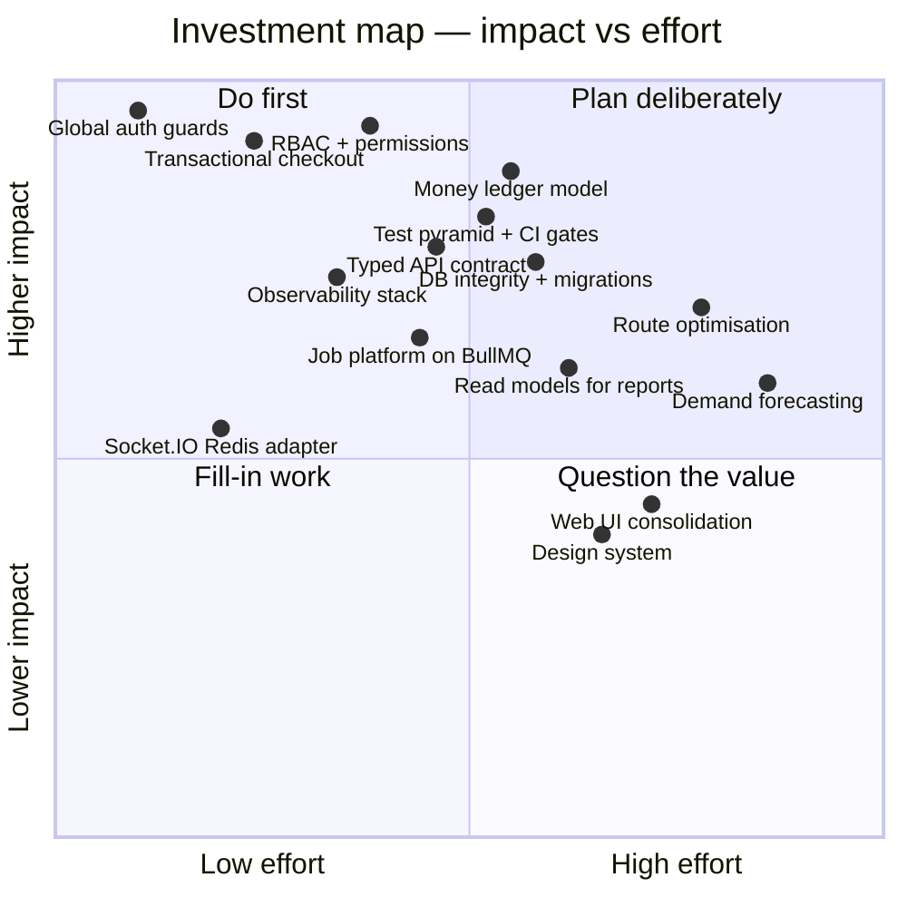

**Guiding principles for everything below**

1. **Make the safe thing the default.** Guards global and opt-out; transactions the norm; types enforced by CI.
2. **One source of truth per fact.** One balance, one schema authority, one API contract, one client generator.
3. **Change in slices that ship.** Every phase below ends in something deployed and observable, not a branch.
4. **Never break the running business.** Expand/contract migrations, feature flags, backward-compatible APIs.

---

## 2. Roadmap at a Glance

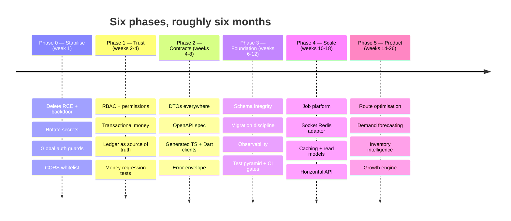

| Phase | Theme | Outcome you can demonstrate |
|---|---|---|
| **0** | Stabilise | No unauthenticated admin surface; secrets rotated |
| **1** | Trust | A customer token gets `403` on admin routes; no checkout can lose money |
| **2** | Contracts | One OpenAPI spec generates the TypeScript **and** Dart clients |
| **3** | Foundation | Every deploy is gated by types, tests, and migrations; every request is traceable |
| **4** | Scale | API runs `instances: max` safely; crons and sockets survive it |
| **5** | Product | Routes optimised, demand forecast, stock decisions data-driven |

---

## 3. Phase 0 — Stabilise (week 1)

Covered in detail in [flaws.md](flaws.md); listed here so the sequence is complete. Nothing in Phase 1+
should start before these land.

| Action | Finding | Effort |
|---|---|---|
| Delete `POST /app/rebuild` | [F-01](flaws.md#f-01) | 10 min |
| Delete the `maintainence` ADMIN backdoor | [F-04](flaws.md#f-04) | 10 min |
| Delete password logging + SQL debug file writer | [F-16](flaws.md#f-16), [F-17](flaws.md#f-17) | 10 min |
| Rotate JWT / session / encryption / DB / CI secrets | [F-10](flaws.md#f-10) | half day |
| Register `JwtAuthGuard` as a global `APP_GUARD` | [F-02](flaws.md#f-02) | 1 hour + route audit |
| CORS origin whitelist from env | [F-08](flaws.md#f-08) | 30 min |
| Remove the throttler `Origin` bypass | [F-05](flaws.md#f-05) | 1 hour |
| Harden the APK upload endpoint | [F-06](flaws.md#f-06) | 2 hours |

---

## 4. Phase 1 — Trust: Authorization and Money (weeks 2-4)

These two subsystems are what a delivery business actually is. Both are currently unenforced.

### 4.1 A real authorization model

Go beyond the minimum `RolesGuard` in [F-03](flaws.md#f-03) and build the model the domain already implies —
the admin panel has eight functional groups and the DB has `admin_roles`, `role_assignments`, and
`admin_audit_logs` waiting to be used.

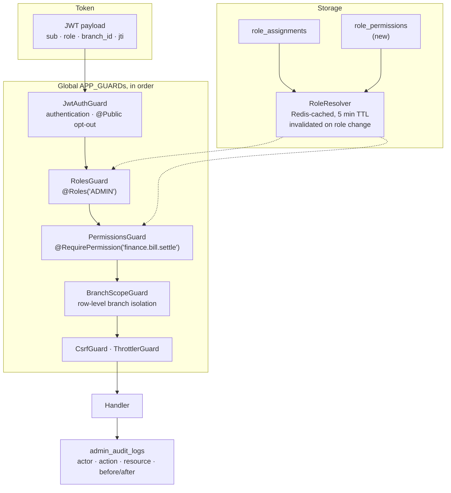

**Build order**

1. **Roles first** (`ADMIN` / `DELIVERY_PARTNER` / `CUSTOMER`) — this alone closes [F-03](flaws.md#f-03).
2. **Permissions second.** Add a `role_permissions` table and a `@RequirePermission()` decorator. Seed
   permissions from the panel structure that already exists:
   `catalog.*`, `inventory.*`, `orders.*`, `subscriptions.*`, `delivery.*`, `finance.*`, `vendors.*`, `system.*`.
   This lets you create a "Branch Manager" or "Finance Only" staff role without code changes.
3. **Branch scoping third.** `branches`, `branch_sectors`, and `zones` exist and `orders.branch_id` is on
   every row, but nothing scopes a query by branch. Add a `BranchScopeGuard` that injects
   `req.scope = { branchIds }` and a repository helper that appends `AND branch_id = ANY($n)` — so a branch
   manager physically cannot read another branch's revenue.
4. **Audit last.** Wrap write handlers in an interceptor that records actor, action, resource id, and a
   before/after diff into `admin_audit_logs`. The table exists (171 rows) and the
   `/admin/system/audit` page exists — connect them.

**Acceptance test** (write this before the code):
```ts
it.each(ADMIN_ROUTE_PREFIXES)('rejects a customer token on %s', async (route) => {
  await request(app).get(route).set('Authorization', `Bearer ${customerToken}`).expect(403);
});
```

### 4.2 Money that cannot be lost

Today the wallet is a mutable number ([F-11](flaws.md#f-11), [F-12](flaws.md#f-12), [F-25](flaws.md#f-25)).
Move to **ledger-first accounting**, where balances are derived and every movement is an immutable entry.

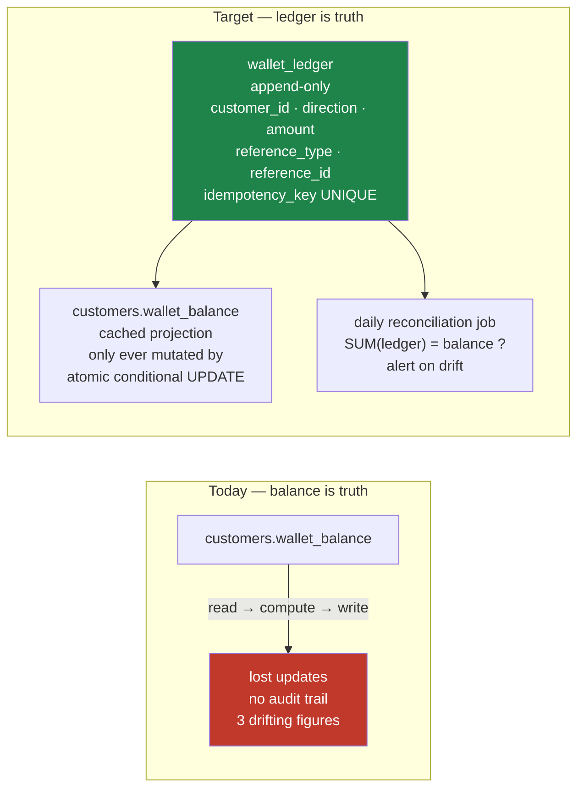

**Rules to enforce, in this order**

1. **Every money mutation runs inside `db.transaction()`.** No exceptions. Add a lint rule or a repository
   method that refuses to write to a money table outside a transaction context.
2. **Every debit is conditional and atomic:**
   ```sql
   UPDATE customers SET wallet_balance = wallet_balance - $1
    WHERE customer_id = $2 AND wallet_balance >= $1 RETURNING wallet_balance;
   ```
3. **Every ledger write carries an `idempotency_key`** with a unique index. Retries become no-ops — the
   pattern `payment_webhook_events` already uses correctly. Extend it: accept an `Idempotency-Key` header on
   `POST /customer/checkout/payment` and every payment mutation.
4. **Side effects happen after commit.** Push notifications, socket broadcasts, and emails move to an
   `@OnEvent('order.placed')` handler dispatched post-commit, not inline in the write path.
5. **Reconciliation is a first-class job**, alongside the Razorpay sweep that already exists — daily
   `SUM(ledger) == cached balance` for wallets, plus `SUM(order_items.total_price) == orders.total_amount`,
   with alerts on mismatch.

**Extend the same discipline to the other money surfaces:** `customer_bills` (postpaid),
`subscription_refund_payouts`, `delivery_partner_referral_bonuses`, and `dispatch_balances`
(dispatched − delivered − returned − damaged should always equal `balance_qty`; today nothing checks).

---

## 5. Phase 2 — One Contract, Three Clients (weeks 4-8)

The API is consumed by a Next.js app and two Flutter apps. Today all three hand-maintain their view of every
endpoint: `apps/web/src/services/api.client.ts`, plus `ApiEndpoints` in each Flutter app. A response shape
change breaks clients silently — and with `ignoreBuildErrors: true` ([F-21](flaws.md#f-21)) and
`: any` everywhere ([F-27](flaws.md#f-27)), nothing catches it.

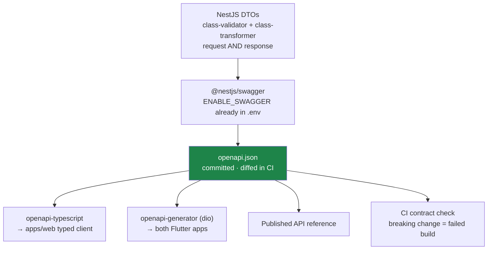

**Work items**

1. **Replace every `@Body() body: any` / `@Query() query: any` with a DTO.** This is the single highest-value
   typing change: the global `ValidationPipe` is already configured with `whitelist: true` and
   `transform: true`, so each DTO you add immediately starts stripping unknown fields and coercing types on
   that route. Prioritise write endpoints and anything reaching a query builder.
2. **Adopt a single response envelope.** The API currently returns bare objects, `{ status, data }`,
   `{ success, message }`, and `{ error }` depending on the handler — `AuthContext` even has to check
   `data.error` *and* the HTTP status. Standardise:
   ```jsonc
   // success
   { "data": { … }, "meta": { "page": 1, "total": 240 } }
   // failure
   { "error": { "code": "INSUFFICIENT_BALANCE", "message": "…", "details": { … } } }
   ```
   Implement with a global `ClassSerializerInterceptor` + a `TransformInterceptor`, and an
   `AllExceptionsFilter` that maps domain exceptions to stable machine-readable `code`s. Machine-readable
   codes matter most for the Flutter apps, which currently string-match on messages.
3. **Generate clients.** `openapi-typescript` for web, `openapi-generator` (dio template) for Flutter.
   Delete the hand-written `ApiEndpoints` constants once generation lands.
4. **Gate breaking changes in CI** with `oasdiff` — a removed field or narrowed enum fails the build.
5. **Version deliberately.** URI versioning (`/api/v1/`) is already wired; when a contract must break,
   introduce `/api/v2/` for that resource and keep v1 alive until mobile adoption
   (measurable via the existing `X-Ver` header) crosses your threshold.

**Cleanup that belongs here:** route paths are inconsistent (`admin/branch-Management`,
`DeliveryPartner/profile`, `delivery-partner/profile`, `cartAndCheckout`). Standardise on kebab-case
resource paths, keeping the old paths as aliases (the codebase already uses `@Controller({ path: [...] })`
arrays for exactly this) until clients migrate.

---

## 6. Phase 3 — Foundation: Schema, Tests, Observability (weeks 6-12)

### 6.1 Schema integrity and migration discipline

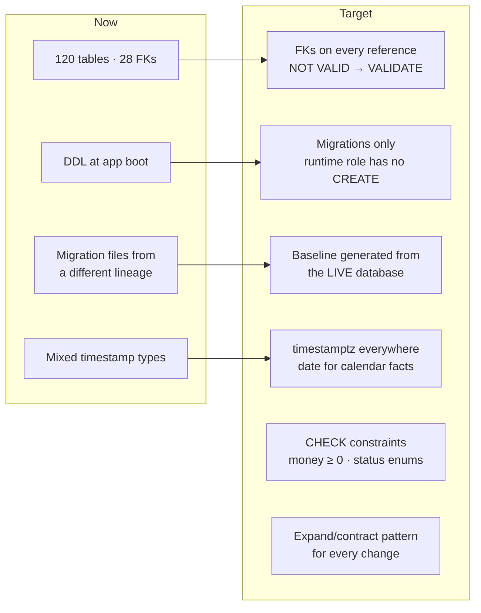

**Start by baselining from the live database, not from the repo.** The existing migration `001` belongs to a
different schema lineage — generate the baseline with `pg_dump --schema-only` and treat that as migration
zero. Then adopt a real tool. Prisma 7 is already a dependency (`@prisma/client`, `prisma`) but is not the
access path; either commit to `prisma migrate` for schema (keeping the hand-written SQL access layer) or
adopt a focused runner like `node-pg-migrate`. Choose one; the current split of
`src/scripts/run-migration.ts` + `panels/*/migrations/` + boot-time DDL is three mechanisms doing one job.

**Every schema change follows expand/contract:** add nullable → backfill → dual-write → switch reads →
drop old. Never a `DROP COLUMN` in the same deploy as the code that stops using it.

**The `optimize.md` plan.** The repository contains a substantial prior design (`optimize.md`, 64 KB) for
unifying identity around a single `users` table with extension profiles and a unified `user_addresses`
table. That plan is sound and addresses real duplication visible in the live schema
(`customers` / `delivery_partners` / `management_staff` each carrying overlapping profile columns;
`customer_addresses` as a customer-only concept). **Execute it — but after Phase 1.** Restructuring identity
tables while there is no authorization layer and no transactional safety multiplies the blast radius of any
mistake. Sequence it as: authorization → money safety → tests → then identity unification, each table
migrated expand/contract with dual-write.

### 6.2 A test pyramid that protects the business

Current state: 4 test files across 304 API sources, 0 in web ([F-22](flaws.md#f-22)). Do not chase a coverage
number — chase the paths where a bug costs money or leaks data.

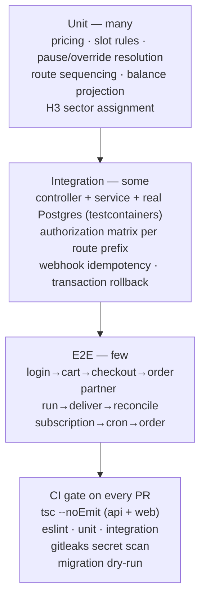

**The five suites to write first**
1. **Authorization matrix** — every admin route prefix × every role → expected status. This is the
   regression test for the whole Phase 1 investment.
2. **Checkout** — insufficient balance, concurrent debit (two parallel requests, assert single deduction),
   invalid variant, mid-loop failure rolls back completely.
3. **Payments** — signature verification rejects tampering; duplicate webhooks credit once.
4. **Subscription generation** — pauses, overrides, weekly/custom schedules, month boundaries, and the
   23:55/11:55 IST edge where a naive timestamp ([F-24](flaws.md#f-24)) shifts a slot.
5. **Delivery reconciliation** — dispatched = delivered + returned + damaged + balance, always.

Use **testcontainers** with a real PostgreSQL rather than mocks — the bugs in this codebase are transaction
and constraint bugs, and a mock cannot express those. Enable `noImplicitAny` and drop `ignoreBuildErrors`
as part of the same PR that makes CI blocking.

### 6.3 Observability

Right now diagnosis relies on `console.log` in PM2 files. Three questions must become answerable in minutes:
*Is it broken? Where? For whom?*

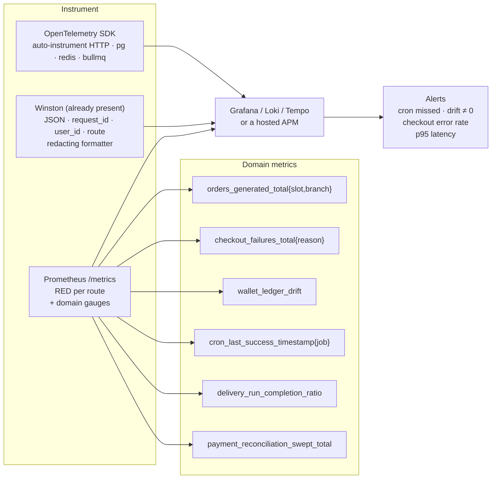

**Highest-value alert in the whole system:** `cron_last_success_timestamp{job="subscription-snapshot"}`.
If the 23:55 job fails, nobody receives a delivery tomorrow — and today that failure is a `console.error` in
a log file nobody reads. Second: wallet ledger drift ≠ 0. Third: `checkout_failures_total` by reason.

Add a request id at the edge (`RoleHeaderMiddleware` is already the first middleware — extend it), propagate
it to every log line and to the client via a response header, and surface it in client error toasts so a
support ticket carries a traceable id. Add error tracking (Sentry or GlitchTip) to the API, the Next.js app,
and both Flutter apps.

---

## 7. Phase 4 — Scale (weeks 10-18)

The system currently runs as a **single PM2 fork**. Three things must change before `instances: max` is safe.

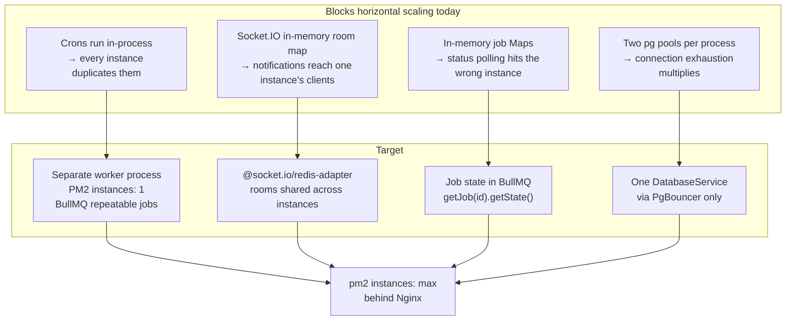

### 7.1 A real background-job platform

BullMQ is already installed and running three queues. Promote it from an implementation detail to the
platform for all deferred work:

| Move to a queue | Why |
|---|---|
| The six `@Cron` handlers | Repeatable jobs, single worker, no distributed lock needed ([F-29](flaws.md#f-29)) |
| Push notifications and email | Currently inline in checkout — an FCM timeout slows a payment |
| PDF invoice/receipt generation | PDFKit is CPU-bound and blocks the event loop |
| APK build / migration jobs | Removes the in-memory `Map`s ([F-26](flaws.md#f-26)) |
| Calendar aggregation | Already queued — keep |

Give every job: a stable `jobId` for idempotency, bounded retries with exponential backoff, a dead-letter
queue, and a `bull-board` dashboard mounted behind the admin `@Roles('ADMIN')` guard so operators can see
and retry failures themselves.

### 7.2 Caching with a strategy, not ad hoc keys

`RedisService` with `CACHE_KEYS`/`CACHE_TTL` already exists. Formalise it:

| Data | TTL | Invalidation |
|---|---|---|
| Catalog (categories, products, variants, images) | 15 min | On catalog write — publish an event |
| `site_settings`, `app_configs`, `api_integrations_config` | 1 hour | On write |
| Role + permission resolution | 5 min | On `role_assignments` change |
| Customer bootstrap payload | 60 s | On profile/address/wallet change |
| Admin dashboard aggregates | 5 min | Time-based only |

Rules: cache **reads that are expensive and tolerate staleness**; never cache a balance or an authorization
decision beyond seconds; always key by tenant/branch; always set a TTL (a cache without one is a memory leak
with extra steps).

### 7.3 Read models for the reporting surface

`(FINANCE_GROWTH)/reports/*` and `(OPERATIONS)/dashboard` run aggregate queries against live OLTP tables.
This is fine at 50 orders and will not be at 50,000/day. Introduce daily materialised summaries —
`daily_branch_revenue`, `daily_product_movement`, `daily_delivery_performance` — refreshed by a nightly job,
with the reporting pages reading only from those. `subscription_calendar_cache` already establishes this
pattern in the codebase; generalise it.

### 7.4 Query and index work

- Add indexes for the FKs introduced in Phase 3 (PostgreSQL does not create them automatically, and an
  unindexed FK makes parent deletes scan the child table).
- Add composite indexes matching the real access patterns:
  `orders(branch_id, scheduled_date, delivery_slot, status)`,
  `orders(customer_id, created_at DESC)`,
  `delivery_location_logs(delivery_partner_id, created_at DESC)`.
- Enable `pg_stat_statements`, review the top 20 by total time monthly, and hunt the remaining N+1s —
  [F-23](flaws.md#f-23) is unlikely to be the only one across 124 services.
- Partition the append-only high-volume tables by month once they grow: `delivery_location_logs`,
  `notification_recipients`, `auth_logs`, `admin_audit_logs`, `stock_movements`.

---

## 8. Phase 5 — Product Improvements (weeks 14-26)

With the platform trustworthy, these are the improvements that move the business. Each one depends on
foundations laid above.

### 8.1 Route optimisation

`delivery-route.cron` builds runs and sequences stops; `zone_hexagons` (H3), `branch_sectors`,
`delivery_routes`, and `route_daily_overrides` are all modelled. What is missing is optimisation.

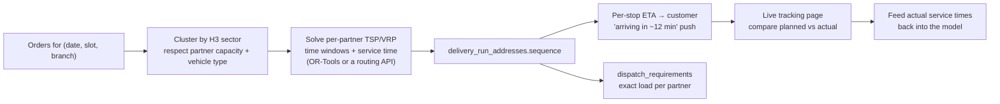

Measurable outcomes: kilometres per delivery, stops per hour, on-time percentage, and — via the ETA push —
fewer failed deliveries. `is_arriving_notified` already exists on `orders`, unused.

### 8.2 Demand forecasting and procurement

`consumption_forecasts`, `production_plans`, `purchase_entries`, `vendor_intakes`, and `stock_balances`
exist. Subscriptions make demand **unusually predictable** — tomorrow's committed quantity is literally
computable from active subscriptions before the day starts. Exploit that:

- Forecast tomorrow's demand per variant per branch from active subscriptions + pause/override adjustments
  + a moving average of one-time orders.
- Convert forecast → production plan → purchase order automatically, with a human approval step.
- Track forecast error (MAPE) per product and surface it — the feedback loop is what makes this improve.
- Alert on wastage: `expiry` and `reconciliation` pages exist; connect them to forecast accuracy so
  over-ordering is visible per product per week.

### 8.3 Subscription intelligence

The subscription is the product. Instrument its lifecycle:

- **Churn signals** — pause frequency and duration, skip rate, delivery failures, complaint tickets. Surface
  an at-risk list to ops before cancellation, not after.
- **Self-service** — let customers pause, skip, swap a variant, and shift a slot from the app without support.
  The tables (`subscription_pauses`, `subscription_overrides`, `subscription_delivery_slots`) support all of it.
- **Renewal transparency** — `subscription_renewal_attempts` already records failures; notify the customer
  *before* a wallet-funded renewal fails, not after a missed delivery.
- **Cohort retention** by signup month, plan, and branch, in the analytics panel.

### 8.4 Growth engine

`referrals`, `coupons`, `promotions`, `promotion_redemptions`, `coupon_redemptions`, and a full referral
module (events, listeners, reward engine — the best-tested code in the repo) already exist. Complete it:

- One rules engine covering coupons, promotions, and referrals, so discount precedence and stacking are
  defined in one place rather than three.
- Fraud controls: per-device and per-address referral caps (`device_information` and `user_devices` already
  capture what is needed), self-referral detection, and reward clawback on early cancellation.
- Attribution reporting: cost per acquired subscriber by channel, and payback period against wallet spend.

### 8.5 Delivery partner experience

The partner app is the operational bottleneck; treat it as a product.

- **Offline-first.** Isar is already a dependency in both apps. A partner in a low-signal area must be able
  to complete a run entirely offline and sync on reconnect — which requires idempotency keys on every
  delivery mutation (Phase 1) so replayed writes are safe.
- **Earnings transparency.** Per-run and per-day earnings, incentives, and redeem status
  (`delivery_partner_redeem_requests`, `_referral_bonuses` exist).
- **Battery-aware GPS.** `battery_plus` is already a dependency — adapt ping frequency to battery level and
  movement, and stop pinging when a run is complete.
- **Safety.** SOS exists; add an escalation path with acknowledgement, and a breakdown flow
  (`breakdown_incidents` exists) that reassigns the remaining stops automatically.

### 8.6 Customer experience

- **Delivery-day certainty** — a single screen answering "what am I getting tomorrow, when, and what will it
  cost", built from the subscription calendar that already exists.
- **Proof of delivery** in the customer app — `delivery_proof_logs` and `orders.delivery_image` are captured
  but never shown to the customer.
- **Container/bottle returns** — `customer_container_balances` is tracked; expose it so customers see what
  they owe and can hand it back.
- **Feedback loop** — `customer_feedback` exists; prompt after delivery and route low scores into
  `support_tickets` automatically.

---

## 9. Frontend and Mobile Modernisation (continuous)

### 9.1 Next.js admin panel

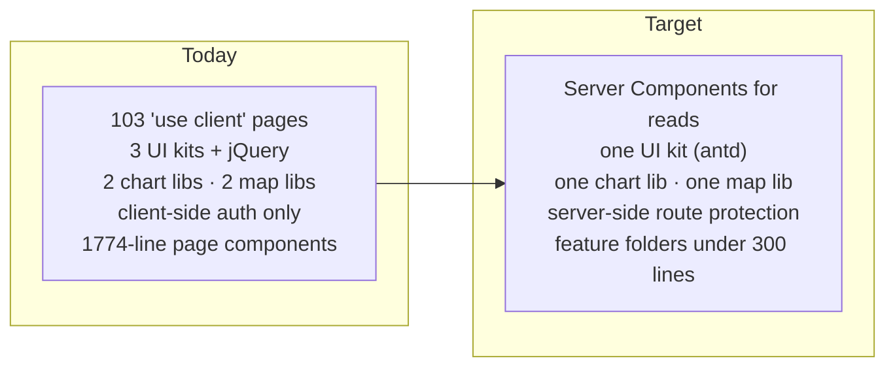

- **Move data fetching to the server** where it is read-only. React 19 + App Router make this available today
  and it removes a whole class of loading-state and waterfall bugs from the largest pages.
- **Protect routes on the server.** `proxy.ts` currently lets every panel route through and defers to a
  client-side `AuthProvider` — so admin page shells render before auth resolves. Once the JWT carries a role
  (Phase 1), verify it in the proxy and redirect server-side.
- **Consolidate the dependency set** ([F-33](flaws.md#f-33)) — three component libraries in one bundle is
  both a performance and a consistency problem. Delete the accidental `"20"` and `"start"` packages today.
- **Split the giants.** `customers/[id]/page.tsx` is 1,774 lines; five pages exceed 1,000. Extract feature
  components and data hooks; the `src/components/` structure already exists for this.
- **Build a small design system** — tokens, one table component, one form component, one modal — so 103 pages
  stop each inventing their own.
- **Accessibility and error states**: keyboard navigation, focus management, and a consistent
  loading/empty/error triad. The admin panel is a daily tool for staff; these compound.

### 9.2 Flutter apps

The Flutter code is the best-structured part of the repository — clean architecture, BLoC, DI, feature
folders. Build on it rather than restructure it.

- **Shared package.** The two apps duplicate `core/api`, `core/auth`, `core/cache`, and DI wiring. Extract a
  `packages/f2h_core` and depend on it from both — one place to fix an interceptor bug.
- **Generated API client** from the OpenAPI spec (Phase 2), replacing hand-maintained `ApiEndpoints`.
- **Offline-first sync layer** on Isar with a queued-mutation outbox — pairs with server idempotency keys.
- **Release pipeline.** `shorebird.yaml` is present in the customer app: adopt code push for hot fixes across
  both apps, and move builds into CI so the [F-06](flaws.md#f-06) upload endpoint can be deleted entirely.
- **Test the domain layer.** Usecases and BLoCs are pure and trivially testable; 2 test files today.
- **Remote config / feature flags** — `app_configs` and `api_integrations_config` already exist server-side;
  use them to dark-launch features rather than gating on app-store rollout.

---

## 10. Engineering Practice

These are cheap, and they are what stops the [flaws.md](flaws.md) list from regenerating itself.

```mermaid
flowchart LR
    PR["Pull request"] --> CI
    subgraph CI["Required checks"]
        C1["tsc --noEmit (api + web)"]
        C2["eslint — no-console, no-empty,<br/>no-explicit-any (ratcheted)"]
        C3["unit + integration tests"]
        C4["gitleaks secret scan"]
        C5["npm audit / dependency review"]
        C6["migration dry-run on a clone"]
        C7["oasdiff — no breaking API change"]
    end
    CI --> REV["Review against docs/skills/*<br/>security · architecture · clean-code"]
    REV --> MERGE["Merge → staging deploy"]
    MERGE --> SMOKE["Smoke tests + health check"]
    SMOKE --> PROD["Production deploy<br/>migrations first, expand/contract<br/>documented rollback"]
```

**Also worth doing early**

- **A staging environment.** There is currently one database. Ship a staging stack with anonymised data —
  no schema change should first meet production traffic in production.
- **Backups you have restored.** Automated `pg_dump` plus PITR, and a **quarterly restore drill**. An
  untested backup is a hypothesis.
- **Runbooks** for the failures that will happen: subscription cron missed, Razorpay webhook backlog,
  Redis down (note: sessions live there, so this is a total auth outage — decide whether that is acceptable
  or whether JWT verification should degrade gracefully), PgBouncer saturation, partner GPS flood.
- **A CODEOWNERS file and a definition of done** that includes tests, docs, and a migration plan.
- **Dependency hygiene** — Renovate/Dependabot with grouped, scheduled PRs. `next 16`, `react 19`,
  `nestjs 11`, and `prisma 7` are all current; the way to stay there is small continuous upgrades.

---

## 11. Priority Summary

If only ten things get done, do these, in this order:

| # | Do this | Why it is on the list | Effort |
|---|---|---|---|
| 1 | Delete `POST /app/rebuild` and the `maintainence` backdoor | Unauthenticated host command execution and self-service admin | 30 min |
| 2 | Register `JwtAuthGuard` globally | Closes 17 unauthenticated controllers with two lines | 1 hour |
| 3 | Rotate every committed secret | They are published in git | half day |
| 4 | Ship `RolesGuard` + `@Roles()` + the authorization test matrix | The system has no authorization at all | 3-4 days |
| 5 | Wrap checkout in a transaction with an atomic wallet debit | Money can currently be taken without an order, and double-spent | 2-3 days |
| 6 | Fix the throttler bypass, CORS whitelist, socket room authorization, cart IDOR | Four independent holes, each a day or less | 3 days |
| 7 | Enforce CSRF; move to 15-minute tokens with rotating refresh | Completes the auth story that is already 90% built | 1 week |
| 8 | DTOs on every write endpoint + a single response envelope | Makes the `ValidationPipe` actually validate; unblocks generated clients | 2 weeks |
| 9 | Foreign keys, migrations-only DDL, `timestamptz`, one `DatabaseService` | The database stops depending on 124 services being correct | 2-3 weeks |
| 10 | CI gates: `tsc --noEmit`, lint, the five test suites, secret scanning | Stops all of the above from silently coming back | 1 week |

Everything after that — job platform, observability, read models, route optimisation, forecasting — is
genuine product and platform work, and it will move much faster on a foundation where a mistake is caught by
a test instead of by a customer.

---

**Related documents:** [existing.md](existing.md) — complete current-state flows and architecture ·
[flaws.md](flaws.md) — the 35 confirmed defects with concrete fixes.
